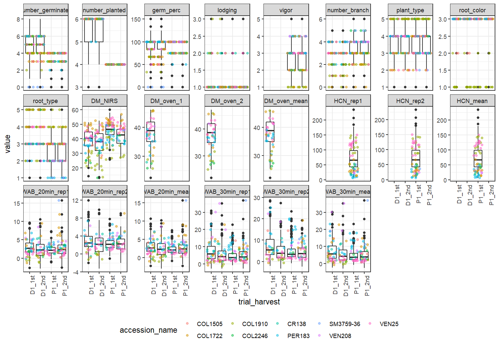
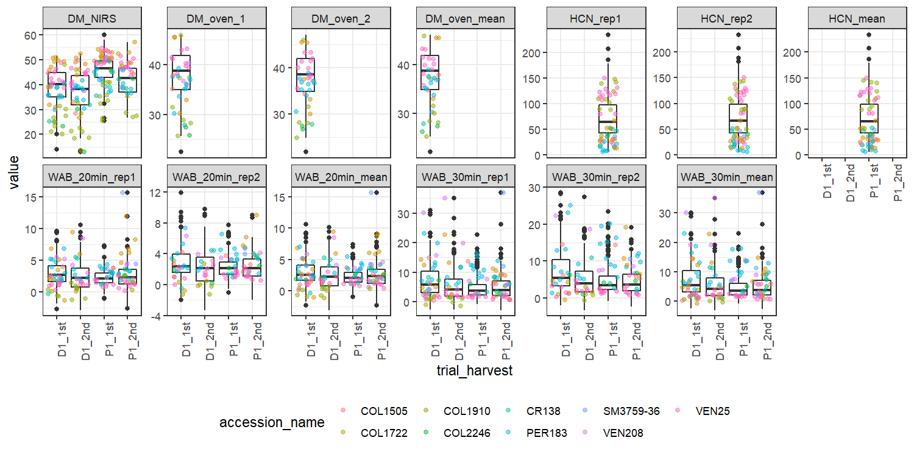
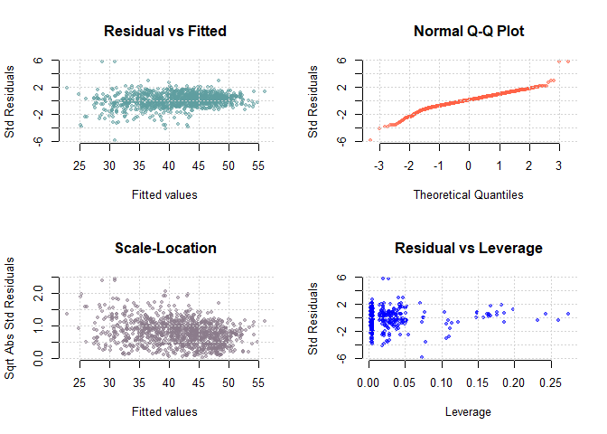
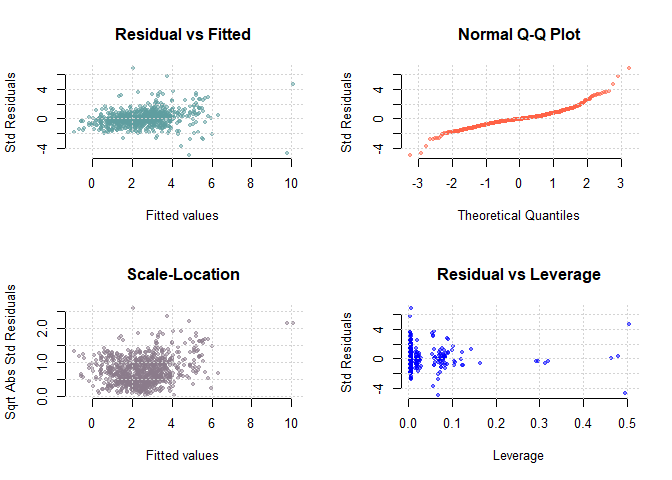
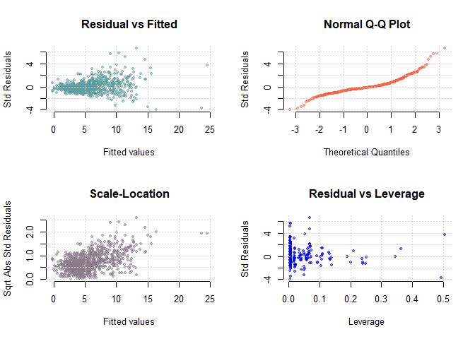
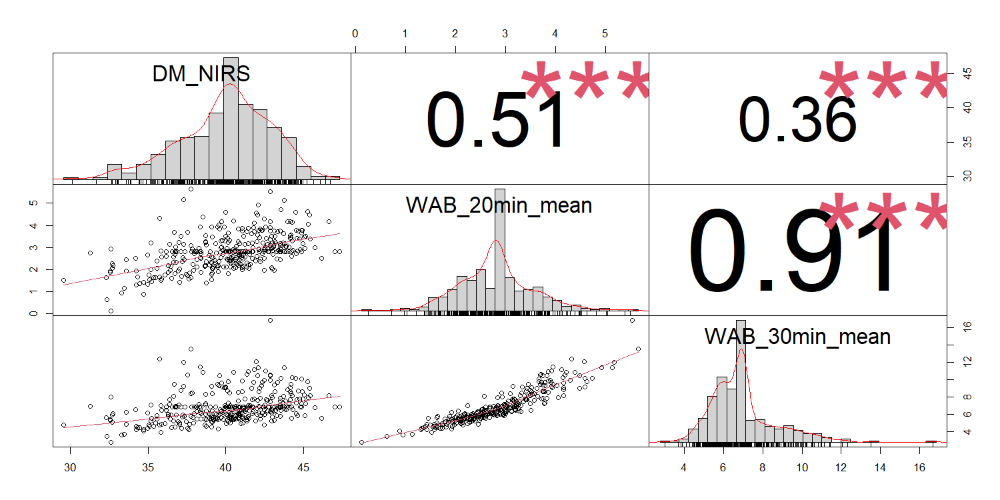
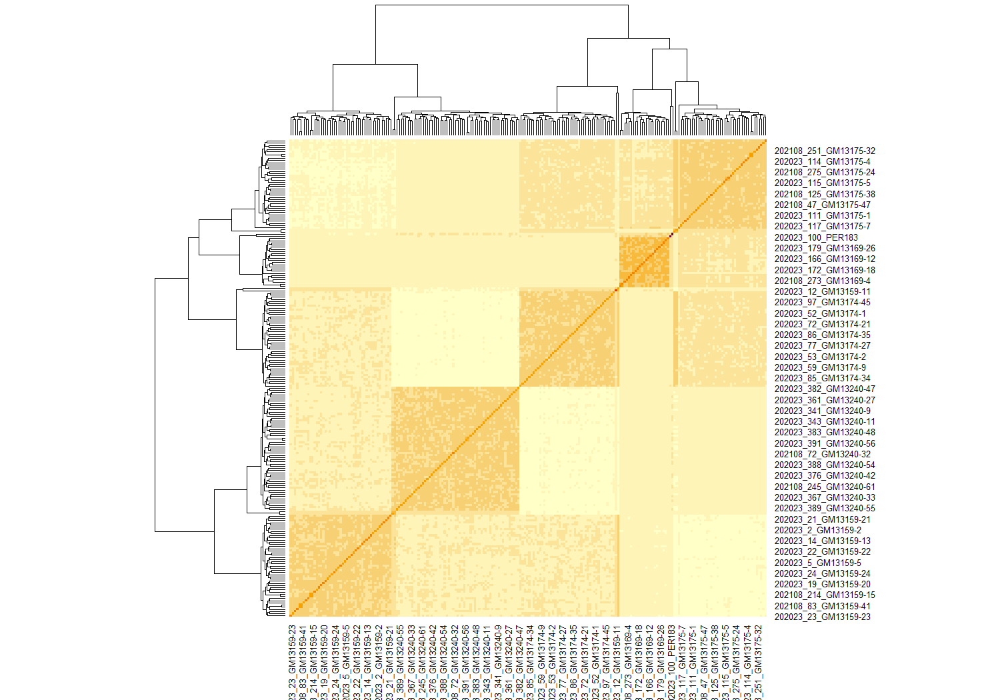
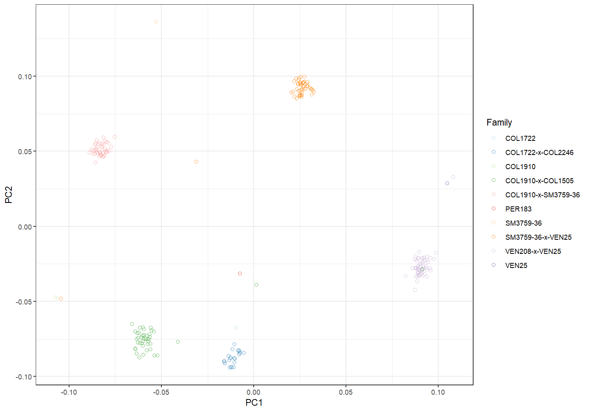
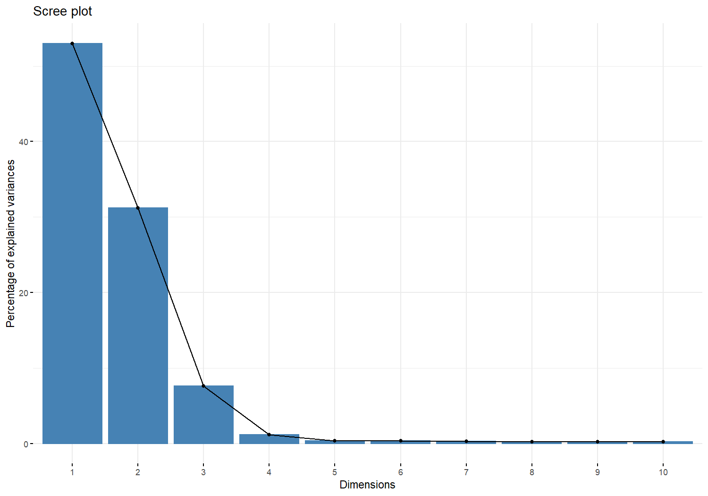

# Installing and loading R Packages:


```r
package.cran <- c("tidyverse", "sommer", "PerformanceAnalytics", "vcfR", "ggplot2", "bigmemory", "RColorBrewer", "factoextra", "rMVP", "statgenGWAS")
missing.cran <- setdiff(package.cran, rownames(installed.packages()))
if(length(missing.cran) > 0) install.packages(c(missing.cran), dep = TRUE) 
invisible(lapply(c(package.cran), library, character.only = TRUE))
```

# Introduction

This tutorial reports the phenotypic data analysis and genetic mapping for a cassava population, which is part of the mapping current studies developed by the CIAT Breeding Program, Colombia. Our aim is to use this population to provide an introductory training on quantitative genetics to the CIAT Breeding Team. 

The used population consists of 381 individuals belonging to six full-sib families, which have been phenotyped for cooking quality traits. A total of seven parents were crossed to generate these six families: 

1. SM3759-36 x VEN25
2. COL2246 x COL1722
3. COL1910 x SM3759-36
4. COL1910 x COL1505
5. COL1505 x COL1910
6. VEN208 x VEN25

Four parents and 226 progenies were genotyped for 8,590,486 single nucleotide polymorphism (SNP) markers (BGI), distributed in the entire genome (18 chromosomes + scaffolds) stored in variant call format (VCF) file. The VCF also has SNPs called together with a second population (370 clones) focused on beta-carotene content. For the sake of time, we'll onlly deal with the first population.

The present training is structured as follows:

- phenotypic analysis of quality traits via mixed models, using three specific traits (DM_NIRS, WAB_20min_mean, and WAB_30min_mean) evaluated in four trials during years 2020 and 2021
- construction of genetic linkage map for one of the five full-sib families (SM3759-36 x VEN25), which presented the larger amount of genotyped progenies ($n=49$) and both parents genotyped among all families
- quantitative trait loci (QTL) mapping, via composite interval mapping (CIM), for the three cooking quality traits
- genome-wide association study (GWAS) for the same traits, considering all the five full-sib families. 

Also for the sake of time, we'll use a subset of 9,000 SNP ($\sim$0.1\%) markers randomly sampled out of the 8.5M markers. 

# Phenotypic Analyses via Mixed Models

## Data and Exploratory Analysis


```r
data.pheno <- read.csv("01_RTBfoods_progeny_2020_2021_4_env 2022-05-08.csv") 
head(data.pheno)
```

```
##                           plot_name trial_harvest plot_number rep_number
## 1 202002CQQU1_ciat_rep1_GM13159-1_1        D1_1st           1          1
## 2 202002CQQU1_ciat_rep1_GM13159-4_2        D1_1st           2          1
## 3 202002CQQU1_ciat_rep1_GM13159-6_3        D1_1st           3          1
## 4 202002CQQU1_ciat_rep1_GM13159-7_4        D1_1st           4          1
## 5 202002CQQU1_ciat_rep1_GM13159-8_5        D1_1st           5          1
## 6 202002CQQU1_ciat_rep1_GM13159-9_6        D1_1st           6          1
##   accession_name col_number row_number check number_germinated number_planted
## 1      GM13159-1          1          1    NA                 6              6
## 2      GM13159-4          1          2    NA                 5              4
## 3      GM13159-6          1          3    NA                 6              6
## 4      GM13159-7          1          4    NA                 4              4
## 5      GM13159-8          1          5    NA                 6              6
## 6      GM13159-9          1          6    NA                 5              5
##   germ_perc lodging vigor number_branch plant_type root_color root_type
## 1       100       1    NA             3          3          3         3
## 2       125       1    NA             4          3          3         3
## 3       100       1    NA             2          4          3         2
## 4       100       1    NA             4          3          3         2
## 5       100       1    NA             3          3          3         2
## 6       100       1    NA             2          4          3         3
##    DM_NIRS DM_oven_1 DM_oven_2 DM_oven_mean HCN_rep1 HCN_rep2 HCN_mean
## 1 40.97823  41.34744  41.46142     41.40443       NA       NA       NA
## 2 41.77826  42.61983  42.56000     42.58992       NA       NA       NA
## 3 45.29284  43.47788  43.66805     43.57296       NA       NA       NA
## 4 43.35637  42.63282  42.66809     42.65046       NA       NA       NA
## 5 43.76374  42.55326  43.01971     42.78648       NA       NA       NA
## 6 43.24713  42.48462  42.81179     42.64821       NA       NA       NA
##   WAB_20min_rep1 WAB_20min_rep2 WAB_20min_mean WAB_30min_rep1 WAB_30min_rep2
## 1       1.454041       1.746310       1.600175       3.451960       5.019413
## 2       1.811940       2.430337       2.121139       3.280565       3.582652
## 3       4.184988       4.113949       4.149469      12.017386      13.360680
## 4       2.244308       2.270785       2.257546       5.345699       5.129318
## 5       2.515546       2.367617       2.441581       5.016959       4.175153
## 6       2.202935       2.200254       2.201595       5.122711       4.359793
##   WAB_30min_mean
## 1       4.235686
## 2       3.431608
## 3      12.689033
## 4       5.237508
## 5       4.596056
## 6       4.741252
```

```r
str(data.pheno)
```

```
## 'data.frame':	1468 obs. of  30 variables:
##  $ plot_name        : chr  "202002CQQU1_ciat_rep1_GM13159-1_1" "202002CQQU1_ciat_rep1_GM13159-4_2" "202002CQQU1_ciat_rep1_GM13159-6_3" "202002CQQU1_ciat_rep1_GM13159-7_4" ...
##  $ trial_harvest    : chr  "D1_1st" "D1_1st" "D1_1st" "D1_1st" ...
##  $ plot_number      : int  1 2 3 4 5 6 7 8 9 10 ...
##  $ rep_number       : int  1 1 1 1 1 1 1 1 1 1 ...
##  $ accession_name   : chr  "GM13159-1" "GM13159-4" "GM13159-6" "GM13159-7" ...
##  $ col_number       : int  1 1 1 1 1 1 1 1 2 2 ...
##  $ row_number       : int  1 2 3 4 5 6 7 8 8 7 ...
##  $ check            : int  NA NA NA NA NA NA NA NA NA 1 ...
##  $ number_germinated: int  6 5 6 4 6 5 5 6 6 3 ...
##  $ number_planted   : int  6 4 6 4 6 5 6 6 6 6 ...
##  $ germ_perc        : num  100 125 100 100 100 ...
##  $ lodging          : int  1 1 1 1 1 1 1 1 1 1 ...
##  $ vigor            : int  NA NA NA NA NA NA NA NA NA NA ...
##  $ number_branch    : int  3 4 2 4 3 2 3 4 2 2 ...
##  $ plant_type       : int  3 3 4 3 3 4 4 4 3 5 ...
##  $ root_color       : int  3 3 3 3 3 3 2 3 3 3 ...
##  $ root_type        : int  3 3 2 2 2 3 2 3 3 5 ...
##  $ DM_NIRS          : num  41 41.8 45.3 43.4 43.8 ...
##  $ DM_oven_1        : num  41.3 42.6 43.5 42.6 42.6 ...
##  $ DM_oven_2        : num  41.5 42.6 43.7 42.7 43 ...
##  $ DM_oven_mean     : num  41.4 42.6 43.6 42.7 42.8 ...
##  $ HCN_rep1         : num  NA NA NA NA NA NA NA NA NA NA ...
##  $ HCN_rep2         : num  NA NA NA NA NA NA NA NA NA NA ...
##  $ HCN_mean         : num  NA NA NA NA NA NA NA NA NA NA ...
##  $ WAB_20min_rep1   : num  1.45 1.81 4.18 2.24 2.52 ...
##  $ WAB_20min_rep2   : num  1.75 2.43 4.11 2.27 2.37 ...
##  $ WAB_20min_mean   : num  1.6 2.12 4.15 2.26 2.44 ...
##  $ WAB_30min_rep1   : num  3.45 3.28 12.02 5.35 5.02 ...
##  $ WAB_30min_rep2   : num  5.02 3.58 13.36 5.13 4.18 ...
##  $ WAB_30min_mean   : num  4.24 3.43 12.69 5.24 4.6 ...
```

```r
data.pheno <- data.pheno %>% arrange(trial_harvest, rep_number, col_number, row_number, accession_name)
factors <- c("trial_harvest", "rep_number", "accession_name")
data.pheno[,factors] <- lapply(data.pheno[,factors], factor)
str(data.pheno)
```

```
## 'data.frame':	1468 obs. of  30 variables:
##  $ plot_name        : chr  "202002CQQU1_ciat_rep1_GM13159-1_1" "202002CQQU1_ciat_rep1_GM13159-4_2" "202002CQQU1_ciat_rep1_GM13159-6_3" "202002CQQU1_ciat_rep1_GM13159-7_4" ...
##  $ trial_harvest    : Factor w/ 4 levels "D1_1st","D1_2nd",..: 1 1 1 1 1 1 1 1 1 1 ...
##  $ plot_number      : int  1 2 3 4 5 6 7 8 16 15 ...
##  $ rep_number       : Factor w/ 9 levels "1","2","3","4",..: 1 1 1 1 1 1 1 1 1 1 ...
##  $ accession_name   : Factor w/ 390 levels "COL1505","COL1722",..: 6 36 55 56 57 58 8 9 16 15 ...
##  $ col_number       : int  1 1 1 1 1 1 1 1 2 2 ...
##  $ row_number       : int  1 2 3 4 5 6 7 8 1 2 ...
##  $ check            : int  NA NA NA NA NA NA NA NA NA NA ...
##  $ number_germinated: int  6 5 6 4 6 5 5 6 6 5 ...
##  $ number_planted   : int  6 4 6 4 6 5 6 6 6 6 ...
##  $ germ_perc        : num  100 125 100 100 100 ...
##  $ lodging          : int  1 1 1 1 1 1 1 1 1 1 ...
##  $ vigor            : int  NA NA NA NA NA NA NA NA NA NA ...
##  $ number_branch    : int  3 4 2 4 3 2 3 4 4 3 ...
##  $ plant_type       : int  3 3 4 3 3 4 4 4 3 3 ...
##  $ root_color       : int  3 3 3 3 3 3 2 3 3 3 ...
##  $ root_type        : int  3 3 2 2 2 3 2 3 3 3 ...
##  $ DM_NIRS          : num  41 41.8 45.3 43.4 43.8 ...
##  $ DM_oven_1        : num  41.3 42.6 43.5 42.6 42.6 ...
##  $ DM_oven_2        : num  41.5 42.6 43.7 42.7 43 ...
##  $ DM_oven_mean     : num  41.4 42.6 43.6 42.7 42.8 ...
##  $ HCN_rep1         : num  NA NA NA NA NA NA NA NA NA NA ...
##  $ HCN_rep2         : num  NA NA NA NA NA NA NA NA NA NA ...
##  $ HCN_mean         : num  NA NA NA NA NA NA NA NA NA NA ...
##  $ WAB_20min_rep1   : num  1.45 1.81 4.18 2.24 2.52 ...
##  $ WAB_20min_rep2   : num  1.75 2.43 4.11 2.27 2.37 ...
##  $ WAB_20min_mean   : num  1.6 2.12 4.15 2.26 2.44 ...
##  $ WAB_30min_rep1   : num  3.45 3.28 12.02 5.35 5.02 ...
##  $ WAB_30min_rep2   : num  5.02 3.58 13.36 5.13 4.18 ...
##  $ WAB_30min_mean   : num  4.24 3.43 12.69 5.24 4.6 ...
```

```r
table(data.pheno$trial_harvest)
```

```
## 
## D1_1st D1_2nd P1_1st P1_2nd 
##    334    334    400    400
```

```r
colnames(data.pheno)
```

```
##  [1] "plot_name"         "trial_harvest"     "plot_number"      
##  [4] "rep_number"        "accession_name"    "col_number"       
##  [7] "row_number"        "check"             "number_germinated"
## [10] "number_planted"    "germ_perc"         "lodging"          
## [13] "vigor"             "number_branch"     "plant_type"       
## [16] "root_color"        "root_type"         "DM_NIRS"          
## [19] "DM_oven_1"         "DM_oven_2"         "DM_oven_mean"     
## [22] "HCN_rep1"          "HCN_rep2"          "HCN_mean"         
## [25] "WAB_20min_rep1"    "WAB_20min_rep2"    "WAB_20min_mean"   
## [28] "WAB_30min_rep1"    "WAB_30min_rep2"    "WAB_30min_mean"
```

```r
traits <- colnames(data.pheno)[9:30]
traits
```

```
##  [1] "number_germinated" "number_planted"    "germ_perc"        
##  [4] "lodging"           "vigor"             "number_branch"    
##  [7] "plant_type"        "root_color"        "root_type"        
## [10] "DM_NIRS"           "DM_oven_1"         "DM_oven_2"        
## [13] "DM_oven_mean"      "HCN_rep1"          "HCN_rep2"         
## [16] "HCN_mean"          "WAB_20min_rep1"    "WAB_20min_rep2"   
## [19] "WAB_20min_mean"    "WAB_30min_rep1"    "WAB_30min_rep2"   
## [22] "WAB_30min_mean"
```

Let's take a look of checks used in the trials:


```r
sort(table(data.pheno$accession_name))
```

```
## 
##  GM13159-10  GM13159-15  GM13159-16   GM13159-2  GM13159-29   GM13159-3 
##           2           2           2           2           2           2 
##  GM13159-31  GM13159-34  GM13159-35  GM13159-37  GM13159-41  GM13159-42 
##           2           2           2           2           2           2 
##  GM13159-44  GM13159-45  GM13159-48   GM13159-5  GM13159-52   GM13169-1 
##           2           2           2           2           2           2 
##  GM13169-15  GM13169-20  GM13169-29   GM13169-4   GM13169-5  GM13174-25 
##           2           2           2           2           2           2 
##  GM13174-26  GM13174-52   GM13174-8  GM13175-10  GM13175-12  GM13175-13 
##           2           2           2           2           2           2 
##  GM13175-14  GM13175-15  GM13175-17   GM13175-2  GM13175-20  GM13175-21 
##           2           2           2           2           2           2 
##  GM13175-23  GM13175-24  GM13175-31  GM13175-32  GM13175-33  GM13175-35 
##           2           2           2           2           2           2 
##  GM13175-36  GM13175-39  GM13175-47  GM13175-49   GM13196-1 GM13196-100 
##           2           2           2           2           2           2 
## GM13196-101 GM13196-102 GM13196-104 GM13196-106 GM13196-109 GM13196-110 
##           2           2           2           2           2           2 
## GM13196-112 GM13196-113 GM13196-115 GM13196-116 GM13196-121 GM13196-123 
##           2           2           2           2           2           2 
## GM13196-125  GM13196-14 GM13196-140 GM13196-143 GM13196-147 GM13196-148 
##           2           2           2           2           2           2 
## GM13196-149 GM13196-150 GM13196-151 GM13196-155 GM13196-156 GM13196-160 
##           2           2           2           2           2           2 
## GM13196-163  GM13196-21  GM13196-23  GM13196-24  GM13196-26  GM13196-32 
##           2           2           2           2           2           2 
##  GM13196-42  GM13196-43  GM13196-44  GM13196-45  GM13196-46  GM13196-47 
##           2           2           2           2           2           2 
##  GM13196-48  GM13196-49   GM13196-5  GM13196-53  GM13196-54  GM13196-56 
##           2           2           2           2           2           2 
##  GM13196-57  GM13196-58  GM13196-59  GM13196-61  GM13196-64  GM13196-65 
##           2           2           2           2           2           2 
##  GM13196-66  GM13196-70  GM13196-72  GM13196-76  GM13196-77  GM13196-80 
##           2           2           2           2           2           2 
##  GM13196-81  GM13196-83  GM13196-85  GM13196-87  GM13196-88  GM13196-89 
##           2           2           2           2           2           2 
##  GM13196-90  GM13196-91  GM13196-92  GM13196-93  GM13196-94  GM13196-95 
##           2           2           2           2           2           2 
##  GM13196-96  GM13196-97  GM13196-98  GM13240-10  GM13240-11  GM13240-12 
##           2           2           2           2           2           2 
##  GM13240-16  GM13240-20  GM13240-22  GM13240-31  GM13240-35  GM13240-36 
##           2           2           2           2           2           2 
##  GM13240-37  GM13240-45   GM13240-5  GM13240-57  GM13240-59  GM13240-61 
##           2           2           2           2           2           2 
##   GM13240-7   GM13240-9   GM13159-1  GM13159-11  GM13159-12  GM13159-13 
##           2           2           4           4           4           4 
##  GM13159-14  GM13159-17  GM13159-18  GM13159-19  GM13159-20  GM13159-21 
##           4           4           4           4           4           4 
##  GM13159-22  GM13159-23  GM13159-24  GM13159-25  GM13159-26  GM13159-27 
##           4           4           4           4           4           4 
##  GM13159-28  GM13159-30  GM13159-32  GM13159-33   GM13159-4  GM13159-43 
##           4           4           4           4           4           4 
##  GM13159-46  GM13159-47  GM13159-49  GM13159-50  GM13159-51  GM13159-53 
##           4           4           4           4           4           4 
##  GM13159-54  GM13159-55  GM13159-56  GM13159-57   GM13159-6   GM13159-7 
##           4           4           4           4           4           4 
##   GM13159-8   GM13159-9  GM13169-10  GM13169-11  GM13169-12  GM13169-13 
##           4           4           4           4           4           4 
##  GM13169-14  GM13169-16  GM13169-18  GM13169-19   GM13169-2  GM13169-21 
##           4           4           4           4           4           4 
##  GM13169-22  GM13169-23  GM13169-24  GM13169-25  GM13169-26   GM13169-7 
##           4           4           4           4           4           4 
##   GM13169-8   GM13169-9   GM13174-1  GM13174-10  GM13174-11  GM13174-12 
##           4           4           4           4           4           4 
##  GM13174-13  GM13174-14  GM13174-15  GM13174-16  GM13174-17  GM13174-18 
##           4           4           4           4           4           4 
##   GM13174-2  GM13174-20  GM13174-21  GM13174-22  GM13174-23  GM13174-24 
##           4           4           4           4           4           4 
##  GM13174-27  GM13174-28  GM13174-29   GM13174-3  GM13174-30  GM13174-31 
##           4           4           4           4           4           4 
##  GM13174-32  GM13174-33  GM13174-34  GM13174-35  GM13174-36  GM13174-37 
##           4           4           4           4           4           4 
##  GM13174-38  GM13174-39   GM13174-4  GM13174-40  GM13174-41  GM13174-42 
##           4           4           4           4           4           4 
##  GM13174-43  GM13174-44  GM13174-45  GM13174-46  GM13174-47  GM13174-48 
##           4           4           4           4           4           4 
##  GM13174-49  GM13174-50  GM13174-51  GM13174-53  GM13174-54  GM13174-55 
##           4           4           4           4           4           4 
##  GM13174-56   GM13174-6   GM13174-7   GM13174-9   GM13175-1  GM13175-16 
##           4           4           4           4           4           4 
##  GM13175-19  GM13175-22  GM13175-25  GM13175-26  GM13175-27  GM13175-28 
##           4           4           4           4           4           4 
##  GM13175-29   GM13175-3  GM13175-30  GM13175-38   GM13175-4  GM13175-40 
##           4           4           4           4           4           4 
##  GM13175-42  GM13175-43  GM13175-44  GM13175-45  GM13175-46  GM13175-48 
##           4           4           4           4           4           4 
##   GM13175-5   GM13175-6   GM13175-7   GM13175-8   GM13175-9  GM13196-10 
##           4           4           4           4           4           4 
## GM13196-105 GM13196-107 GM13196-111 GM13196-118 GM13196-119  GM13196-12 
##           4           4           4           4           4           4 
## GM13196-120 GM13196-122 GM13196-124 GM13196-126 GM13196-127 GM13196-128 
##           4           4           4           4           4           4 
## GM13196-129  GM13196-13 GM13196-130 GM13196-131 GM13196-132 GM13196-133 
##           4           4           4           4           4           4 
## GM13196-134 GM13196-135 GM13196-136 GM13196-137 GM13196-138 GM13196-139 
##           4           4           4           4           4           4 
## GM13196-141 GM13196-142 GM13196-145 GM13196-152 GM13196-153 GM13196-154 
##           4           4           4           4           4           4 
## GM13196-157 GM13196-158 GM13196-159  GM13196-16 GM13196-161 GM13196-162 
##           4           4           4           4           4           4 
## GM13196-164 GM13196-165 GM13196-166   GM13196-2  GM13196-20  GM13196-27 
##           4           4           4           4           4           4 
##  GM13196-28  GM13196-29   GM13196-3  GM13196-30  GM13196-31  GM13196-33 
##           4           4           4           4           4           4 
##  GM13196-35  GM13196-36  GM13196-37  GM13196-38  GM13196-39   GM13196-4 
##           4           4           4           4           4           4 
##  GM13196-41  GM13196-52  GM13196-60  GM13196-62  GM13196-67  GM13196-68 
##           4           4           4           4           4           4 
##   GM13196-7  GM13196-73  GM13196-74  GM13196-75  GM13196-78  GM13196-79 
##           4           4           4           4           4           4 
##   GM13196-8  GM13196-82  GM13196-84   GM13196-9  GM13196-99   GM13240-1 
##           4           4           4           4           4           4 
##  GM13240-13  GM13240-14  GM13240-15  GM13240-17  GM13240-18  GM13240-19 
##           4           4           4           4           4           4 
##   GM13240-2  GM13240-21  GM13240-23  GM13240-24  GM13240-25  GM13240-26 
##           4           4           4           4           4           4 
##  GM13240-27  GM13240-28  GM13240-29   GM13240-3  GM13240-30  GM13240-32 
##           4           4           4           4           4           4 
##  GM13240-33  GM13240-34  GM13240-38  GM13240-39  GM13240-40  GM13240-41 
##           4           4           4           4           4           4 
##  GM13240-42  GM13240-43  GM13240-44  GM13240-46  GM13240-47  GM13240-48 
##           4           4           4           4           4           4 
##  GM13240-49  GM13240-51  GM13240-52  GM13240-53  GM13240-54  GM13240-55 
##           4           4           4           4           4           4 
##  GM13240-56  GM13240-58   GM13240-6  GM13240-60  GM13240-62  GM13240-63 
##           4           4           4           4           4           4 
##  GM13240-64  GM13240-65   GM13240-8     COL1505     COL2246       CR138 
##           4           4           4           8           8           8 
##   SM3759-36      VEN208      PER183     COL1722       VEN25     COL1910 
##           8           8          38          44          44          46
```

The checks consist of seven full-sib parents and the individuals CR138 and PER183.


```r
table(data.pheno$check)
```

```
## 
##  1 
## 68
```

```r
data.pheno$check[which(substr(data.pheno$accession_name, 1, 2) == "GM")] <- 0
data.pheno$check[which(substr(data.pheno$accession_name, 1, 2) != "GM")] <- 1
table(data.pheno$check)
```

```
## 
##    0    1 
## 1256  212
```

```r
data.pheno$pop <- abs(data.pheno$check - 1)
table(data.pheno$pop)
```

```
## 
##    0    1 
##  212 1256
```

Boxplots for all traits:


```r
long.data <- reshape2::melt(data.pheno, measure.vars = traits)
head(long.data)
```

```
##                           plot_name trial_harvest plot_number rep_number
## 1 202002CQQU1_ciat_rep1_GM13159-1_1        D1_1st           1          1
## 2 202002CQQU1_ciat_rep1_GM13159-4_2        D1_1st           2          1
## 3 202002CQQU1_ciat_rep1_GM13159-6_3        D1_1st           3          1
## 4 202002CQQU1_ciat_rep1_GM13159-7_4        D1_1st           4          1
## 5 202002CQQU1_ciat_rep1_GM13159-8_5        D1_1st           5          1
## 6 202002CQQU1_ciat_rep1_GM13159-9_6        D1_1st           6          1
##   accession_name col_number row_number check pop          variable value
## 1      GM13159-1          1          1     0   1 number_germinated     6
## 2      GM13159-4          1          2     0   1 number_germinated     5
## 3      GM13159-6          1          3     0   1 number_germinated     6
## 4      GM13159-7          1          4     0   1 number_germinated     4
## 5      GM13159-8          1          5     0   1 number_germinated     6
## 6      GM13159-9          1          6     0   1 number_germinated     5
```

```r
ggplot(data = long.data, aes(x = trial_harvest, y = value)) + 
  geom_boxplot() +
  geom_point(data = long.data %>% filter(check == 1), aes(color = accession_name), position = "jitter", alpha = 0.5) +
  facet_wrap(~ variable, scales = "free_y", nrow = 3) + theme_bw() +
  theme(axis.text.x = element_text(angle = 90, hjust = 1), legend.position = "bottom")
```

```
## Warning: Removed 12204 rows containing non-finite values (stat_boxplot).
```

```
## Warning: Removed 1798 rows containing missing values (geom_point).
```

<!-- -->

Boxplots for cooking quality-related traits:


```r
traits <- traits[-c(1:9)]
long.data <- long.data %>% filter(variable %in% traits)
long.data$variable <- factor(long.data$variable, levels = traits)
head(long.data)
```

```
##                           plot_name trial_harvest plot_number rep_number
## 1 202002CQQU1_ciat_rep1_GM13159-1_1        D1_1st           1          1
## 2 202002CQQU1_ciat_rep1_GM13159-4_2        D1_1st           2          1
## 3 202002CQQU1_ciat_rep1_GM13159-6_3        D1_1st           3          1
## 4 202002CQQU1_ciat_rep1_GM13159-7_4        D1_1st           4          1
## 5 202002CQQU1_ciat_rep1_GM13159-8_5        D1_1st           5          1
## 6 202002CQQU1_ciat_rep1_GM13159-9_6        D1_1st           6          1
##   accession_name col_number row_number check pop variable    value
## 1      GM13159-1          1          1     0   1  DM_NIRS 40.97823
## 2      GM13159-4          1          2     0   1  DM_NIRS 41.77826
## 3      GM13159-6          1          3     0   1  DM_NIRS 45.29284
## 4      GM13159-7          1          4     0   1  DM_NIRS 43.35637
## 5      GM13159-8          1          5     0   1  DM_NIRS 43.76374
## 6      GM13159-9          1          6     0   1  DM_NIRS 43.24713
```

```r
ggplot(data = long.data, aes(x = trial_harvest, y = value)) +
  geom_boxplot() + 
  geom_point(data = long.data %>% filter(check == 1), aes(color = accession_name), position = "jitter", alpha = 0.5) +
  facet_wrap(~ variable, scales = "free_y", nrow = 2) + 
  theme_bw() +
  theme(axis.text.x = element_text(angle = 90, hjust = 1), legend.position = "bottom")
```

```
## Warning: Removed 11042 rows containing non-finite values (stat_boxplot).
```

```
## Warning: Removed 1654 rows containing missing values (geom_point).
```

<!-- -->

## Mixed Model Analysis

For the selected traits (DM_NIRS, WAB_20min_mean, and WAB_30min_mean), the mixed model below will be fitted to estimate (i) variance components, (ii) broad-sense heritability (plant level), and (iii) predictions by treating genotype as random effect. Genetic correlations will be also estimated using the predictions. Additionally, the genotype effects will be declared as a fixed term in the model, and the individual's best linear unbiased estimates (BLUEs) will be used for QTL mapping purposes. The aim is to avoid double shrinkage due to the inclusion of random genetic effects specifically in the GWAS model. 

$$y_{ij} = \mu + t_j + g_i + f(r,c) + \varepsilon_{ij}$$
where 
- $y_{ij}$ is the phenotypic observation of genotype $i$ in trial $j$, 
- $t_j$ is the fixed effect of trial $j$ ($j=1,\dots,J$; $J=4$),
- $g_i$ is the effect of genotype $i$ separated into random effects of progenies ($i=1,\dots,I_g$; $I_g=381$, with $g_i \sim N(0, \sigma^2_g)$, and fixed effects of parents and checks ($i=I_g+1,\dots,I_g+I_c$; $I_c=9$, 
- $f(r,c)$ is the random effect of spatial trends considering the row and column levels, and 
- $\varepsilon_{ij}$ is the residual random error with $\varepsilon_{ij} \sim N(0, \sigma^2)$.

### DM_NIRS


```r
model.DM <- mmer(DM_NIRS ~ trial_harvest + check:accession_name,
                 random = ~ pop:accession_name + spl2D(row_number, col_number, at.levels = trial_harvest),
                 rcov = ~ vs(ds(trial_harvest), units),
                 data = data.pheno, verbose = TRUE)
```

```
## fixed-effect model matrix is rank deficient so dropping 381 columns / coefficients
## iteration    LogLik     wall    cpu(sec)   restrained
##     1      -142.569   2:35:5      9           0
##     2      -43.9087   2:35:14      18           0
##     3      -31.4041   2:35:23      27           0
##     4      -29.78   2:35:32      36           0
##     5      -29.6896   2:35:41      45           0
##     6      -29.6827   2:35:50      54           0
##     7      -29.682   2:35:58      62           0
```

```r
plot(model.DM)
```

```
## fixed-effect model matrix is rank deficient so dropping 381 columns / coefficients
## fixed-effect model matrix is rank deficient so dropping 381 columns / coefficients
## fixed-effect model matrix is rank deficient so dropping 381 columns / coefficients
```

<!-- -->

```r
summary(model.DM)
```

```
## ==========================================================================================================
##                                 Multivariate Linear Mixed Model fit by REML                                
## *********************************************  sommer 4.1  ********************************************* 
## ==========================================================================================================
##          logLik      AIC      BIC Method Converge
## Value -29.68204 85.36409 150.2494     NR     TRUE
## ==========================================================================================================
## Variance-Covariance components:
##                                                                          VarComp
## pop:accession_name.DM_NIRS-DM_NIRS                                        14.188
## spl2D(row_number, col_number, at.levels = trial_harvest).DM_NIRS-DM_NIRS  21.849
## D1_1st:units.DM_NIRS-DM_NIRS                                              14.472
## D1_2nd:units.DM_NIRS-DM_NIRS                                              21.544
## P1_1st:units.DM_NIRS-DM_NIRS                                               7.782
## P1_2nd:units.DM_NIRS-DM_NIRS                                               8.788
##                                                                          VarCompSE
## pop:accession_name.DM_NIRS-DM_NIRS                                          1.5273
## spl2D(row_number, col_number, at.levels = trial_harvest).DM_NIRS-DM_NIRS    5.0606
## D1_1st:units.DM_NIRS-DM_NIRS                                                1.6587
## D1_2nd:units.DM_NIRS-DM_NIRS                                                2.3338
## P1_1st:units.DM_NIRS-DM_NIRS                                                0.9799
## P1_2nd:units.DM_NIRS-DM_NIRS                                                1.1740
##                                                                          Zratio
## pop:accession_name.DM_NIRS-DM_NIRS                                        9.290
## spl2D(row_number, col_number, at.levels = trial_harvest).DM_NIRS-DM_NIRS  4.317
## D1_1st:units.DM_NIRS-DM_NIRS                                              8.725
## D1_2nd:units.DM_NIRS-DM_NIRS                                              9.231
## P1_1st:units.DM_NIRS-DM_NIRS                                              7.942
## P1_2nd:units.DM_NIRS-DM_NIRS                                              7.485
##                                                                          Constraint
## pop:accession_name.DM_NIRS-DM_NIRS                                         Positive
## spl2D(row_number, col_number, at.levels = trial_harvest).DM_NIRS-DM_NIRS   Positive
## D1_1st:units.DM_NIRS-DM_NIRS                                               Positive
## D1_2nd:units.DM_NIRS-DM_NIRS                                               Positive
## P1_1st:units.DM_NIRS-DM_NIRS                                               Positive
## P1_2nd:units.DM_NIRS-DM_NIRS                                               Positive
## ==========================================================================================================
## Fixed effects:
##     Trait                      Effect Estimate Std.Error  t.value
## 1 DM_NIRS                 (Intercept)  40.1477    0.3907 102.7568
## 2 DM_NIRS         trial_harvestD1_2nd  -2.0683    0.3928  -5.2657
## 3 DM_NIRS         trial_harvestP1_1st   5.6941    0.3122  18.2406
## 4 DM_NIRS         trial_harvestP1_2nd   2.2380    0.3368   6.6448
## 5 DM_NIRS check:accession_nameCOL1505   0.3559    1.3804   0.2578
## 6 DM_NIRS check:accession_nameCOL1722   5.8834    0.6592   8.9246
## 7 DM_NIRS check:accession_nameCOL1910 -11.3395    0.6787 -16.7075
## 8 DM_NIRS check:accession_nameCOL2246  -6.0558    1.3315  -4.5480
##    ... please access the object to see more
## ==========================================================================================================
## Groups and observations:
##                                                          DM_NIRS
## pop:accession_name                                           390
## spl2D(row_number, col_number, at.levels = trial_harvest)     168
## ==========================================================================================================
## Use the '$' sign to access results and parameters
```

```r
coef.mmer(model.DM)
```

```
##      Trait                        Effect    Estimate
## 1  DM_NIRS                   (Intercept)  40.1476897
## 2  DM_NIRS           trial_harvestD1_2nd  -2.0682826
## 3  DM_NIRS           trial_harvestP1_1st   5.6941482
## 4  DM_NIRS           trial_harvestP1_2nd   2.2380421
## 5  DM_NIRS   check:accession_nameCOL1505   0.3559151
## 6  DM_NIRS   check:accession_nameCOL1722   5.8834301
## 7  DM_NIRS   check:accession_nameCOL1910 -11.3395260
## 8  DM_NIRS   check:accession_nameCOL2246  -6.0557938
## 9  DM_NIRS     check:accession_nameCR138  -4.7099465
## 10 DM_NIRS    check:accession_namePER183  -3.9511592
## 11 DM_NIRS check:accession_nameSM3759-36  -2.4881537
## 12 DM_NIRS    check:accession_nameVEN208   1.9845716
## 13 DM_NIRS     check:accession_nameVEN25   4.4996748
```

```r
summary(model.DM)$varcomp
```

```
##                                                                            VarComp
## pop:accession_name.DM_NIRS-DM_NIRS                                       14.187650
## spl2D(row_number, col_number, at.levels = trial_harvest).DM_NIRS-DM_NIRS 21.848932
## D1_1st:units.DM_NIRS-DM_NIRS                                             14.472425
## D1_2nd:units.DM_NIRS-DM_NIRS                                             21.543719
## P1_1st:units.DM_NIRS-DM_NIRS                                              7.782145
## P1_2nd:units.DM_NIRS-DM_NIRS                                              8.787567
##                                                                          VarCompSE
## pop:accession_name.DM_NIRS-DM_NIRS                                       1.5272780
## spl2D(row_number, col_number, at.levels = trial_harvest).DM_NIRS-DM_NIRS 5.0605857
## D1_1st:units.DM_NIRS-DM_NIRS                                             1.6586775
## D1_2nd:units.DM_NIRS-DM_NIRS                                             2.3338287
## P1_1st:units.DM_NIRS-DM_NIRS                                             0.9799001
## P1_2nd:units.DM_NIRS-DM_NIRS                                             1.1740350
##                                                                            Zratio
## pop:accession_name.DM_NIRS-DM_NIRS                                       9.289501
## spl2D(row_number, col_number, at.levels = trial_harvest).DM_NIRS-DM_NIRS 4.317471
## D1_1st:units.DM_NIRS-DM_NIRS                                             8.725280
## D1_2nd:units.DM_NIRS-DM_NIRS                                             9.231063
## P1_1st:units.DM_NIRS-DM_NIRS                                             7.941774
## P1_2nd:units.DM_NIRS-DM_NIRS                                             7.484927
##                                                                          Constraint
## pop:accession_name.DM_NIRS-DM_NIRS                                         Positive
## spl2D(row_number, col_number, at.levels = trial_harvest).DM_NIRS-DM_NIRS   Positive
## D1_1st:units.DM_NIRS-DM_NIRS                                               Positive
## D1_2nd:units.DM_NIRS-DM_NIRS                                               Positive
## P1_1st:units.DM_NIRS-DM_NIRS                                               Positive
## P1_2nd:units.DM_NIRS-DM_NIRS                                               Positive
```

```r
heritability.DM <- vpredict(model.DM, h2 ~ (V1) / (V1 + (V3+V4+V5+V6)/4))
heritability.DM
```

```
##     Estimate         SE
## h2 0.5190455 0.03207124
```

```r
checks <- paste("pop:accession_name", unique(data.pheno$accession_name[data.pheno$check == 1]), sep = "")
BLUPs.DM <- coef.mmer(model.DM)$Estimate[1] + randef(model.DM)[[1]]$DM_NIRS[!names(randef(model.DM)[[1]]$DM_NIRS) %in% checks]
head(BLUPs.DM, 10)
```

```
##  pop:accession_nameGM13159-1 pop:accession_nameGM13159-10 
##                     35.87008                     32.68062 
## pop:accession_nameGM13159-11 pop:accession_nameGM13159-12 
##                     37.75610                     34.68457 
## pop:accession_nameGM13159-13 pop:accession_nameGM13159-14 
##                     35.84614                     42.33356 
## pop:accession_nameGM13159-15 pop:accession_nameGM13159-16 
##                     44.24813                     44.18083 
## pop:accession_nameGM13159-17 pop:accession_nameGM13159-18 
##                     42.98113                     36.27245
```

```r
length(BLUPs.DM)
```

```
## [1] 381
```

### WAB_20min_mean


```r
model.WAB20 <- mmer(WAB_20min_mean ~ trial_harvest + check:accession_name,
                    random = ~ pop:accession_name + spl2D(row_number, col_number, at.levels = trial_harvest),
                    rcov = ~vs(ds(trial_harvest), units),
                    data = data.pheno, verbose = TRUE)
```

```
## fixed-effect model matrix is rank deficient so dropping 381 columns / coefficients
## iteration    LogLik     wall    cpu(sec)   restrained
##     1      -296.354   2:36:19      5           0
##     2      -246.988   2:36:23      9           0
##     3      -235.283   2:36:27      13           0
##     4      -233.316   2:36:31      17           0
##     5      -233.023   2:36:35      21           0
##     6      -232.978   2:36:40      26           0
##     7      -232.971   2:36:44      30           0
##     8      -232.97   2:36:48      34           0
##     9      -232.969   2:36:52      38           0
```

```r
plot(model.WAB20)
```

```
## fixed-effect model matrix is rank deficient so dropping 381 columns / coefficients
## fixed-effect model matrix is rank deficient so dropping 381 columns / coefficients
## fixed-effect model matrix is rank deficient so dropping 381 columns / coefficients
```

<!-- -->

```r
summary(model.WAB20)
```

```
## ========================================================================================================================
##                                        Multivariate Linear Mixed Model fit by REML                                       
## ****************************************************  sommer 4.1  **************************************************** 
## ========================================================================================================================
##          logLik     AIC      BIC Method Converge
## Value -232.9695 491.939 554.0039     NR     TRUE
## ========================================================================================================================
## Variance-Covariance components:
##                                                                                        VarComp
## pop:accession_name.WAB_20min_mean-WAB_20min_mean                                        1.1052
## spl2D(row_number, col_number, at.levels = trial_harvest).WAB_20min_mean-WAB_20min_mean  1.0793
## D1_1st:units.WAB_20min_mean-WAB_20min_mean                                              2.3875
## D1_2nd:units.WAB_20min_mean-WAB_20min_mean                                              3.0807
## P1_1st:units.WAB_20min_mean-WAB_20min_mean                                              0.4469
## P1_2nd:units.WAB_20min_mean-WAB_20min_mean                                              1.7482
##                                                                                        VarCompSE
## pop:accession_name.WAB_20min_mean-WAB_20min_mean                                         0.14368
## spl2D(row_number, col_number, at.levels = trial_harvest).WAB_20min_mean-WAB_20min_mean   0.35126
## D1_1st:units.WAB_20min_mean-WAB_20min_mean                                               0.26797
## D1_2nd:units.WAB_20min_mean-WAB_20min_mean                                               0.37841
## P1_1st:units.WAB_20min_mean-WAB_20min_mean                                               0.09984
## P1_2nd:units.WAB_20min_mean-WAB_20min_mean                                               0.20346
##                                                                                        Zratio
## pop:accession_name.WAB_20min_mean-WAB_20min_mean                                        7.692
## spl2D(row_number, col_number, at.levels = trial_harvest).WAB_20min_mean-WAB_20min_mean  3.073
## D1_1st:units.WAB_20min_mean-WAB_20min_mean                                              8.910
## D1_2nd:units.WAB_20min_mean-WAB_20min_mean                                              8.141
## P1_1st:units.WAB_20min_mean-WAB_20min_mean                                              4.476
## P1_2nd:units.WAB_20min_mean-WAB_20min_mean                                              8.592
##                                                                                        Constraint
## pop:accession_name.WAB_20min_mean-WAB_20min_mean                                         Positive
## spl2D(row_number, col_number, at.levels = trial_harvest).WAB_20min_mean-WAB_20min_mean   Positive
## D1_1st:units.WAB_20min_mean-WAB_20min_mean                                               Positive
## D1_2nd:units.WAB_20min_mean-WAB_20min_mean                                               Positive
## P1_1st:units.WAB_20min_mean-WAB_20min_mean                                               Positive
## P1_2nd:units.WAB_20min_mean-WAB_20min_mean                                               Positive
## ========================================================================================================================
## Fixed effects:
##            Trait                      Effect Estimate Std.Error t.value
## 1 WAB_20min_mean                 (Intercept)   2.8124    0.1337 21.0318
## 2 WAB_20min_mean         trial_harvestD1_2nd  -0.4485    0.1716 -2.6133
## 3 WAB_20min_mean         trial_harvestP1_1st  -0.5412    0.1218 -4.4433
## 4 WAB_20min_mean         trial_harvestP1_2nd  -0.5284    0.1423 -3.7124
## 5 WAB_20min_mean check:accession_nameCOL1505   0.7239    0.5495  1.3176
## 6 WAB_20min_mean check:accession_nameCOL1722   2.7641    0.4128  6.6962
## 7 WAB_20min_mean check:accession_nameCOL1910  -1.9140    0.4386 -4.3639
## 8 WAB_20min_mean check:accession_nameCOL2246  -0.1893    0.5118 -0.3699
##    ... please access the object to see more
## ========================================================================================================================
## Groups and observations:
##                                                          WAB_20min_mean
## pop:accession_name                                                  390
## spl2D(row_number, col_number, at.levels = trial_harvest)            168
## ========================================================================================================================
## Use the '$' sign to access results and parameters
```

```r
coef.mmer(model.WAB20)
```

```
##             Trait                        Effect   Estimate
## 1  WAB_20min_mean                   (Intercept)  2.8124402
## 2  WAB_20min_mean           trial_harvestD1_2nd -0.4485312
## 3  WAB_20min_mean           trial_harvestP1_1st -0.5412128
## 4  WAB_20min_mean           trial_harvestP1_2nd -0.5283583
## 5  WAB_20min_mean   check:accession_nameCOL1505  0.7239452
## 6  WAB_20min_mean   check:accession_nameCOL1722  2.7640615
## 7  WAB_20min_mean   check:accession_nameCOL1910 -1.9139502
## 8  WAB_20min_mean   check:accession_nameCOL2246 -0.1893205
## 9  WAB_20min_mean     check:accession_nameCR138 -1.0103466
## 10 WAB_20min_mean    check:accession_namePER183  1.1037378
## 11 WAB_20min_mean check:accession_nameSM3759-36  7.3550936
## 12 WAB_20min_mean    check:accession_nameVEN208  1.7915189
## 13 WAB_20min_mean     check:accession_nameVEN25 -0.9241181
```

```r
summary(model.WAB20)$varcomp
```

```
##                                                                                          VarComp
## pop:accession_name.WAB_20min_mean-WAB_20min_mean                                       1.1052121
## spl2D(row_number, col_number, at.levels = trial_harvest).WAB_20min_mean-WAB_20min_mean 1.0793062
## D1_1st:units.WAB_20min_mean-WAB_20min_mean                                             2.3875305
## D1_2nd:units.WAB_20min_mean-WAB_20min_mean                                             3.0807322
## P1_1st:units.WAB_20min_mean-WAB_20min_mean                                             0.4468689
## P1_2nd:units.WAB_20min_mean-WAB_20min_mean                                             1.7482206
##                                                                                         VarCompSE
## pop:accession_name.WAB_20min_mean-WAB_20min_mean                                       0.14368059
## spl2D(row_number, col_number, at.levels = trial_harvest).WAB_20min_mean-WAB_20min_mean 0.35126179
## D1_1st:units.WAB_20min_mean-WAB_20min_mean                                             0.26796539
## D1_2nd:units.WAB_20min_mean-WAB_20min_mean                                             0.37840805
## P1_1st:units.WAB_20min_mean-WAB_20min_mean                                             0.09984169
## P1_2nd:units.WAB_20min_mean-WAB_20min_mean                                             0.20345988
##                                                                                          Zratio
## pop:accession_name.WAB_20min_mean-WAB_20min_mean                                       7.692146
## spl2D(row_number, col_number, at.levels = trial_harvest).WAB_20min_mean-WAB_20min_mean 3.072655
## D1_1st:units.WAB_20min_mean-WAB_20min_mean                                             8.909846
## D1_2nd:units.WAB_20min_mean-WAB_20min_mean                                             8.141297
## P1_1st:units.WAB_20min_mean-WAB_20min_mean                                             4.475775
## P1_2nd:units.WAB_20min_mean-WAB_20min_mean                                             8.592458
##                                                                                        Constraint
## pop:accession_name.WAB_20min_mean-WAB_20min_mean                                         Positive
## spl2D(row_number, col_number, at.levels = trial_harvest).WAB_20min_mean-WAB_20min_mean   Positive
## D1_1st:units.WAB_20min_mean-WAB_20min_mean                                               Positive
## D1_2nd:units.WAB_20min_mean-WAB_20min_mean                                               Positive
## P1_1st:units.WAB_20min_mean-WAB_20min_mean                                               Positive
## P1_2nd:units.WAB_20min_mean-WAB_20min_mean                                               Positive
```

```r
heritability.WAB20 <- vpredict(model.WAB20, h2 ~ (V1) / (V1 + (V3+V4+V5+V6)/4))
heritability.WAB20
```

```
##     Estimate         SE
## h2 0.3658371 0.03541532
```

```r
BLUPs.WAB20 <- coef.mmer(model.WAB20)$Estimate[1] + randef(model.WAB20)[[1]]$WAB_20min_mean[!names(randef(model.WAB20)[[1]]$WAB_20min_mean) %in% checks]
head(BLUPs.WAB20, 10)
```

```
##  pop:accession_nameGM13159-1 pop:accession_nameGM13159-10 
##                     1.574262                     2.042428 
## pop:accession_nameGM13159-11 pop:accession_nameGM13159-12 
##                     5.641966                     1.432623 
## pop:accession_nameGM13159-13 pop:accession_nameGM13159-14 
##                     2.573704                     3.778014 
## pop:accession_nameGM13159-15 pop:accession_nameGM13159-16 
##                     2.593442                     3.450701 
## pop:accession_nameGM13159-17 pop:accession_nameGM13159-18 
##                     2.989358                     2.168107
```

```r
length(BLUPs.WAB20)
```

```
## [1] 381
```

### WAB_30min_mean


```r
model.WAB30 <- mmer(WAB_30min_mean ~ trial_harvest + check:accession_name,
                    random = ~ pop:accession_name + spl2D(row_number, col_number, at.levels = trial_harvest),
                    rcov = ~ vs(ds(trial_harvest), units),
                    data = data.pheno, verbose = TRUE)
```

```
## fixed-effect model matrix is rank deficient so dropping 381 columns / coefficients
## iteration    LogLik     wall    cpu(sec)   restrained
##     1      -289.928   2:37:9      6           0
##     2      -260.349   2:37:15      12           0
##     3      -250.163   2:37:20      17           0
##     4      -247.031   2:37:24      21           0
##     5      -246.48   2:37:29      26           0
##     6      -246.392   2:37:34      31           0
##     7      -246.379   2:37:39      36           0
##     8      -246.377   2:37:45      42           0
##     9      -246.377   2:37:50      47           0
```

```r
plot(model.WAB30)
```

```
## fixed-effect model matrix is rank deficient so dropping 381 columns / coefficients
## fixed-effect model matrix is rank deficient so dropping 381 columns / coefficients
## fixed-effect model matrix is rank deficient so dropping 381 columns / coefficients
```

<!-- -->

```r
summary(model.WAB30)
```

```
## ========================================================================================================================
##                                        Multivariate Linear Mixed Model fit by REML                                       
## ****************************************************  sommer 4.1  **************************************************** 
## ========================================================================================================================
##          logLik      AIC      BIC Method Converge
## Value -246.3767 518.7534 580.8183     NR     TRUE
## ========================================================================================================================
## Variance-Covariance components:
##                                                                                        VarComp
## pop:accession_name.WAB_30min_mean-WAB_30min_mean                                         6.390
## spl2D(row_number, col_number, at.levels = trial_harvest).WAB_30min_mean-WAB_30min_mean   6.275
## D1_1st:units.WAB_30min_mean-WAB_30min_mean                                              21.621
## D1_2nd:units.WAB_30min_mean-WAB_30min_mean                                              21.404
## P1_1st:units.WAB_30min_mean-WAB_30min_mean                                               4.919
## P1_2nd:units.WAB_30min_mean-WAB_30min_mean                                               8.948
##                                                                                        VarCompSE
## pop:accession_name.WAB_30min_mean-WAB_30min_mean                                          0.9491
## spl2D(row_number, col_number, at.levels = trial_harvest).WAB_30min_mean-WAB_30min_mean    2.2615
## D1_1st:units.WAB_30min_mean-WAB_30min_mean                                                2.3302
## D1_2nd:units.WAB_30min_mean-WAB_30min_mean                                                2.6352
## P1_1st:units.WAB_30min_mean-WAB_30min_mean                                                0.8346
## P1_2nd:units.WAB_30min_mean-WAB_30min_mean                                                1.1345
##                                                                                        Zratio
## pop:accession_name.WAB_30min_mean-WAB_30min_mean                                        6.732
## spl2D(row_number, col_number, at.levels = trial_harvest).WAB_30min_mean-WAB_30min_mean  2.775
## D1_1st:units.WAB_30min_mean-WAB_30min_mean                                              9.279
## D1_2nd:units.WAB_30min_mean-WAB_30min_mean                                              8.122
## P1_1st:units.WAB_30min_mean-WAB_30min_mean                                              5.893
## P1_2nd:units.WAB_30min_mean-WAB_30min_mean                                              7.887
##                                                                                        Constraint
## pop:accession_name.WAB_30min_mean-WAB_30min_mean                                         Positive
## spl2D(row_number, col_number, at.levels = trial_harvest).WAB_30min_mean-WAB_30min_mean   Positive
## D1_1st:units.WAB_30min_mean-WAB_30min_mean                                               Positive
## D1_2nd:units.WAB_30min_mean-WAB_30min_mean                                               Positive
## P1_1st:units.WAB_30min_mean-WAB_30min_mean                                               Positive
## P1_2nd:units.WAB_30min_mean-WAB_30min_mean                                               Positive
## ========================================================================================================================
## Fixed effects:
##            Trait                      Effect  Estimate Std.Error   t.value
## 1 WAB_30min_mean                 (Intercept)  6.820520    0.3758 18.149604
## 2 WAB_30min_mean         trial_harvestD1_2nd -1.389722    0.4765 -2.916619
## 3 WAB_30min_mean         trial_harvestP1_1st -2.199545    0.3638 -6.046344
## 4 WAB_30min_mean         trial_harvestP1_2nd -2.378249    0.3847 -6.181939
## 5 WAB_30min_mean check:accession_nameCOL1505  4.421027    1.5172  2.914008
## 6 WAB_30min_mean check:accession_nameCOL1722  4.634232    1.0362  4.472403
## 7 WAB_30min_mean check:accession_nameCOL1910 -4.037205    1.1437 -3.529893
## 8 WAB_30min_mean check:accession_nameCOL2246 -0.007587    1.4222 -0.005334
##    ... please access the object to see more
## ========================================================================================================================
## Groups and observations:
##                                                          WAB_30min_mean
## pop:accession_name                                                  390
## spl2D(row_number, col_number, at.levels = trial_harvest)            168
## ========================================================================================================================
## Use the '$' sign to access results and parameters
```

```r
coef.mmer(model.WAB30)
```

```
##             Trait                        Effect     Estimate
## 1  WAB_30min_mean                   (Intercept)  6.820519686
## 2  WAB_30min_mean           trial_harvestD1_2nd -1.389721732
## 3  WAB_30min_mean           trial_harvestP1_1st -2.199545090
## 4  WAB_30min_mean           trial_harvestP1_2nd -2.378249158
## 5  WAB_30min_mean   check:accession_nameCOL1505  4.421026774
## 6  WAB_30min_mean   check:accession_nameCOL1722  4.634232134
## 7  WAB_30min_mean   check:accession_nameCOL1910 -4.037204680
## 8  WAB_30min_mean   check:accession_nameCOL2246 -0.007586806
## 9  WAB_30min_mean     check:accession_nameCR138 -1.064557076
## 10 WAB_30min_mean    check:accession_namePER183  6.189858592
## 11 WAB_30min_mean check:accession_nameSM3759-36 18.767248890
## 12 WAB_30min_mean    check:accession_nameVEN208  7.157392630
## 13 WAB_30min_mean     check:accession_nameVEN25 -2.922550250
```

```r
summary(model.WAB30)$varcomp
```

```
##                                                                                          VarComp
## pop:accession_name.WAB_30min_mean-WAB_30min_mean                                        6.389527
## spl2D(row_number, col_number, at.levels = trial_harvest).WAB_30min_mean-WAB_30min_mean  6.274815
## D1_1st:units.WAB_30min_mean-WAB_30min_mean                                             21.621055
## D1_2nd:units.WAB_30min_mean-WAB_30min_mean                                             21.403562
## P1_1st:units.WAB_30min_mean-WAB_30min_mean                                              4.918515
## P1_2nd:units.WAB_30min_mean-WAB_30min_mean                                              8.947913
##                                                                                        VarCompSE
## pop:accession_name.WAB_30min_mean-WAB_30min_mean                                       0.9491154
## spl2D(row_number, col_number, at.levels = trial_harvest).WAB_30min_mean-WAB_30min_mean 2.2614863
## D1_1st:units.WAB_30min_mean-WAB_30min_mean                                             2.3301612
## D1_2nd:units.WAB_30min_mean-WAB_30min_mean                                             2.6351936
## P1_1st:units.WAB_30min_mean-WAB_30min_mean                                             0.8346329
## P1_2nd:units.WAB_30min_mean-WAB_30min_mean                                             1.1344607
##                                                                                          Zratio
## pop:accession_name.WAB_30min_mean-WAB_30min_mean                                       6.732087
## spl2D(row_number, col_number, at.levels = trial_harvest).WAB_30min_mean-WAB_30min_mean 2.774642
## D1_1st:units.WAB_30min_mean-WAB_30min_mean                                             9.278781
## D1_2nd:units.WAB_30min_mean-WAB_30min_mean                                             8.122197
## P1_1st:units.WAB_30min_mean-WAB_30min_mean                                             5.893028
## P1_2nd:units.WAB_30min_mean-WAB_30min_mean                                             7.887372
##                                                                                        Constraint
## pop:accession_name.WAB_30min_mean-WAB_30min_mean                                         Positive
## spl2D(row_number, col_number, at.levels = trial_harvest).WAB_30min_mean-WAB_30min_mean   Positive
## D1_1st:units.WAB_30min_mean-WAB_30min_mean                                               Positive
## D1_2nd:units.WAB_30min_mean-WAB_30min_mean                                               Positive
## P1_1st:units.WAB_30min_mean-WAB_30min_mean                                               Positive
## P1_2nd:units.WAB_30min_mean-WAB_30min_mean                                               Positive
```

```r
heritability.WAB30 <- vpredict(model.WAB30, h2 ~ (V1) / (V1 + (V3+V4+V5+V6)/4))
heritability.WAB30
```

```
##     Estimate        SE
## h2 0.3099863 0.0368102
```

```r
BLUPs.WAB30 <- coef.mmer(model.WAB30)$Estimate[1] + randef(model.WAB30)[[1]]$WAB_30min_mean[!names(randef(model.WAB30)[[1]]$WAB_30min_mean) %in% checks]
head(BLUPs.WAB30, 10)
```

```
##  pop:accession_nameGM13159-1 pop:accession_nameGM13159-10 
##                     4.839227                     5.891614 
## pop:accession_nameGM13159-11 pop:accession_nameGM13159-12 
##                    13.574418                     4.246389 
## pop:accession_nameGM13159-13 pop:accession_nameGM13159-14 
##                     6.487390                     9.658390 
## pop:accession_nameGM13159-15 pop:accession_nameGM13159-16 
##                     5.540753                     9.498941 
## pop:accession_nameGM13159-17 pop:accession_nameGM13159-18 
##                     6.414940                     6.009262
```

```r
length(BLUPs.WAB30)
```

```
## [1] 381
```

Heritability table:


```r
heritability <- rbind(heritability.DM, heritability.WAB20, heritability.WAB30)
rownames(heritability) <- c("DM_NIRS", "WAB_20min_mean", "WAB_30min_mean")
knitr::kable(heritability)
```


|               |  Estimate|        SE|
|:--------------|---------:|---------:|
|DM_NIRS        | 0.5190455| 0.0320712|
|WAB_20min_mean | 0.3658371| 0.0354153|
|WAB_30min_mean | 0.3099863| 0.0368102|

Pairwise correlations:


```r
BLUPs.DM.WAB20.WAB30 <- cbind(BLUPs.DM, BLUPs.WAB20, BLUPs.WAB30)
head(BLUPs.DM.WAB20.WAB30, 10)
```

```
##                              BLUPs.DM BLUPs.WAB20 BLUPs.WAB30
## pop:accession_nameGM13159-1  35.87008    1.574262    4.839227
## pop:accession_nameGM13159-10 32.68062    2.042428    5.891614
## pop:accession_nameGM13159-11 37.75610    5.641966   13.574418
## pop:accession_nameGM13159-12 34.68457    1.432623    4.246389
## pop:accession_nameGM13159-13 35.84614    2.573704    6.487390
## pop:accession_nameGM13159-14 42.33356    3.778014    9.658390
## pop:accession_nameGM13159-15 44.24813    2.593442    5.540753
## pop:accession_nameGM13159-16 44.18083    3.450701    9.498941
## pop:accession_nameGM13159-17 42.98113    2.989358    6.414940
## pop:accession_nameGM13159-18 36.27245    2.168107    6.009262
```

```r
rownames(BLUPs.DM.WAB20.WAB30) <- gsub(pattern = "pop:accession_name", replacement = "", rownames(BLUPs.DM.WAB20.WAB30))
colnames(BLUPs.DM.WAB20.WAB30) <- c("DM_NIRS", "WAB_20min_mean", "WAB_30min_mean")
head(BLUPs.DM.WAB20.WAB30)
```

```
##             DM_NIRS WAB_20min_mean WAB_30min_mean
## GM13159-1  35.87008       1.574262       4.839227
## GM13159-10 32.68062       2.042428       5.891614
## GM13159-11 37.75610       5.641966      13.574418
## GM13159-12 34.68457       1.432623       4.246389
## GM13159-13 35.84614       2.573704       6.487390
## GM13159-14 42.33356       3.778014       9.658390
```

```r
correlation <- cor(BLUPs.DM.WAB20.WAB30)
correlation
```

```
##                  DM_NIRS WAB_20min_mean WAB_30min_mean
## DM_NIRS        1.0000000      0.5127114      0.3610787
## WAB_20min_mean 0.5127114      1.0000000      0.9148518
## WAB_30min_mean 0.3610787      0.9148518      1.0000000
```

```r
chart.Correlation(BLUPs.DM.WAB20.WAB30, histogram = TRUE, method = "pearson")
```

<!-- -->

# Genome-Wide Association Study (GWAS)

## Preparing the VCF file

We will use the six full-sib families, which constitute the first population in the VCF. Let's load the VCF file containing the sample of 9,000 markers and the individuals of both populations:


```r
vcf.file.P1.P2 <- read.vcfR(file = "samplesnp_1.vcf.gz", verbose = TRUE)
```

```
## Scanning file to determine attributes.
## File attributes:
##   meta lines: 114
##   header_line: 115
##   variant count: 9000
##   column count: 618
## 
Meta line 114 read in.
## All meta lines processed.
## gt matrix initialized.
## Character matrix gt created.
##   Character matrix gt rows: 9000
##   Character matrix gt cols: 618
##   skip: 0
##   nrows: 9000
##   row_num: 0
## 
Processed variant 1000
Processed variant 2000
Processed variant 3000
Processed variant 4000
Processed variant 5000
Processed variant 6000
Processed variant 7000
Processed variant 8000
Processed variant 9000
Processed variant: 9000
## All variants processed
```

```r
head(vcf.file.P1.P2)
```

```
## [1] "***** Object of class 'vcfR' *****"
## [1] "***** Meta section *****"
## [1] "##fileformat=VCFv4.2"
## [1] "##FILTER=<ID=snp_filter,Description=\"QD < 2.0 || FS > 60.0 || MQ < 4 [Truncated]"
## [1] "##FORMAT=<ID=AD,Number=R,Type=Integer,Description=\"Allelic depths fo [Truncated]"
## [1] "##FORMAT=<ID=DP,Number=1,Type=Integer,Description=\"Read depth\">"
## [1] "##FORMAT=<ID=GQ,Number=1,Type=Integer,Description=\"Genotype quality\">"
## [1] "##FORMAT=<ID=GT,Number=1,Type=String,Description=\"Genotype\">"
## [1] "First 6 rows."
## [1] 
## [1] "***** Fixed section *****"
##      CHROM   POS        ID REF ALT QUAL       FILTER
## [1,] "chr09" "36007461" NA "A" "G" "35529.40" "PASS"
## [2,] "chr10" "20626079" NA "A" "T" "221719"   "PASS"
## [3,] "chr12" "28750390" NA "A" "C" "24385.70" "PASS"
## [4,] "chr17" "1253873"  NA "G" "A" "30410"    "PASS"
## [5,] "chr15" "25005084" NA "G" "A" "61007.20" "PASS"
## [6,] "chr01" "22541997" NA "C" "T" "77006.90" "PASS"
## [1] 
## [1] "***** Genotype section *****"
##      FORMAT                   202023_100_PER183              
## [1,] "GT:AD:DP:GQ:PGT:PID:PL" "0/0:13,0:13:36:.:.:0,36,540"  
## [2,] "GT:AD:DP:GQ:PGT:PID:PL" "1/1:0,43:43:99:.:.:1777,132,0"
## [3,] "GT:AD:DP:GQ:PGT:PID:PL" "0/0:24,0:24:63:.:.:0,63,945"  
## [4,] "GT:AD:DP:GQ:PGT:PID:PL" "0/1:11,8:19:99:.:.:143,0,201" 
## [5,] "GT:AD:DP:GQ:PGT:PID:PL" "0/0:14,0:14:39:.:.:0,39,585"  
## [6,] "GT:AD:DP:GQ:PGT:PID:PL" "0/0:15,0:15:36:.:.:0,36,540"  
##      202023_101_GM13174-48                   
## [1,] "1/1:0,7:7:21:1|1:36007449_C_G:315,21,0"
## [2,] "0/1:8,23:31:99:.:.:459,0,102"          
## [3,] "0/0:33,0:33:90:.:.:0,90,1350"          
## [4,] "0/0:16,0:16:39:.:.:0,39,585"           
## [5,] "0/0:5,0:5:15:.:.:0,15,111"             
## [6,] "0/0:21,0:21:57:.:.:0,57,855"           
##      202023_102_GM13174-49                
## [1,] "1/1:0,2:2:6:1|1:36007449_C_G:90,6,0"
## [2,] "0/1:18,62:80:99:.:.:1297,0,205"     
## [3,] "0/0:43,0:43:99:.:.:0,102,1530"      
## [4,] "0/0:32,0:32:87:.:.:0,87,1305"       
## [5,] "0/0:35,0:35:99:.:.:0,99,1485"       
## [6,] "0/1:21,15:36:99:.:.:250,0,367"      
##      202023_103_GM13174-50                     
## [1,] "1/1:0,12:12:39:1|1:36007449_C_G:585,39,0"
## [2,] "0/1:25,59:84:99:.:.:1405,0,349"          
## [3,] "0/0:64,0:64:99:.:.:0,120,1800"           
## [4,] "0/1:20,13:33:99:.:.:298,0,357"           
## [5,] "0/0:21,0:21:60:.:.:0,60,900"             
## [6,] "0/0:35,0:35:99:.:.:0,99,1485"            
##      202023_104_GM13174-51                     
## [1,] "1/1:0,5:5:15:1|1:36007449_C_G:225,15,0"  
## [2,] "0/1:8,18:26:99:.:.:511,0,105"            
## [3,] "0/0:11,0:11:30:.:.:0,30,450"             
## [4,] "0/1:11,13:24:99:.:.:253,0,191"           
## [5,] "1/1:0,12:12:42:1|1:25005084_G_A:440,42,0"
## [6,] "0/1:13,11:24:99:.:.:184,0,217"           
## [1] "First 6 columns only."
## [1] 
## [1] "Unique GT formats:"
## [1] "GT:AD:DP:GQ:PGT:PID:PL" "GT:AD:DP:GQ:PL"        
## [1]
```

Loading the information from population and pedigree of the genotyped individuals: 


```r
indiv.vcf <- read.csv(file = "Indiv_VCF_File_Info_Pop_Family.csv", header = TRUE)
head(indiv.vcf)
```

```
##               Indiv_VCF Indiv_VCF_Edit Population              Family
## 1     202023_100_PER183         PER183         P1              PER183
## 2 202023_101_GM13174-48     GM13174-48         P1 COL1910-x-SM3759-36
## 3 202023_102_GM13174-49     GM13174-49         P1 COL1910-x-SM3759-36
## 4 202023_103_GM13174-50     GM13174-50         P1 COL1910-x-SM3759-36
## 5 202023_104_GM13174-51     GM13174-51         P1 COL1910-x-SM3759-36
## 6 202023_105_GM13174-52     GM13174-52         P1 COL1910-x-SM3759-36
```

```r
table(indiv.vcf$Population)
```

```
## 
##      P1      P2 Parents 
##     226     370      13
```

```r
P1 <- which(indiv.vcf$Population == "P1")
Pr <- which(indiv.vcf$Population == "Parents")
indiv.vcf.P1 <- indiv.vcf[c(P1, Pr),]
table(indiv.vcf.P1$Population)
```

```
## 
##      P1 Parents 
##     226      13
```

Let's save the individuals from the first population:


```r
corresp.P1 <- colnames(vcf.file.P1.P2@gt) %in% indiv.vcf.P1$Indiv_VCF
columns.to.keep <- c(1,which(corresp.P1 == TRUE))
vcf.file.P1 <- vcf.file.P1.P2 # to get the vcf structure
vcf.file.P1@gt <- vcf.file.P1@gt[,columns.to.keep] 
dim(vcf.file.P1@gt) # 227 + 13
```

```
## [1] 9000  240
```

Checking the amount of individuals for each full-sib family:


```r
split.names <- strsplit(colnames(vcf.file.P1@gt)[-1], split = "_")
split.names <- sapply(split.names, unlist)
split.names <- as.data.frame(t(split.names))
colnames(split.names) <- c("trial","id","ind")
head(split.names)
```

```
##    trial  id        ind
## 1 202023 100     PER183
## 2 202023 101 GM13174-48
## 3 202023 102 GM13174-49
## 4 202023 103 GM13174-50
## 5 202023 104 GM13174-51
## 6 202023 105 GM13174-52
```

```r
split.names$family <- substr(split.names$ind, 1, 7)
table(split.names$family)
```

```
## 
## COL1722 COL1910 GM13159 GM13169 GM13174 GM13175 GM13240  PER183 SM3759-   VEN25 
##       5       3      49      24      44      44      62       3       1       4
```

```r
split.names$family[which(split.names$family == "SM3759-")] <- split.names$ind[which(split.names$family == "SM3759-")]
```

To perform association mapping, we need to extract the genotypic data from the original VCF file:


```r
vcf.file.P1.geno <- extract.gt(vcf.file.P1, element = "GT", as.numeric = FALSE, return.alleles = FALSE, IDtoRowNames = TRUE, extract = TRUE, convertNA = FALSE)
vcf.file.P1.geno[1:5,1:5]
```

```
##                202023_100_PER183 202023_101_GM13174-48 202023_102_GM13174-49
## chr09_36007461 "0/0"             "1/1"                 "1/1"                
## chr10_20626079 "1/1"             "0/1"                 "0/1"                
## chr12_28750390 "0/0"             "0/0"                 "0/0"                
## chr17_1253873  "0/1"             "0/0"                 "0/0"                
## chr15_25005084 "0/0"             "0/0"                 "0/0"                
##                202023_103_GM13174-50 202023_104_GM13174-51
## chr09_36007461 "1/1"                 "1/1"                
## chr10_20626079 "0/1"                 "0/1"                
## chr12_28750390 "0/0"                 "0/0"                
## chr17_1253873  "0/1"                 "0/1"                
## chr15_25005084 "0/0"                 "1/1"
```

```r
vcf.file.P1.geno <- apply(vcf.file.P1.geno, 2, function(x) unlist(lapply(strsplit(x, split = ""), function(y) paste(y[c(1,3)], collapse = ""))))
for(i in 1:nrow(vcf.file.P1.geno)) {
  vcf.file.P1.geno[i,][which(vcf.file.P1.geno[i,] == "..")] <- NA
}
vcf.file.P1.geno[1:5,1:5]
```

```
##                202023_100_PER183 202023_101_GM13174-48 202023_102_GM13174-49
## chr09_36007461 "00"              "11"                  "11"                 
## chr10_20626079 "11"              "01"                  "01"                 
## chr12_28750390 "00"              "00"                  "00"                 
## chr17_1253873  "01"              "00"                  "00"                 
## chr15_25005084 "00"              "00"                  "00"                 
##                202023_103_GM13174-50 202023_104_GM13174-51
## chr09_36007461 "11"                  "11"                 
## chr10_20626079 "01"                  "01"                 
## chr12_28750390 "00"                  "00"                 
## chr17_1253873  "01"                  "01"                 
## chr15_25005084 "00"                  "11"
```

Let's check which genotypes were really phenotyped for the traits and only use them to perform GWAS:


```r
BLUEs.DM.WAB <- read.csv(file = "BLUEs_DM_WAB.csv", header = TRUE)
head(BLUEs.DM.WAB)
```

```
##                genotype  DM_NIRS WAB_20min_mean WAB_30min_mean
## 1    202023_1_GM13159-1 34.44704      0.9350957       3.384388
## 2     202023_10_COL1722 46.70277      5.6381474      11.787712
## 3     202023_100_PER183 36.91860      3.8691301      12.844435
## 4 202023_101_GM13174-48 32.51729      0.6115424       2.282428
## 5 202023_102_GM13174-49 39.80332      2.4799337       4.255318
## 6 202023_103_GM13174-50 33.85145      0.9029387       2.813686
```


```r
corresp <- colnames(vcf.file.P1.geno) %in% BLUEs.DM.WAB$genotype
vcf.file.P1.geno.DM.WAB <- vcf.file.P1.geno[,which(corresp == TRUE)]
dim(vcf.file.P1.geno.DM.WAB)
```

```
## [1] 9000  220
```

Since we will use a numeric format (0, 1, 2) for the genotypic data, it is need to convert the original data from a VCF file. The users can transform the data by their own and also filter them for some parameters, such as minor allele frequency (MAF), number of genotypes and markers to be considered following some proportion of missing data, and so on. Moreover, a imputation can be done for missing data. For now, we will transform and filter genotypic data for the numeric format using the R package `statgenGWAS`.


```r
# Geno:
vcf.file.P1.geno.DM.WAB <- t(vcf.file.P1.geno.DM.WAB)
dim(vcf.file.P1.geno.DM.WAB)
```

```
## [1]  220 9000
```

```r
vcf.file.P1.geno.DM.WAB[1:5,1:5]
```

```
##                       chr09_36007461 chr10_20626079 chr12_28750390
## 202023_100_PER183     "00"           "11"           "00"          
## 202023_101_GM13174-48 "11"           "01"           "00"          
## 202023_102_GM13174-49 "11"           "01"           "00"          
## 202023_103_GM13174-50 "11"           "01"           "00"          
## 202023_104_GM13174-51 "11"           "01"           "00"          
##                       chr17_1253873 chr15_25005084
## 202023_100_PER183     "01"          "00"          
## 202023_101_GM13174-48 "00"          "00"          
## 202023_102_GM13174-49 "00"          "00"          
## 202023_103_GM13174-50 "01"          "00"          
## 202023_104_GM13174-51 "01"          "11"
```

```r
vcf.file.P1.geno.DM.WAB <- vcf.file.P1.geno.DM.WAB[,order(colnames(vcf.file.P1.geno.DM.WAB))]
vcf.file.P1.geno.DM.WAB[1:5,1:5]
```

```
##                       chr01_10004826 chr01_10151663 chr01_10367331
## 202023_100_PER183     "01"           "00"           "00"          
## 202023_101_GM13174-48 "01"           "00"           "00"          
## 202023_102_GM13174-49 "01"           "00"           "00"          
## 202023_103_GM13174-50 "01"           "00"           "00"          
## 202023_104_GM13174-51 "01"           "00"           "00"          
##                       chr01_10386693 chr01_10394249
## 202023_100_PER183     "00"           "00"          
## 202023_101_GM13174-48 "01"           "01"          
## 202023_102_GM13174-49 "01"           "01"          
## 202023_103_GM13174-50 "01"           "01"          
## 202023_104_GM13174-51 "00"           "00"
```


```r
# Map:
spliting.names <- strsplit(colnames(vcf.file.P1.geno.DM.WAB), split = "")
chr <- unlist(lapply(spliting.names, function(x) paste(x[(which(x == "_")-2):(which(x == "_")-1)],
                                                       collapse = "")))
pos <- unlist(lapply(spliting.names, function(x) paste(x[(which(x == "_")+1):(length(x))],
                                                       collapse = "")))
table(chr)
```

```
## chr
##  01  02  03  04  05  06  07  08  09  10  11  12  13  14  15  16  17  18 
## 598 605 456 522 452 475 547 546 485 435 473 585 535 460 488 470 449 419
```

```r
map <- data.frame(chr = chr, pos = pos)
head(map)
```

```
##   chr      pos
## 1  01 10004826
## 2  01 10151663
## 3  01 10367331
## 4  01 10386693
## 5  01 10394249
## 6  01 10459214
```

```r
dim(map)
```

```
## [1] 9000    2
```

```r
rownames(map) <- colnames(vcf.file.P1.geno.DM.WAB)
head(map)
```

```
##                chr      pos
## chr01_10004826  01 10004826
## chr01_10151663  01 10151663
## chr01_10367331  01 10367331
## chr01_10386693  01 10386693
## chr01_10394249  01 10394249
## chr01_10459214  01 10459214
```

```r
str(map)
```

```
## 'data.frame':	9000 obs. of  2 variables:
##  $ chr: chr  "01" "01" "01" "01" ...
##  $ pos: chr  "10004826" "10151663" "10367331" "10386693" ...
```

```r
map$pos <- as.numeric(map$pos)
```


```r
cassava.data <- createGData(geno = vcf.file.P1.geno.DM.WAB, map = map)
```


```r
cassava.data.coded <- codeMarkers(gData = cassava.data, refAll = rep("0", times = ncol(vcf.file.P1.geno.DM.WAB)),
                                  nMissGeno = 0.40, nMiss = 0.50, impute = TRUE, imputeType = "fixed", fixedValue = 1,
                                  MAF = 0.05, removeDuplicates = TRUE, verbose = TRUE)
```

```
## Input contains 9000 SNPs for 220 genotypes.
## 0 genotypes removed because proportion of missing values larger than or equal to 0.4.
## 0 SNPs removed because proportion of missing values larger than or equal to 0.5.
## 1141 SNPs removed because MAF smaller than 0.05.
## 98 duplicate SNPs removed.
## 23069 missing values imputed.
## 0 SNPs removed because MAF smaller than 0.05 after imputation.
## 9 duplicate SNPs removed after imputation.
## Output contains 7752 SNPs for 220 genotypes.
```

With the genotypic data in numeric format, we can prepare the files for running GWAS in the R package `rMVP`.


```r
# Geno:
data.for.rMVP <- cassava.data.coded$markers
dim(data.for.rMVP)
```

```
## [1]  220 7752
```

```r
data.for.rMVP[1:5,1:5]
```

```
##                       chr01_10004826 chr01_10151663 chr01_10367331
## 202023_1_GM13159-1                 0              2              2
## 202023_10_COL1722                  0              2              0
## 202023_100_PER183                  1              2              2
## 202023_101_GM13174-48              1              2              2
## 202023_102_GM13174-49              1              2              2
##                       chr01_10386693 chr01_10394249
## 202023_1_GM13159-1                 1              2
## 202023_10_COL1722                  1              2
## 202023_100_PER183                  2              2
## 202023_101_GM13174-48              1              1
## 202023_102_GM13174-49              1              1
```

```r
data.for.rMVP <- t(data.for.rMVP)
dim(data.for.rMVP)
```

```
## [1] 7752  220
```

```r
data.for.rMVP[1:5,1:5]
```

```
##                202023_1_GM13159-1 202023_10_COL1722 202023_100_PER183
## chr01_10004826                  0                 0                 1
## chr01_10151663                  2                 2                 2
## chr01_10367331                  2                 0                 2
## chr01_10386693                  1                 1                 2
## chr01_10394249                  2                 2                 2
##                202023_101_GM13174-48 202023_102_GM13174-49
## chr01_10004826                     1                     1
## chr01_10151663                     2                     2
## chr01_10367331                     2                     2
## chr01_10386693                     1                     1
## chr01_10394249                     1                     1
```


```r
# Map:
map.for.rMVP <- map
dim(map.for.rMVP)
```

```
## [1] 9000    2
```

```r
head(map.for.rMVP)
```

```
##                chr      pos
## chr01_10004826  01 10004826
## chr01_10151663  01 10151663
## chr01_10367331  01 10367331
## chr01_10386693  01 10386693
## chr01_10394249  01 10394249
## chr01_10459214  01 10459214
```

```r
map.for.rMVP$Pos <- map.for.rMVP$pos
map.for.rMVP <- map.for.rMVP[,-2]
map.for.rMVP$SNP <- rownames(map.for.rMVP)
map.for.rMVP <- map.for.rMVP[rownames(data.for.rMVP),]
rownames(map.for.rMVP) <- 1:nrow(map.for.rMVP)
colnames(map.for.rMVP)[1] <- "Chr"
map.for.rMVP <- map.for.rMVP[,c("SNP","Chr","Pos")]
head(map.for.rMVP)
```

```
##              SNP Chr      Pos
## 1 chr01_10004826  01 10004826
## 2 chr01_10151663  01 10151663
## 3 chr01_10367331  01 10367331
## 4 chr01_10386693  01 10386693
## 5 chr01_10394249  01 10394249
## 6 chr01_10459214  01 10459214
```

```r
str(map.for.rMVP)
```

```
## 'data.frame':	7752 obs. of  3 variables:
##  $ SNP: chr  "chr01_10004826" "chr01_10151663" "chr01_10367331" "chr01_10386693" ...
##  $ Chr: chr  "01" "01" "01" "01" ...
##  $ Pos: num  10004826 10151663 10367331 10386693 10394249 ...
```

```r
dim(map.for.rMVP)
```

```
## [1] 7752    3
```


```r
write.table(map.for.rMVP, file = "Map_For_rMVP.txt", row.names = FALSE, sep = "\t")
```

For a suitable reading of data from R package `rMVP`, it is needed to save the file as a big matrix:


```r
data.for.rMVP <- as.matrix(data.for.rMVP)
data.for.rMVP[1:5,1:5]
```

```
##                202023_1_GM13159-1 202023_10_COL1722 202023_100_PER183
## chr01_10004826                  0                 0                 1
## chr01_10151663                  2                 2                 2
## chr01_10367331                  2                 0                 2
## chr01_10386693                  1                 1                 2
## chr01_10394249                  2                 2                 2
##                202023_101_GM13174-48 202023_102_GM13174-49
## chr01_10004826                     1                     1
## chr01_10151663                     2                     2
## chr01_10367331                     2                     2
## chr01_10386693                     1                     1
## chr01_10394249                     1                     1
```

```r
data.for.rMVP <- as.big.matrix(data.for.rMVP)
data.for.rMVP[1:5,1:5]
```

```
##                202023_1_GM13159-1 202023_10_COL1722 202023_100_PER183
## chr01_10004826                  0                 0                 1
## chr01_10151663                  2                 2                 2
## chr01_10367331                  2                 0                 2
## chr01_10386693                  1                 1                 2
## chr01_10394249                  2                 2                 2
##                202023_101_GM13174-48 202023_102_GM13174-49
## chr01_10004826                     1                     1
## chr01_10151663                     2                     2
## chr01_10367331                     2                     2
## chr01_10386693                     1                     1
## chr01_10394249                     1                     1
```


```r
write.big.matrix(data.for.rMVP, file = "Data_For_rMVP.txt", row.names = FALSE, sep = "\t")
```

Preparing files in the R package `rMVP` for run GWAS:


```r
MVP.Data(fileNum = "Data_For_rMVP.txt", filePhe = "BLUEs_DM_WAB.csv", fileMap = "Map_For_rMVP.txt",
         sep.num = "\t", sep.phe = ",", sep.map = "\t", SNP.impute = NULL, fileKin = FALSE, filePC = FALSE, 
         out = "mvp", priority = "speed", verbose = TRUE)
```

```
## Preparing data for MVP...
## Reading file...
## inds: 220	markers:7752
## Preparation for GENOTYPE data is done within 1s 
## Preparation for PHENOTYPE data is Done within 0s 
## MVP data prepration accomplished successfully!
```

```r
MVP.Data.Kin(fileKin = TRUE, sep = "\t", mvp_prefix = "mvp", out = "mvp",
             priority = "speed", verbose = TRUE)
```

```
## Calculate KINSHIP using Vanraden method... 
## Computing GRM under mode: Speed
## Scale the genotype matrix
## Computing Z'Z
## Deriving relationship matrix successfully 
## Preparation for Kinship matrix is done!
```

```
## An object of class "big.matrix"
## Slot "address":
## <pointer: 0x00000000298633f0>
```

```r
MVP.Data.PC(filePC = TRUE, sep = "\t", pcs.keep = 5, mvp_prefix = "mvp", out = "mvp", 
            priority = "speed", verbose = TRUE)
```

```
## Computing GRM under mode: Speed
## Scale the genotype matrix
## Computing Z'Z
## Deriving relationship matrix successfully 
## Eigen Decomposition on GRM 
## Deriving PCs successfully 
## Preparation for PC matrix is done!
```

Let's load the files created by R package `rMVP` in the current directory:


```r
genotype <- attach.big.matrix("mvp.geno.desc")
phenotype <- read.table("mvp.phe", head = TRUE)
map <- read.table("mvp.geno.map", head = TRUE)
kinship <- attach.big.matrix("mvp.kin.desc")
```

## Genomic-based Relationship Matrix (K Matrix)


```r
kinship.plot <- MVP.K.VanRaden(M = genotype, priority = "speed", cpu = 1, verbose = TRUE)
```

```
## Computing GRM under mode: Speed
## Scale the genotype matrix
## Computing Z'Z
## Deriving relationship matrix successfully
```

```r
dim(kinship.plot)
```

```
## [1] 220 220
```

```r
kinship.plot[1:5,1:5]
```

```
##             [,1]        [,2]        [,3]        [,4]        [,5]
## [1,]  0.79759277 -0.13057867 -0.09066269 -0.01227824  0.09039744
## [2,] -0.13057867  1.18495572  0.12611138 -0.07782971 -0.09098944
## [3,] -0.09066269  0.12611138  1.28862520 -0.01631098 -0.03729239
## [4,] -0.01227824 -0.07782971 -0.01631098  0.90495299  0.32974942
## [5,]  0.09039744 -0.09098944 -0.03729239  0.32974942  0.88980737
```

```r
rownames(kinship.plot) <- colnames(data.for.rMVP)
colnames(kinship.plot) <- colnames(data.for.rMVP)
heatmap(kinship.plot, Rowv = TRUE, Colv = TRUE)
```

<!-- -->

## Population Structure (Q Matrix)

Although the R package `rMVP` will automatically create a PCA plot in the current directory, from the run of its GWAS function, we will build it by ourselves using the principal components calculated by `rMVP`. Thus, it will be possible to input and view the clustering patterns considering particular filtering, such as different fullsib families, which constitute the first population (P1):


```r
pca <- MVP.PCA(M = genotype, priority = "speed", pcs.keep = 5, cpu = 1, verbose = TRUE)
```

```
## Computing GRM under mode: Speed
## Scale the genotype matrix
## Computing Z'Z
## Deriving relationship matrix successfully 
## Eigen Decomposition on GRM 
## Deriving PCs successfully
```

```r
head(pca)
```

```
##              [,1]        [,2]        [,3]        [,4]         [,5]
## [1,]  0.023973749  0.09454377  0.02415545  0.08622249 -0.015670244
## [2,] -0.009518504 -0.06762087  0.18683689 -0.09775046  0.012224385
## [3,] -0.007393545 -0.03154574  0.04407003 -0.01051980  0.018478677
## [4,] -0.084794346  0.05234778 -0.01680075 -0.07072566  0.081086945
## [5,] -0.079858265  0.05609353 -0.02496888 -0.06410526 -0.006268762
## [6,] -0.080535903  0.05698547 -0.01866969 -0.05947868 -0.039488964
```

```r
dim(pca)
```

```
## [1] 220   5
```

```r
rownames(pca) <- colnames(data.for.rMVP)
colnames(pca) <- c("PC1", "PC2", "PC3", "PC4", "PC5")
head(pca)
```

```
##                                PC1         PC2         PC3         PC4
## 202023_1_GM13159-1     0.023973749  0.09454377  0.02415545  0.08622249
## 202023_10_COL1722     -0.009518504 -0.06762087  0.18683689 -0.09775046
## 202023_100_PER183     -0.007393545 -0.03154574  0.04407003 -0.01051980
## 202023_101_GM13174-48 -0.084794346  0.05234778 -0.01680075 -0.07072566
## 202023_102_GM13174-49 -0.079858265  0.05609353 -0.02496888 -0.06410526
## 202023_103_GM13174-50 -0.080535903  0.05698547 -0.01866969 -0.05947868
##                                PC5
## 202023_1_GM13159-1    -0.015670244
## 202023_10_COL1722      0.012224385
## 202023_100_PER183      0.018478677
## 202023_101_GM13174-48  0.081086945
## 202023_102_GM13174-49 -0.006268762
## 202023_103_GM13174-50 -0.039488964
```

```r
pca <- as.data.frame(pca)
indiv.vcf.P1.pca <- indiv.vcf.P1[which(indiv.vcf.P1$Indiv_VCF %in% rownames(pca) == TRUE),]
indiv.vcf.P1.pca <- indiv.vcf.P1.pca[order(indiv.vcf.P1.pca$Indiv_VCF),]
pca <- pca[order(rownames(pca)),]
head(cbind(indiv.vcf.P1.pca$Indiv_VCF, rownames(pca)), 20)
```

```
##       [,1]                    [,2]                   
##  [1,] "202023_1_GM13159-1"    "202023_1_GM13159-1"   
##  [2,] "202023_10_COL1722"     "202023_10_COL1722"    
##  [3,] "202023_100_PER183"     "202023_100_PER183"    
##  [4,] "202023_101_GM13174-48" "202023_101_GM13174-48"
##  [5,] "202023_102_GM13174-49" "202023_102_GM13174-49"
##  [6,] "202023_103_GM13174-50" "202023_103_GM13174-50"
##  [7,] "202023_104_GM13174-51" "202023_104_GM13174-51"
##  [8,] "202023_105_GM13174-52" "202023_105_GM13174-52"
##  [9,] "202023_106_GM13174-53" "202023_106_GM13174-53"
## [10,] "202023_107_GM13174-54" "202023_107_GM13174-54"
## [11,] "202023_108_GM13174-55" "202023_108_GM13174-55"
## [12,] "202023_11_GM13159-10"  "202023_11_GM13159-10" 
## [13,] "202023_110_COL1910"    "202023_110_COL1910"   
## [14,] "202023_111_GM13175-1"  "202023_111_GM13175-1" 
## [15,] "202023_112_GM13175-2"  "202023_112_GM13175-2" 
## [16,] "202023_113_GM13175-3"  "202023_113_GM13175-3" 
## [17,] "202023_114_GM13175-4"  "202023_114_GM13175-4" 
## [18,] "202023_115_GM13175-5"  "202023_115_GM13175-5" 
## [19,] "202023_116_GM13175-6"  "202023_116_GM13175-6" 
## [20,] "202023_117_GM13175-7"  "202023_117_GM13175-7"
```

```r
pca$Family <- indiv.vcf.P1.pca$Family
head(pca)
```

```
##                                PC1         PC2         PC3         PC4
## 202023_1_GM13159-1     0.023973749  0.09454377  0.02415545  0.08622249
## 202023_10_COL1722     -0.009518504 -0.06762087  0.18683689 -0.09775046
## 202023_100_PER183     -0.007393545 -0.03154574  0.04407003 -0.01051980
## 202023_101_GM13174-48 -0.084794346  0.05234778 -0.01680075 -0.07072566
## 202023_102_GM13174-49 -0.079858265  0.05609353 -0.02496888 -0.06410526
## 202023_103_GM13174-50 -0.080535903  0.05698547 -0.01866969 -0.05947868
##                                PC5              Family
## 202023_1_GM13159-1    -0.015670244   SM3759-36-x-VEN25
## 202023_10_COL1722      0.012224385             COL1722
## 202023_100_PER183      0.018478677              PER183
## 202023_101_GM13174-48  0.081086945 COL1910-x-SM3759-36
## 202023_102_GM13174-49 -0.006268762 COL1910-x-SM3759-36
## 202023_103_GM13174-50 -0.039488964 COL1910-x-SM3759-36
```


```r
ggplot(pca, aes(PC1, PC2, colour = Family)) + geom_point(size = 2, shape = 1, alpha = 0.7) +
  scale_color_manual(values = brewer.pal(n = 11, "Paired")) +
  xlab("PC1") + ylab("PC2") +
  theme_bw()
```

<!-- -->

Let's check the proportion explained by the first three principal components. We are going to run PCA again using the R function `prcomp`, because the function from `rMVP` does not provide the variance of these components.   


```r
prin.comp <- prcomp(kinship.plot, scale = TRUE)
eig <- get_eigenvalue(prin.comp)
round(sum(eig$variance.percent[1]),1)
```

```
## [1] 53
```

```r
round(sum(eig$variance.percent[2]),1)
```

```
## [1] 31.2
```

```r
round(sum(eig$variance.percent[1:3]),1)
```

```
## [1] 91.9
```


```r
fviz_eig(prin.comp)
```

<!-- -->

## GWAS Analyses

Running GWAS analyses for the traits `DM_NIRS`, `WAB_20min_mean`, and `WAB_30min_mean`:


```r
GWAS.rMVP <- vector("list", ncol(phenotype)-1)
for(i in 2:ncol(phenotype)) {
  GWAS.rMVP[[i-1]] <- MVP(phe = phenotype[,c(1,i)],
                          geno = genotype,
                          map = map,
                          K = kinship,
                          nPC.GLM = 5,
                          nPC.MLM = 3,
                          nPC.FarmCPU = 3,
                          #CV.GLM = NULL,
                          #CV.MLM = NULL,
                          #CV.FarmCPU = NULL,
                          priority = "speed",
                          ncpus = 1,
                          vc.method = "BRENT",
                          maxLoop = 12,
                          method.bin = "static",
                          permutation.threshold = TRUE,
                          permutation.rep = 1000,
                          method = c("GLM","MLM","FarmCPU"),
                          file.output = c("pmap","pmap.signal","plot","log"),
                          verbose = FALSE)
}
```

```
## scanning...
## scanning...
## scanning...
## scanning...
## scanning...
## scanning...
## scanning...
## scanning...
## scanning...
## scanning...
## scanning...
## scanning...
## scanning...
## scanning...
## scanning...
## scanning...
## scanning...
## scanning...
## scanning...
## scanning...
## scanning...
## scanning...
## scanning...
## scanning...
## scanning...
## scanning...
## scanning...
## scanning...
## scanning...
## scanning...
## scanning...
## scanning...
## scanning...
## scanning...
## scanning...
## scanning...
## scanning...
## scanning...
## scanning...
## scanning...
## scanning...
## scanning...
## scanning...
## scanning...
## scanning...
## scanning...
## scanning...
## scanning...
## scanning...
## scanning...
## scanning...
## scanning...
## scanning...
## scanning...
## scanning...
## scanning...
## scanning...
## scanning...
## scanning...
## scanning...
## scanning...
## scanning...
## scanning...
## scanning...
## scanning...
## scanning...
## scanning...
## scanning...
## scanning...
## scanning...
## scanning...
## scanning...
## scanning...
## scanning...
## scanning...
## scanning...
## scanning...
## scanning...
## scanning...
## scanning...
## scanning...
## scanning...
## scanning...
## scanning...
## scanning...
## scanning...
## scanning...
## scanning...
## scanning...
## scanning...
## scanning...
## scanning...
## scanning...
## scanning...
## scanning...
## scanning...
## scanning...
## scanning...
## scanning...
## scanning...
## scanning...
## scanning...
## scanning...
## scanning...
## scanning...
## scanning...
## scanning...
## scanning...
## scanning...
## scanning...
## scanning...
## scanning...
## scanning...
## scanning...
## scanning...
## scanning...
## scanning...
## scanning...
## scanning...
## scanning...
## scanning...
## scanning...
## scanning...
## scanning...
## scanning...
## scanning...
## scanning...
## scanning...
## scanning...
## scanning...
## scanning...
## scanning...
## scanning...
## scanning...
## scanning...
## scanning...
## scanning...
## scanning...
## scanning...
## scanning...
## scanning...
## scanning...
## scanning...
## scanning...
## scanning...
## scanning...
## scanning...
## scanning...
## scanning...
## scanning...
## scanning...
## scanning...
## scanning...
## scanning...
## scanning...
## scanning...
## scanning...
## scanning...
## scanning...
## scanning...
## scanning...
## scanning...
## scanning...
## scanning...
## scanning...
## scanning...
## scanning...
## scanning...
## scanning...
## scanning...
## scanning...
## scanning...
## scanning...
## scanning...
## scanning...
## scanning...
## scanning...
## scanning...
## scanning...
## scanning...
## scanning...
## scanning...
## scanning...
## scanning...
## scanning...
## scanning...
## scanning...
## scanning...
## scanning...
## scanning...
## scanning...
## scanning...
## scanning...
## scanning...
## scanning...
## scanning...
## scanning...
## scanning...
## scanning...
## scanning...
## scanning...
## scanning...
## scanning...
## scanning...
## scanning...
## scanning...
## scanning...
## scanning...
## scanning...
## scanning...
## scanning...
## scanning...
## scanning...
## scanning...
## scanning...
## scanning...
## scanning...
## scanning...
## scanning...
## scanning...
## scanning...
## scanning...
## scanning...
## scanning...
## scanning...
## scanning...
## scanning...
## scanning...
## scanning...
## scanning...
## scanning...
## scanning...
## scanning...
## scanning...
## scanning...
## scanning...
## scanning...
## scanning...
## scanning...
## scanning...
## scanning...
## scanning...
## scanning...
## scanning...
## scanning...
## scanning...
## scanning...
## scanning...
## scanning...
## scanning...
## scanning...
## scanning...
## scanning...
## scanning...
## scanning...
## scanning...
## scanning...
## scanning...
## scanning...
## scanning...
## scanning...
## scanning...
## scanning...
## scanning...
## scanning...
## scanning...
## scanning...
## scanning...
## scanning...
## scanning...
## scanning...
## scanning...
## scanning...
## scanning...
## scanning...
## scanning...
## scanning...
## scanning...
## scanning...
## scanning...
## scanning...
## scanning...
## scanning...
## scanning...
## scanning...
## scanning...
## scanning...
## scanning...
## scanning...
## scanning...
## scanning...
## scanning...
## scanning...
## scanning...
## scanning...
## scanning...
## scanning...
## scanning...
## scanning...
## scanning...
## scanning...
## scanning...
## scanning...
## scanning...
## scanning...
## scanning...
## scanning...
## scanning...
## scanning...
## scanning...
## scanning...
## scanning...
## scanning...
## scanning...
## scanning...
## scanning...
## scanning...
## scanning...
## scanning...
## scanning...
## scanning...
## scanning...
## scanning...
## scanning...
## scanning...
## scanning...
## scanning...
## scanning...
## scanning...
## scanning...
## scanning...
## scanning...
## scanning...
## scanning...
## scanning...
## scanning...
## scanning...
## scanning...
## scanning...
## scanning...
## scanning...
## scanning...
## scanning...
## scanning...
## scanning...
## scanning...
## scanning...
## scanning...
## scanning...
## scanning...
## scanning...
## scanning...
## scanning...
## scanning...
## scanning...
## scanning...
## scanning...
## scanning...
## scanning...
## scanning...
## scanning...
## scanning...
## scanning...
## scanning...
## scanning...
## scanning...
## scanning...
## scanning...
## scanning...
## scanning...
## scanning...
## scanning...
## scanning...
## scanning...
## scanning...
## scanning...
## scanning...
## scanning...
## scanning...
## scanning...
## scanning...
## scanning...
## scanning...
## scanning...
## scanning...
## scanning...
## scanning...
## scanning...
## scanning...
## scanning...
## scanning...
## scanning...
## scanning...
## scanning...
## scanning...
## scanning...
## scanning...
## scanning...
## scanning...
## scanning...
## scanning...
## scanning...
## scanning...
## scanning...
## scanning...
## scanning...
## scanning...
## scanning...
## scanning...
## scanning...
## scanning...
## scanning...
## scanning...
## scanning...
## scanning...
## scanning...
## scanning...
## scanning...
## scanning...
## scanning...
## scanning...
## scanning...
## scanning...
## scanning...
## scanning...
## scanning...
## scanning...
## scanning...
## scanning...
## scanning...
## scanning...
## scanning...
## scanning...
## scanning...
## scanning...
## scanning...
## scanning...
## scanning...
## scanning...
## scanning...
## scanning...
## scanning...
## scanning...
## scanning...
## scanning...
## scanning...
## scanning...
## scanning...
## scanning...
## scanning...
## scanning...
## scanning...
## scanning...
## scanning...
## scanning...
## scanning...
## scanning...
## scanning...
## scanning...
## scanning...
## scanning...
## scanning...
## scanning...
## scanning...
## scanning...
## scanning...
## scanning...
## scanning...
## scanning...
## scanning...
## scanning...
## scanning...
## scanning...
## scanning...
## scanning...
## scanning...
## scanning...
## scanning...
## scanning...
## scanning...
## scanning...
## scanning...
## scanning...
## scanning...
## scanning...
## scanning...
## scanning...
## scanning...
## scanning...
## scanning...
## scanning...
## scanning...
## scanning...
## scanning...
## scanning...
## scanning...
## scanning...
## scanning...
## scanning...
## scanning...
## scanning...
## scanning...
## scanning...
## scanning...
## scanning...
## scanning...
## scanning...
## scanning...
## scanning...
## scanning...
## scanning...
## scanning...
## scanning...
## scanning...
## scanning...
## scanning...
## scanning...
## scanning...
## scanning...
## scanning...
## scanning...
## scanning...
## scanning...
## scanning...
## scanning...
## scanning...
## scanning...
## scanning...
## scanning...
## scanning...
## scanning...
## scanning...
## scanning...
## scanning...
## scanning...
## scanning...
## scanning...
## scanning...
## scanning...
## scanning...
## scanning...
## scanning...
## scanning...
## scanning...
## scanning...
## scanning...
## scanning...
## scanning...
## scanning...
## scanning...
## scanning...
## scanning...
## scanning...
## scanning...
## scanning...
## scanning...
## scanning...
## scanning...
## scanning...
## scanning...
## scanning...
## scanning...
## scanning...
## scanning...
## scanning...
## scanning...
## scanning...
## scanning...
## scanning...
## scanning...
## scanning...
## scanning...
## scanning...
## scanning...
## scanning...
## scanning...
## scanning...
## scanning...
## scanning...
## scanning...
## scanning...
## scanning...
## scanning...
## scanning...
## scanning...
## scanning...
## scanning...
## scanning...
## scanning...
## scanning...
## scanning...
## scanning...
## scanning...
## scanning...
## scanning...
## scanning...
## scanning...
## scanning...
## scanning...
## scanning...
## scanning...
## scanning...
## scanning...
## scanning...
## scanning...
## scanning...
## scanning...
## scanning...
## scanning...
## scanning...
## scanning...
## scanning...
## scanning...
## scanning...
## scanning...
## scanning...
## scanning...
## scanning...
## scanning...
## scanning...
## scanning...
## scanning...
## scanning...
## scanning...
## scanning...
## scanning...
## scanning...
## scanning...
## scanning...
## scanning...
## scanning...
## scanning...
## scanning...
## scanning...
## scanning...
## scanning...
## scanning...
## scanning...
## scanning...
## scanning...
## scanning...
## scanning...
## scanning...
## scanning...
## scanning...
## scanning...
## scanning...
## scanning...
## scanning...
## scanning...
## scanning...
## scanning...
## scanning...
## scanning...
## scanning...
## scanning...
## scanning...
## scanning...
## scanning...
## scanning...
## scanning...
## scanning...
## scanning...
## scanning...
## scanning...
## scanning...
## scanning...
## scanning...
## scanning...
## scanning...
## scanning...
## scanning...
## scanning...
## scanning...
## scanning...
## scanning...
## scanning...
## scanning...
## scanning...
## scanning...
## scanning...
## scanning...
## scanning...
## scanning...
## scanning...
## scanning...
## scanning...
## scanning...
## scanning...
## scanning...
## scanning...
## scanning...
## scanning...
## scanning...
## scanning...
## scanning...
## scanning...
## scanning...
## scanning...
## scanning...
## scanning...
## scanning...
## scanning...
## scanning...
## scanning...
## scanning...
## scanning...
## scanning...
## scanning...
## scanning...
## scanning...
## scanning...
## scanning...
## scanning...
## scanning...
## scanning...
## scanning...
## scanning...
## scanning...
## scanning...
## scanning...
## scanning...
## scanning...
## scanning...
## scanning...
## scanning...
## scanning...
## scanning...
## scanning...
## scanning...
## scanning...
## scanning...
## scanning...
## scanning...
## scanning...
## scanning...
## scanning...
## scanning...
## scanning...
## scanning...
## scanning...
## scanning...
## scanning...
## scanning...
## scanning...
## scanning...
## scanning...
## scanning...
## scanning...
## scanning...
## scanning...
## scanning...
## scanning...
## scanning...
## scanning...
## scanning...
## scanning...
## scanning...
## scanning...
## scanning...
## scanning...
## scanning...
## scanning...
## scanning...
## scanning...
## scanning...
## scanning...
## scanning...
## scanning...
## scanning...
## scanning...
## scanning...
## scanning...
## scanning...
## scanning...
## scanning...
## scanning...
## scanning...
## scanning...
## scanning...
## scanning...
## scanning...
## scanning...
## scanning...
## scanning...
## scanning...
## scanning...
## scanning...
## scanning...
## scanning...
## scanning...
## scanning...
## scanning...
## scanning...
## scanning...
## scanning...
## scanning...
## scanning...
## scanning...
## scanning...
## scanning...
## scanning...
## scanning...
## scanning...
## scanning...
## scanning...
## scanning...
## scanning...
## scanning...
## scanning...
## scanning...
## scanning...
## scanning...
## scanning...
## scanning...
## scanning...
## scanning...
## scanning...
## scanning...
## scanning...
## scanning...
## scanning...
## scanning...
## scanning...
## scanning...
## scanning...
## scanning...
## scanning...
## scanning...
## scanning...
## scanning...
## scanning...
## scanning...
## scanning...
## scanning...
## scanning...
## scanning...
## scanning...
## scanning...
## scanning...
## scanning...
## scanning...
## scanning...
## scanning...
## scanning...
## scanning...
## scanning...
## scanning...
## scanning...
## scanning...
## scanning...
## scanning...
## scanning...
## scanning...
## scanning...
## scanning...
## scanning...
## scanning...
## scanning...
## scanning...
## scanning...
## scanning...
## scanning...
## scanning...
## scanning...
## scanning...
## scanning...
## scanning...
## scanning...
## scanning...
## scanning...
## scanning...
## scanning...
## scanning...
## scanning...
## scanning...
## scanning...
## scanning...
## scanning...
## scanning...
## scanning...
## scanning...
## scanning...
## scanning...
## scanning...
## scanning...
## scanning...
## scanning...
## scanning...
## scanning...
## scanning...
## scanning...
## scanning...
## scanning...
## scanning...
## scanning...
## scanning...
## scanning...
## scanning...
## scanning...
## scanning...
## scanning...
## scanning...
## scanning...
## scanning...
## scanning...
## scanning...
## scanning...
## scanning...
## scanning...
## scanning...
## scanning...
## scanning...
## scanning...
## scanning...
## scanning...
## scanning...
## scanning...
## scanning...
## scanning...
## scanning...
## scanning...
## scanning...
## scanning...
## scanning...
## scanning...
## scanning...
## scanning...
## scanning...
## scanning...
## scanning...
## scanning...
## scanning...
## scanning...
## scanning...
## scanning...
## scanning...
## scanning...
## scanning...
## scanning...
## scanning...
## scanning...
## scanning...
## scanning...
## scanning...
## scanning...
## scanning...
## scanning...
## scanning...
## scanning...
## scanning...
## scanning...
## scanning...
## scanning...
## scanning...
## scanning...
## scanning...
## scanning...
## scanning...
## scanning...
## scanning...
## scanning...
## scanning...
## scanning...
## scanning...
## scanning...
## scanning...
## scanning...
## scanning...
## scanning...
## scanning...
## scanning...
## scanning...
## scanning...
## scanning...
## scanning...
## scanning...
## scanning...
## scanning...
## scanning...
## scanning...
## scanning...
## scanning...
## scanning...
## scanning...
## scanning...
## scanning...
## scanning...
## scanning...
## scanning...
## scanning...
## scanning...
## scanning...
## scanning...
## scanning...
## scanning...
## scanning...
## scanning...
## scanning...
## scanning...
```

```
## PCA plot2d
```

```
## SNP_Density Plotting
```

```
## Circular_Manhattan Plotting DM_NIRS.GLM 
## Circular_Manhattan Plotting DM_NIRS.MLM 
## Circular_Manhattan Plotting DM_NIRS.FarmCPU 
## Rectangular_Manhattan Plotting DM_NIRS.GLM
```

```
## Rectangular_Manhattan Plotting DM_NIRS.MLM
```

```
## Rectangular_Manhattan Plotting DM_NIRS.FarmCPU
```

```
## Q_Q Plotting DM_NIRS.GLM
```

```
## Q_Q Plotting DM_NIRS.MLM
```

```
## Q_Q Plotting DM_NIRS.FarmCPU
```

```
## Multracks_Rectangular Plotting DM_NIRS.GLM
```

```
## Multracks_Rectangular Plotting DM_NIRS.MLM
```

```
## Multracks_Rectangular Plotting DM_NIRS.FarmCPU
```

```
## Multraits_Rectangular Plotting...(finished 14%)
Multraits_Rectangular Plotting...(finished 27%)
Multraits_Rectangular Plotting...(finished 40%)
Multraits_Rectangular Plotting...(finished 53%)
Multraits_Rectangular Plotting...(finished 65%)
Multraits_Rectangular Plotting...(finished 78%)
Multraits_Rectangular Plotting...(finished 91%)
Multraits_Rectangular Plotting...(finished 100%)
## Multracks_QQ Plotting DM_NIRS.GLM
```

```
## Multracks_QQ Plotting DM_NIRS.MLM
```

```
## Multracks_QQ Plotting DM_NIRS.FarmCPU
```

```
## Multraits_QQ Plotting DM_NIRS.GLM 
## Multraits_QQ Plotting DM_NIRS.MLM 
## Multraits_QQ Plotting DM_NIRS.FarmCPU 
## scanning...
## scanning...
## scanning...
## scanning...
## scanning...
## scanning...
## scanning...
## scanning...
## scanning...
## scanning...
## scanning...
## scanning...
## scanning...
## scanning...
## scanning...
## scanning...
## scanning...
## scanning...
## scanning...
## scanning...
## scanning...
## scanning...
## scanning...
## scanning...
## scanning...
## scanning...
## scanning...
## scanning...
## scanning...
## scanning...
## scanning...
## scanning...
## scanning...
## scanning...
## scanning...
## scanning...
## scanning...
## scanning...
## scanning...
## scanning...
## scanning...
## scanning...
## scanning...
## scanning...
## scanning...
## scanning...
## scanning...
## scanning...
## scanning...
## scanning...
## scanning...
## scanning...
## scanning...
## scanning...
## scanning...
## scanning...
## scanning...
## scanning...
## scanning...
## scanning...
## scanning...
## scanning...
## scanning...
## scanning...
## scanning...
## scanning...
## scanning...
## scanning...
## scanning...
## scanning...
## scanning...
## scanning...
## scanning...
## scanning...
## scanning...
## scanning...
## scanning...
## scanning...
## scanning...
## scanning...
## scanning...
## scanning...
## scanning...
## scanning...
## scanning...
## scanning...
## scanning...
## scanning...
## scanning...
## scanning...
## scanning...
## scanning...
## scanning...
## scanning...
## scanning...
## scanning...
## scanning...
## scanning...
## scanning...
## scanning...
## scanning...
## scanning...
## scanning...
## scanning...
## scanning...
## scanning...
## scanning...
## scanning...
## scanning...
## scanning...
## scanning...
## scanning...
## scanning...
## scanning...
## scanning...
## scanning...
## scanning...
## scanning...
## scanning...
## scanning...
## scanning...
## scanning...
## scanning...
## scanning...
## scanning...
## scanning...
## scanning...
## scanning...
## scanning...
## scanning...
## scanning...
## scanning...
## scanning...
## scanning...
## scanning...
## scanning...
## scanning...
## scanning...
## scanning...
## scanning...
## scanning...
## scanning...
## scanning...
## scanning...
## scanning...
## scanning...
## scanning...
## scanning...
## scanning...
## scanning...
## scanning...
## scanning...
## scanning...
## scanning...
## scanning...
## scanning...
## scanning...
## scanning...
## scanning...
## scanning...
## scanning...
## scanning...
## scanning...
## scanning...
## scanning...
## scanning...
## scanning...
## scanning...
## scanning...
## scanning...
## scanning...
## scanning...
## scanning...
## scanning...
## scanning...
## scanning...
## scanning...
## scanning...
## scanning...
## scanning...
## scanning...
## scanning...
## scanning...
## scanning...
## scanning...
## scanning...
## scanning...
## scanning...
## scanning...
## scanning...
## scanning...
## scanning...
## scanning...
## scanning...
## scanning...
## scanning...
## scanning...
## scanning...
## scanning...
## scanning...
## scanning...
## scanning...
## scanning...
## scanning...
## scanning...
## scanning...
## scanning...
## scanning...
## scanning...
## scanning...
## scanning...
## scanning...
## scanning...
## scanning...
## scanning...
## scanning...
## scanning...
## scanning...
## scanning...
## scanning...
## scanning...
## scanning...
## scanning...
## scanning...
## scanning...
## scanning...
## scanning...
## scanning...
## scanning...
## scanning...
## scanning...
## scanning...
## scanning...
## scanning...
## scanning...
## scanning...
## scanning...
## scanning...
## scanning...
## scanning...
## scanning...
## scanning...
## scanning...
## scanning...
## scanning...
## scanning...
## scanning...
## scanning...
## scanning...
## scanning...
## scanning...
## scanning...
## scanning...
## scanning...
## scanning...
## scanning...
## scanning...
## scanning...
## scanning...
## scanning...
## scanning...
## scanning...
## scanning...
## scanning...
## scanning...
## scanning...
## scanning...
## scanning...
## scanning...
## scanning...
## scanning...
## scanning...
## scanning...
## scanning...
## scanning...
## scanning...
## scanning...
## scanning...
## scanning...
## scanning...
## scanning...
## scanning...
## scanning...
## scanning...
## scanning...
## scanning...
## scanning...
## scanning...
## scanning...
## scanning...
## scanning...
## scanning...
## scanning...
## scanning...
## scanning...
## scanning...
## scanning...
## scanning...
## scanning...
## scanning...
## scanning...
## scanning...
## scanning...
## scanning...
## scanning...
## scanning...
## scanning...
## scanning...
## scanning...
## scanning...
## scanning...
## scanning...
## scanning...
## scanning...
## scanning...
## scanning...
## scanning...
## scanning...
## scanning...
## scanning...
## scanning...
## scanning...
## scanning...
## scanning...
## scanning...
## scanning...
## scanning...
## scanning...
## scanning...
## scanning...
## scanning...
## scanning...
## scanning...
## scanning...
## scanning...
## scanning...
## scanning...
## scanning...
## scanning...
## scanning...
## scanning...
## scanning...
## scanning...
## scanning...
## scanning...
## scanning...
## scanning...
## scanning...
## scanning...
## scanning...
## scanning...
## scanning...
## scanning...
## scanning...
## scanning...
## scanning...
## scanning...
## scanning...
## scanning...
## scanning...
## scanning...
## scanning...
## scanning...
## scanning...
## scanning...
## scanning...
## scanning...
## scanning...
## scanning...
## scanning...
## scanning...
## scanning...
## scanning...
## scanning...
## scanning...
## scanning...
## scanning...
## scanning...
## scanning...
## scanning...
## scanning...
## scanning...
## scanning...
## scanning...
## scanning...
## scanning...
## scanning...
## scanning...
## scanning...
## scanning...
## scanning...
## scanning...
## scanning...
## scanning...
## scanning...
## scanning...
## scanning...
## scanning...
## scanning...
## scanning...
## scanning...
## scanning...
## scanning...
## scanning...
## scanning...
## scanning...
## scanning...
## scanning...
## scanning...
## scanning...
## scanning...
## scanning...
## scanning...
## scanning...
## scanning...
## scanning...
## scanning...
## scanning...
## scanning...
## scanning...
## scanning...
## scanning...
## scanning...
## scanning...
## scanning...
## scanning...
## scanning...
## scanning...
## scanning...
## scanning...
## scanning...
## scanning...
## scanning...
## scanning...
## scanning...
## scanning...
## scanning...
## scanning...
## scanning...
## scanning...
## scanning...
## scanning...
## scanning...
## scanning...
## scanning...
## scanning...
## scanning...
## scanning...
## scanning...
## scanning...
## scanning...
## scanning...
## scanning...
## scanning...
## scanning...
## scanning...
## scanning...
## scanning...
## scanning...
## scanning...
## scanning...
## scanning...
## scanning...
## scanning...
## scanning...
## scanning...
## scanning...
## scanning...
## scanning...
## scanning...
## scanning...
## scanning...
## scanning...
## scanning...
## scanning...
## scanning...
## scanning...
## scanning...
## scanning...
## scanning...
## scanning...
## scanning...
## scanning...
## scanning...
## scanning...
## scanning...
## scanning...
## scanning...
## scanning...
## scanning...
## scanning...
## scanning...
## scanning...
## scanning...
## scanning...
## scanning...
## scanning...
## scanning...
## scanning...
## scanning...
## scanning...
## scanning...
## scanning...
## scanning...
## scanning...
## scanning...
## scanning...
## scanning...
## scanning...
## scanning...
## scanning...
## scanning...
## scanning...
## scanning...
## scanning...
## scanning...
## scanning...
## scanning...
## scanning...
## scanning...
## scanning...
## scanning...
## scanning...
## scanning...
## scanning...
## scanning...
## scanning...
## scanning...
## scanning...
## scanning...
## scanning...
## scanning...
## scanning...
## scanning...
## scanning...
## scanning...
## scanning...
## scanning...
## scanning...
## scanning...
## scanning...
## scanning...
## scanning...
## scanning...
## scanning...
## scanning...
## scanning...
## scanning...
## scanning...
## scanning...
## scanning...
## scanning...
## scanning...
## scanning...
## scanning...
## scanning...
## scanning...
## scanning...
## scanning...
## scanning...
## scanning...
## scanning...
## scanning...
## scanning...
## scanning...
## scanning...
## scanning...
## scanning...
## scanning...
## scanning...
## scanning...
## scanning...
## scanning...
## scanning...
## scanning...
## scanning...
## scanning...
## scanning...
## scanning...
## scanning...
## scanning...
## scanning...
## scanning...
## scanning...
## scanning...
## scanning...
## scanning...
## scanning...
## scanning...
## scanning...
## scanning...
## scanning...
## scanning...
## scanning...
## scanning...
## scanning...
## scanning...
## scanning...
## scanning...
## scanning...
## scanning...
## scanning...
## scanning...
## scanning...
## scanning...
## scanning...
## scanning...
## scanning...
## scanning...
## scanning...
## scanning...
## scanning...
## scanning...
## scanning...
## scanning...
## scanning...
## scanning...
## scanning...
## scanning...
## scanning...
## scanning...
## scanning...
## scanning...
## scanning...
## scanning...
## scanning...
## scanning...
## scanning...
## scanning...
## scanning...
## scanning...
## scanning...
## scanning...
## scanning...
## scanning...
## scanning...
## scanning...
## scanning...
## scanning...
## scanning...
## scanning...
## scanning...
## scanning...
## scanning...
## scanning...
## scanning...
## scanning...
## scanning...
## scanning...
## scanning...
## scanning...
## scanning...
## scanning...
## scanning...
## scanning...
## scanning...
## scanning...
## scanning...
## scanning...
## scanning...
## scanning...
## scanning...
## scanning...
## scanning...
## scanning...
## scanning...
## scanning...
## scanning...
## scanning...
## scanning...
## scanning...
## scanning...
## scanning...
## scanning...
## scanning...
## scanning...
## scanning...
## scanning...
## scanning...
## scanning...
## scanning...
## scanning...
## scanning...
## scanning...
## scanning...
## scanning...
## scanning...
## scanning...
## scanning...
## scanning...
## scanning...
## scanning...
## scanning...
## scanning...
## scanning...
## scanning...
## scanning...
## scanning...
## scanning...
## scanning...
## scanning...
## scanning...
## scanning...
## scanning...
## scanning...
## scanning...
## scanning...
## scanning...
## scanning...
## scanning...
## scanning...
## scanning...
## scanning...
## scanning...
## scanning...
## scanning...
## scanning...
## scanning...
## scanning...
## scanning...
## scanning...
## scanning...
## scanning...
## scanning...
## scanning...
## scanning...
## scanning...
## scanning...
## scanning...
## scanning...
## scanning...
## scanning...
## scanning...
## scanning...
## scanning...
## scanning...
## scanning...
## scanning...
## scanning...
## scanning...
## scanning...
## scanning...
## scanning...
## scanning...
## scanning...
## scanning...
## scanning...
## scanning...
## scanning...
## scanning...
## scanning...
## scanning...
## scanning...
## scanning...
## scanning...
## scanning...
## scanning...
## scanning...
## scanning...
## scanning...
## scanning...
## scanning...
## scanning...
## scanning...
## scanning...
## scanning...
## scanning...
## scanning...
## scanning...
## scanning...
## scanning...
## scanning...
## scanning...
## scanning...
## scanning...
## scanning...
## scanning...
## scanning...
## scanning...
## scanning...
## scanning...
## scanning...
## scanning...
## scanning...
## scanning...
## scanning...
## scanning...
## scanning...
## scanning...
## scanning...
## scanning...
## scanning...
## scanning...
## scanning...
## scanning...
## scanning...
## scanning...
## scanning...
## scanning...
## scanning...
## scanning...
## scanning...
## scanning...
## scanning...
## scanning...
## scanning...
## scanning...
## scanning...
## scanning...
## scanning...
## scanning...
## scanning...
## scanning...
## scanning...
## scanning...
## scanning...
## scanning...
## scanning...
## scanning...
## scanning...
## scanning...
## scanning...
## scanning...
## scanning...
## scanning...
## scanning...
## scanning...
## scanning...
## scanning...
## scanning...
## scanning...
## scanning...
## scanning...
## scanning...
## scanning...
## scanning...
## scanning...
## scanning...
## scanning...
## scanning...
## scanning...
## scanning...
## scanning...
## scanning...
## scanning...
## scanning...
## scanning...
## scanning...
## scanning...
## scanning...
## scanning...
## scanning...
## scanning...
## scanning...
## scanning...
## scanning...
## scanning...
## scanning...
## scanning...
## scanning...
## scanning...
## scanning...
## scanning...
## scanning...
## scanning...
## scanning...
## scanning...
## scanning...
## scanning...
## scanning...
## scanning...
## scanning...
## scanning...
## scanning...
## scanning...
## scanning...
## scanning...
## scanning...
## scanning...
## scanning...
## scanning...
## scanning...
## scanning...
## scanning...
## scanning...
## scanning...
## scanning...
## scanning...
## scanning...
## scanning...
## scanning...
## scanning...
## scanning...
## scanning...
## scanning...
## scanning...
## scanning...
## scanning...
## scanning...
## scanning...
## scanning...
## scanning...
## scanning...
## scanning...
## scanning...
## scanning...
## scanning...
## scanning...
## scanning...
## scanning...
## scanning...
## scanning...
## scanning...
## scanning...
## scanning...
## scanning...
## scanning...
## scanning...
## scanning...
## scanning...
## scanning...
## scanning...
## scanning...
## scanning...
## scanning...
## scanning...
## scanning...
## scanning...
## scanning...
## scanning...
## scanning...
## scanning...
## scanning...
## scanning...
## scanning...
## scanning...
## scanning...
## scanning...
## scanning...
## scanning...
## scanning...
## scanning...
## scanning...
## scanning...
## scanning...
## scanning...
## scanning...
## scanning...
## scanning...
## scanning...
## scanning...
## scanning...
## scanning...
## scanning...
## scanning...
## scanning...
## scanning...
## scanning...
## scanning...
## scanning...
## scanning...
## scanning...
## scanning...
## scanning...
## scanning...
## scanning...
## scanning...
## scanning...
## scanning...
## scanning...
## scanning...
## scanning...
## scanning...
## scanning...
## scanning...
## scanning...
## scanning...
## scanning...
## scanning...
## scanning...
## scanning...
## scanning...
## scanning...
## scanning...
## scanning...
## scanning...
## scanning...
## scanning...
## scanning...
## scanning...
## scanning...
## scanning...
## scanning...
## scanning...
## scanning...
## scanning...
## scanning...
## scanning...
## scanning...
## scanning...
```

```
## PCA plot2d
```

```
## SNP_Density Plotting
```

```
## Circular_Manhattan Plotting WAB_20min_mean.GLM 
## Circular_Manhattan Plotting WAB_20min_mean.MLM 
## Circular_Manhattan Plotting WAB_20min_mean.FarmCPU 
## Rectangular_Manhattan Plotting WAB_20min_mean.GLM
```

```
## Rectangular_Manhattan Plotting WAB_20min_mean.MLM
```

```
## Rectangular_Manhattan Plotting WAB_20min_mean.FarmCPU
```

```
## Q_Q Plotting WAB_20min_mean.GLM
```

```
## Q_Q Plotting WAB_20min_mean.MLM
```

```
## Q_Q Plotting WAB_20min_mean.FarmCPU
```

```
## Multracks_Rectangular Plotting WAB_20min_mean.GLM
```

```
## Multracks_Rectangular Plotting WAB_20min_mean.MLM
```

```
## Multracks_Rectangular Plotting WAB_20min_mean.FarmCPU
```

```
## Multraits_Rectangular Plotting...(finished 14%)
Multraits_Rectangular Plotting...(finished 27%)
Multraits_Rectangular Plotting...(finished 39%)
Multraits_Rectangular Plotting...(finished 52%)
Multraits_Rectangular Plotting...(finished 65%)
Multraits_Rectangular Plotting...(finished 78%)
Multraits_Rectangular Plotting...(finished 91%)
Multraits_Rectangular Plotting...(finished 100%)
## Multracks_QQ Plotting WAB_20min_mean.GLM
```

```
## Multracks_QQ Plotting WAB_20min_mean.MLM
```

```
## Multracks_QQ Plotting WAB_20min_mean.FarmCPU
```

```
## Multraits_QQ Plotting WAB_20min_mean.GLM 
## Multraits_QQ Plotting WAB_20min_mean.MLM 
## Multraits_QQ Plotting WAB_20min_mean.FarmCPU 
## scanning...
## scanning...
## scanning...
## scanning...
## scanning...
## scanning...
## scanning...
## scanning...
## scanning...
## scanning...
## scanning...
## scanning...
## scanning...
## scanning...
## scanning...
## scanning...
## scanning...
## scanning...
## scanning...
## scanning...
## scanning...
## scanning...
## scanning...
## scanning...
## scanning...
## scanning...
## scanning...
## scanning...
## scanning...
## scanning...
## scanning...
## scanning...
## scanning...
## scanning...
## scanning...
## scanning...
## scanning...
## scanning...
## scanning...
## scanning...
## scanning...
## scanning...
## scanning...
## scanning...
## scanning...
## scanning...
## scanning...
## scanning...
## scanning...
## scanning...
## scanning...
## scanning...
## scanning...
## scanning...
## scanning...
## scanning...
## scanning...
## scanning...
## scanning...
## scanning...
## scanning...
## scanning...
## scanning...
## scanning...
## scanning...
## scanning...
## scanning...
## scanning...
## scanning...
## scanning...
## scanning...
## scanning...
## scanning...
## scanning...
## scanning...
## scanning...
## scanning...
## scanning...
## scanning...
## scanning...
## scanning...
## scanning...
## scanning...
## scanning...
## scanning...
## scanning...
## scanning...
## scanning...
## scanning...
## scanning...
## scanning...
## scanning...
## scanning...
## scanning...
## scanning...
## scanning...
## scanning...
## scanning...
## scanning...
## scanning...
## scanning...
## scanning...
## scanning...
## scanning...
## scanning...
## scanning...
## scanning...
## scanning...
## scanning...
## scanning...
## scanning...
## scanning...
## scanning...
## scanning...
## scanning...
## scanning...
## scanning...
## scanning...
## scanning...
## scanning...
## scanning...
## scanning...
## scanning...
## scanning...
## scanning...
## scanning...
## scanning...
## scanning...
## scanning...
## scanning...
## scanning...
## scanning...
## scanning...
## scanning...
## scanning...
## scanning...
## scanning...
## scanning...
## scanning...
## scanning...
## scanning...
## scanning...
## scanning...
## scanning...
## scanning...
## scanning...
## scanning...
## scanning...
## scanning...
## scanning...
## scanning...
## scanning...
## scanning...
## scanning...
## scanning...
## scanning...
## scanning...
## scanning...
## scanning...
## scanning...
## scanning...
## scanning...
## scanning...
## scanning...
## scanning...
## scanning...
## scanning...
## scanning...
## scanning...
## scanning...
## scanning...
## scanning...
## scanning...
## scanning...
## scanning...
## scanning...
## scanning...
## scanning...
## scanning...
## scanning...
## scanning...
## scanning...
## scanning...
## scanning...
## scanning...
## scanning...
## scanning...
## scanning...
## scanning...
## scanning...
## scanning...
## scanning...
## scanning...
## scanning...
## scanning...
## scanning...
## scanning...
## scanning...
## scanning...
## scanning...
## scanning...
## scanning...
## scanning...
## scanning...
## scanning...
## scanning...
## scanning...
## scanning...
## scanning...
## scanning...
## scanning...
## scanning...
## scanning...
## scanning...
## scanning...
## scanning...
## scanning...
## scanning...
## scanning...
## scanning...
## scanning...
## scanning...
## scanning...
## scanning...
## scanning...
## scanning...
## scanning...
## scanning...
## scanning...
## scanning...
## scanning...
## scanning...
## scanning...
## scanning...
## scanning...
## scanning...
## scanning...
## scanning...
## scanning...
## scanning...
## scanning...
## scanning...
## scanning...
## scanning...
## scanning...
## scanning...
## scanning...
## scanning...
## scanning...
## scanning...
## scanning...
## scanning...
## scanning...
## scanning...
## scanning...
## scanning...
## scanning...
## scanning...
## scanning...
## scanning...
## scanning...
## scanning...
## scanning...
## scanning...
## scanning...
## scanning...
## scanning...
## scanning...
## scanning...
## scanning...
## scanning...
## scanning...
## scanning...
## scanning...
## scanning...
## scanning...
## scanning...
## scanning...
## scanning...
## scanning...
## scanning...
## scanning...
## scanning...
## scanning...
## scanning...
## scanning...
## scanning...
## scanning...
## scanning...
## scanning...
## scanning...
## scanning...
## scanning...
## scanning...
## scanning...
## scanning...
## scanning...
## scanning...
## scanning...
## scanning...
## scanning...
## scanning...
## scanning...
## scanning...
## scanning...
## scanning...
## scanning...
## scanning...
## scanning...
## scanning...
## scanning...
## scanning...
## scanning...
## scanning...
## scanning...
## scanning...
## scanning...
## scanning...
## scanning...
## scanning...
## scanning...
## scanning...
## scanning...
## scanning...
## scanning...
## scanning...
## scanning...
## scanning...
## scanning...
## scanning...
## scanning...
## scanning...
## scanning...
## scanning...
## scanning...
## scanning...
## scanning...
## scanning...
## scanning...
## scanning...
## scanning...
## scanning...
## scanning...
## scanning...
## scanning...
## scanning...
## scanning...
## scanning...
## scanning...
## scanning...
## scanning...
## scanning...
## scanning...
## scanning...
## scanning...
## scanning...
## scanning...
## scanning...
## scanning...
## scanning...
## scanning...
## scanning...
## scanning...
## scanning...
## scanning...
## scanning...
## scanning...
## scanning...
## scanning...
## scanning...
## scanning...
## scanning...
## scanning...
## scanning...
## scanning...
## scanning...
## scanning...
## scanning...
## scanning...
## scanning...
## scanning...
## scanning...
## scanning...
## scanning...
## scanning...
## scanning...
## scanning...
## scanning...
## scanning...
## scanning...
## scanning...
## scanning...
## scanning...
## scanning...
## scanning...
## scanning...
## scanning...
## scanning...
## scanning...
## scanning...
## scanning...
## scanning...
## scanning...
## scanning...
## scanning...
## scanning...
## scanning...
## scanning...
## scanning...
## scanning...
## scanning...
## scanning...
## scanning...
## scanning...
## scanning...
## scanning...
## scanning...
## scanning...
## scanning...
## scanning...
## scanning...
## scanning...
## scanning...
## scanning...
## scanning...
## scanning...
## scanning...
## scanning...
## scanning...
## scanning...
## scanning...
## scanning...
## scanning...
## scanning...
## scanning...
## scanning...
## scanning...
## scanning...
## scanning...
## scanning...
## scanning...
## scanning...
## scanning...
## scanning...
## scanning...
## scanning...
## scanning...
## scanning...
## scanning...
## scanning...
## scanning...
## scanning...
## scanning...
## scanning...
## scanning...
## scanning...
## scanning...
## scanning...
## scanning...
## scanning...
## scanning...
## scanning...
## scanning...
## scanning...
## scanning...
## scanning...
## scanning...
## scanning...
## scanning...
## scanning...
## scanning...
## scanning...
## scanning...
## scanning...
## scanning...
## scanning...
## scanning...
## scanning...
## scanning...
## scanning...
## scanning...
## scanning...
## scanning...
## scanning...
## scanning...
## scanning...
## scanning...
## scanning...
## scanning...
## scanning...
## scanning...
## scanning...
## scanning...
## scanning...
## scanning...
## scanning...
## scanning...
## scanning...
## scanning...
## scanning...
## scanning...
## scanning...
## scanning...
## scanning...
## scanning...
## scanning...
## scanning...
## scanning...
## scanning...
## scanning...
## scanning...
## scanning...
## scanning...
## scanning...
## scanning...
## scanning...
## scanning...
## scanning...
## scanning...
## scanning...
## scanning...
## scanning...
## scanning...
## scanning...
## scanning...
## scanning...
## scanning...
## scanning...
## scanning...
## scanning...
## scanning...
## scanning...
## scanning...
## scanning...
## scanning...
## scanning...
## scanning...
## scanning...
## scanning...
## scanning...
## scanning...
## scanning...
## scanning...
## scanning...
## scanning...
## scanning...
## scanning...
## scanning...
## scanning...
## scanning...
## scanning...
## scanning...
## scanning...
## scanning...
## scanning...
## scanning...
## scanning...
## scanning...
## scanning...
## scanning...
## scanning...
## scanning...
## scanning...
## scanning...
## scanning...
## scanning...
## scanning...
## scanning...
## scanning...
## scanning...
## scanning...
## scanning...
## scanning...
## scanning...
## scanning...
## scanning...
## scanning...
## scanning...
## scanning...
## scanning...
## scanning...
## scanning...
## scanning...
## scanning...
## scanning...
## scanning...
## scanning...
## scanning...
## scanning...
## scanning...
## scanning...
## scanning...
## scanning...
## scanning...
## scanning...
## scanning...
## scanning...
## scanning...
## scanning...
## scanning...
## scanning...
## scanning...
## scanning...
## scanning...
## scanning...
## scanning...
## scanning...
## scanning...
## scanning...
## scanning...
## scanning...
## scanning...
## scanning...
## scanning...
## scanning...
## scanning...
## scanning...
## scanning...
## scanning...
## scanning...
## scanning...
## scanning...
## scanning...
## scanning...
## scanning...
## scanning...
## scanning...
## scanning...
## scanning...
## scanning...
## scanning...
## scanning...
## scanning...
## scanning...
## scanning...
## scanning...
## scanning...
## scanning...
## scanning...
## scanning...
## scanning...
## scanning...
## scanning...
## scanning...
## scanning...
## scanning...
## scanning...
## scanning...
## scanning...
## scanning...
## scanning...
## scanning...
## scanning...
## scanning...
## scanning...
## scanning...
## scanning...
## scanning...
## scanning...
## scanning...
## scanning...
## scanning...
## scanning...
## scanning...
## scanning...
## scanning...
## scanning...
## scanning...
## scanning...
## scanning...
## scanning...
## scanning...
## scanning...
## scanning...
## scanning...
## scanning...
## scanning...
## scanning...
## scanning...
## scanning...
## scanning...
## scanning...
## scanning...
## scanning...
## scanning...
## scanning...
## scanning...
## scanning...
## scanning...
## scanning...
## scanning...
## scanning...
## scanning...
## scanning...
## scanning...
## scanning...
## scanning...
## scanning...
## scanning...
## scanning...
## scanning...
## scanning...
## scanning...
## scanning...
## scanning...
## scanning...
## scanning...
## scanning...
## scanning...
## scanning...
## scanning...
## scanning...
## scanning...
## scanning...
## scanning...
## scanning...
## scanning...
## scanning...
## scanning...
## scanning...
## scanning...
## scanning...
## scanning...
## scanning...
## scanning...
## scanning...
## scanning...
## scanning...
## scanning...
## scanning...
## scanning...
## scanning...
## scanning...
## scanning...
## scanning...
## scanning...
## scanning...
## scanning...
## scanning...
## scanning...
## scanning...
## scanning...
## scanning...
## scanning...
## scanning...
## scanning...
## scanning...
## scanning...
## scanning...
## scanning...
## scanning...
## scanning...
## scanning...
## scanning...
## scanning...
## scanning...
## scanning...
## scanning...
## scanning...
## scanning...
## scanning...
## scanning...
## scanning...
## scanning...
## scanning...
## scanning...
## scanning...
## scanning...
## scanning...
## scanning...
## scanning...
## scanning...
## scanning...
## scanning...
## scanning...
## scanning...
## scanning...
## scanning...
## scanning...
## scanning...
## scanning...
## scanning...
## scanning...
## scanning...
## scanning...
## scanning...
## scanning...
## scanning...
## scanning...
## scanning...
## scanning...
## scanning...
## scanning...
## scanning...
## scanning...
## scanning...
## scanning...
## scanning...
## scanning...
## scanning...
## scanning...
## scanning...
## scanning...
## scanning...
## scanning...
## scanning...
## scanning...
## scanning...
## scanning...
## scanning...
## scanning...
## scanning...
## scanning...
## scanning...
## scanning...
## scanning...
## scanning...
## scanning...
## scanning...
## scanning...
## scanning...
## scanning...
## scanning...
## scanning...
## scanning...
## scanning...
## scanning...
## scanning...
## scanning...
## scanning...
## scanning...
## scanning...
## scanning...
## scanning...
## scanning...
## scanning...
## scanning...
## scanning...
## scanning...
## scanning...
## scanning...
## scanning...
## scanning...
## scanning...
## scanning...
## scanning...
## scanning...
## scanning...
## scanning...
## scanning...
## scanning...
## scanning...
## scanning...
## scanning...
## scanning...
## scanning...
## scanning...
## scanning...
## scanning...
## scanning...
## scanning...
## scanning...
## scanning...
## scanning...
## scanning...
## scanning...
## scanning...
## scanning...
## scanning...
## scanning...
## scanning...
## scanning...
## scanning...
## scanning...
## scanning...
## scanning...
## scanning...
## scanning...
## scanning...
## scanning...
## scanning...
## scanning...
## scanning...
## scanning...
## scanning...
## scanning...
## scanning...
## scanning...
## scanning...
## scanning...
## scanning...
## scanning...
## scanning...
## scanning...
## scanning...
## scanning...
## scanning...
## scanning...
## scanning...
## scanning...
## scanning...
## scanning...
## scanning...
## scanning...
## scanning...
## scanning...
## scanning...
## scanning...
## scanning...
## scanning...
## scanning...
## scanning...
## scanning...
## scanning...
## scanning...
## scanning...
## scanning...
## scanning...
## scanning...
## scanning...
## scanning...
## scanning...
## scanning...
## scanning...
## scanning...
## scanning...
## scanning...
## scanning...
## scanning...
## scanning...
## scanning...
## scanning...
## scanning...
## scanning...
## scanning...
## scanning...
## scanning...
## scanning...
## scanning...
## scanning...
## scanning...
## scanning...
## scanning...
## scanning...
## scanning...
## scanning...
## scanning...
## scanning...
## scanning...
## scanning...
## scanning...
## scanning...
## scanning...
## scanning...
## scanning...
## scanning...
## scanning...
## scanning...
## scanning...
## scanning...
## scanning...
## scanning...
## scanning...
## scanning...
## scanning...
## scanning...
## scanning...
## scanning...
## scanning...
## scanning...
## scanning...
## scanning...
## scanning...
## scanning...
## scanning...
## scanning...
## scanning...
## scanning...
## scanning...
## scanning...
## scanning...
## scanning...
## scanning...
## scanning...
## scanning...
## scanning...
## scanning...
## scanning...
## scanning...
## scanning...
## scanning...
## scanning...
## scanning...
## scanning...
## scanning...
## scanning...
## scanning...
## scanning...
## scanning...
## scanning...
```

```
## PCA plot2d
```

```
## SNP_Density Plotting
```

```
## Circular_Manhattan Plotting WAB_30min_mean.GLM 
## Circular_Manhattan Plotting WAB_30min_mean.MLM 
## Circular_Manhattan Plotting WAB_30min_mean.FarmCPU 
## Rectangular_Manhattan Plotting WAB_30min_mean.GLM
```

```
## Rectangular_Manhattan Plotting WAB_30min_mean.MLM
```

```
## Rectangular_Manhattan Plotting WAB_30min_mean.FarmCPU
```

```
## Q_Q Plotting WAB_30min_mean.GLM
```

```
## Q_Q Plotting WAB_30min_mean.MLM
```

```
## Q_Q Plotting WAB_30min_mean.FarmCPU
```

```
## Multracks_Rectangular Plotting WAB_30min_mean.GLM
```

```
## Multracks_Rectangular Plotting WAB_30min_mean.MLM
```

```
## Multracks_Rectangular Plotting WAB_30min_mean.FarmCPU
```

```
## Multraits_Rectangular Plotting...(finished 13%)
Multraits_Rectangular Plotting...(finished 26%)
Multraits_Rectangular Plotting...(finished 39%)
Multraits_Rectangular Plotting...(finished 52%)
Multraits_Rectangular Plotting...(finished 65%)
Multraits_Rectangular Plotting...(finished 78%)
Multraits_Rectangular Plotting...(finished 91%)
Multraits_Rectangular Plotting...(finished 100%)
## Multracks_QQ Plotting WAB_30min_mean.GLM
```

```
## Multracks_QQ Plotting WAB_30min_mean.MLM
```

```
## Multracks_QQ Plotting WAB_30min_mean.FarmCPU
```

```
## Multraits_QQ Plotting WAB_30min_mean.GLM 
## Multraits_QQ Plotting WAB_30min_mean.MLM 
## Multraits_QQ Plotting WAB_30min_mean.FarmCPU
```

```r
save(GWAS.rMVP, file = "GWAS_rMVP.RData")
```

Density Plot:


Let's investigate the GWAS results for the traits `DM_NIRS`, `WAB_20min_mean`, and `WAB_30min_mean`, which were also considered for QTL mapping.

### DM_NIRS

QQplot of GWAS models for DM_NIRS:


Manhattan Plot of GWAS models for DM_NIRS:


Statistically significant SNPs additive effects for DM_NIRS:


```r
DM.NIRS.GLM.signals <- read.csv(file = "DM_NIRS.GLM_signals.csv", header = TRUE)
DM.NIRS.GLM.signals
```

```
##               SNP Chr      Pos    Effect        SE  DM_NIRS.GLM
## 1  chr01_31498756   1 31498756 -2.302833 0.3282478 2.999770e-11
## 2  chr01_31544211   1 31544211  2.218736 0.4140654 2.172779e-07
## 3  chr01_32001190   1 32001190  3.582134 0.5491636 4.937882e-10
## 4  chr01_32687089   1 32687089  2.628886 0.5077581 5.195382e-07
## 5  chr01_32694239   1 32694239  3.763603 0.6199308 5.755794e-09
## 6  chr01_33067627   1 33067627 -2.732186 0.4579702 1.002534e-08
## 7  chr01_33222617   1 33222617  2.597263 0.5047489 6.041679e-07
## 8  chr01_33244439   1 33244439 -6.914814 0.7013632 3.955384e-19
## 9  chr01_33250754   1 33250754  2.145098 0.4320971 1.410393e-06
## 10 chr01_33359326   1 33359326  3.946389 0.5631571 3.140926e-11
## 11 chr01_34671057   1 34671057 -2.364503 0.4626556 7.126068e-07
## 12 chr01_34963322   1 34963322 -4.121935 0.5974487 5.875996e-11
## 13 chr01_35951952   1 35951952 -3.170426 0.5464249 2.348455e-08
## 14 chr01_36342222   1 36342222 -2.455689 0.5095150 2.731641e-06
## 15 chr01_36478419   1 36478419 -2.892930 0.5553346 4.462114e-07
## 16 chr01_36754746   1 36754746 -2.809876 0.5562317 9.404264e-07
## 17 chr01_37058184   1 37058184 -5.225893 0.7809862 1.920962e-10
## 18 chr01_37225079   1 37225079 -3.919845 0.7402210 2.948970e-07
## 19 chr01_37330141   1 37330141 -2.767392 0.5609267 1.625234e-06
## 20 chr01_37460442   1 37460442 -3.726157 0.6906101 1.813031e-07
## 21 chr01_37601557   1 37601557 -2.808490 0.5505880 7.463756e-07
```

```r
DM.NIRS.MLM.signals <- read.csv(file = "DM_NIRS.MLM_signals.csv", header = TRUE)
DM.NIRS.MLM.signals
```

```
##               SNP Chr      Pos    Effect        SE  DM_NIRS.MLM
## 1  chr01_31498756   1 31498756 -2.208510 0.3771795 1.764330e-08
## 2  chr01_31544211   1 31544211  2.087751 0.4588235 8.957437e-06
## 3  chr01_32001190   1 32001190  3.574365 0.6162618 2.347935e-08
## 4  chr01_32687089   1 32687089  2.689982 0.5628273 3.256917e-06
## 5  chr01_32694239   1 32694239  3.736247 0.6910184 1.700010e-07
## 6  chr01_33067627   1 33067627 -2.939845 0.5160218 3.979067e-08
## 7  chr01_33222617   1 33222617  2.526538 0.5499744 7.407272e-06
## 8  chr01_33244439   1 33244439 -6.775264 0.8824841 5.627564e-13
## 9  chr01_33359326   1 33359326  3.853750 0.6491168 1.153116e-08
## 10 chr01_34671057   1 34671057 -2.633247 0.5268758 1.200412e-06
## 11 chr01_34963322   1 34963322 -4.463881 0.7115745 1.917253e-09
## 12 chr01_35951952   1 35951952 -3.380850 0.6413435 3.285720e-07
## 13 chr01_36478419   1 36478419 -3.093867 0.6441909 2.932458e-06
## 14 chr01_36754746   1 36754746 -3.023509 0.6439496 4.742356e-06
## 15 chr01_37058184   1 37058184 -5.380873 0.9206174 1.862806e-08
## 16 chr01_37225079   1 37225079 -4.162402 0.8547003 2.161373e-06
## 17 chr01_37330141   1 37330141 -3.041516 0.6597242 6.895983e-06
## 18 chr01_37460442   1 37460442 -3.790667 0.7788896 2.193667e-06
## 19 chr01_37601557   1 37601557 -2.864610 0.6270143 8.269063e-06
```

```r
DM.NIRS.FarmCPU.signals <- read.csv(file = "DM_NIRS.FarmCPU_signals.csv", header = TRUE)
DM.NIRS.FarmCPU.signals
```

```
##              SNP Chr      Pos    Effect        SE DM_NIRS.FarmCPU
## 1 chr01_33244439   1 33244439 -4.794971 0.6203425    2.670378e-14
## 2 chr17_34503075  17 34503075  2.067476 0.5056101    5.395649e-06
```

### WAB_20min_mean

QQplot of GWAS models for WAB_20min_mean:


Manhattan Plot of GWAS models for WAB_20min_mean:


Statistically significant SNPs additive effects for WAB_20min_mean:


```r
WAB.20min.mean.GLM.signals <- read.csv(file = "WAB_20min_mean.GLM_signals.csv", header = TRUE)
WAB.20min.mean.GLM.signals
```

```
##              SNP Chr      Pos     Effect        SE WAB_20min_mean.GLM
## 1 chr01_31498756   1 31498756 -0.5635170 0.1141130       1.591022e-06
## 2 chr01_31544211   1 31544211  0.6670322 0.1385579       2.801035e-06
## 3 chr01_32001190   1 32001190  1.0545634 0.1853813       4.197399e-08
## 4 chr01_32694239   1 32694239  1.0433538 0.2102696       1.426165e-06
## 5 chr01_33244439   1 33244439 -1.7697750 0.2523417       3.037074e-11
## 6 chr01_37058184   1 37058184 -1.2859028 0.2701833       3.582414e-06
## 7 chr01_37330141   1 37330141 -0.9254164 0.1853055       1.229816e-06
```

```r
WAB.20min.mean.MLM.signals <- read.csv(file = "WAB_20min_mean.MLM_signals.csv", header = TRUE)
WAB.20min.mean.MLM.signals
```

```
##              SNP Chr      Pos     Effect        SE WAB_20min_mean.MLM
## 1 chr01_31498756   1 31498756 -0.5817123 0.1220193       3.437657e-06
## 2 chr01_32001190   1 32001190  1.0668656 0.2000251       2.431516e-07
## 3 chr01_32694239   1 32694239  1.0678013 0.2244055       3.579598e-06
## 4 chr01_33244439   1 33244439 -1.7769769 0.2876506       3.215380e-09
## 5 chr01_37330141   1 37330141 -0.9730553 0.2095997       5.988393e-06
```

```r
WAB.20min.mean.FarmCPU.signals <- read.csv(file = "WAB_20min_mean.FarmCPU_signals.csv", header = TRUE)
WAB.20min.mean.FarmCPU.signals
```

```
##              SNP Chr      Pos     Effect        SE WAB_20min_mean.FarmCPU
## 1 chr01_20330444   1 20330444 -0.7509603 0.1662814           3.072326e-07
## 2 chr01_33244439   1 33244439 -1.6220867 0.1986882           4.265462e-16
## 3 chr10_24095256  10 24095256  1.4701395 0.2662429           6.968733e-09
## 4  chr12_4816670  12  4816670 -0.8644900 0.1596741           1.424908e-08
```

### WAB_30min_mean

QQplot of GWAS models for WAB_30min_mean:


Manhattan Plot of GWAS models for WAB_30min_mean:


Statistically significant SNPs additive effects for WAB_30min_mean:


```r
WAB.30min.mean.GLM.signals <- read.csv(file = "WAB_30min_mean.GLM_signals.csv", header = TRUE)
WAB.30min.mean.GLM.signals
```

```
##              SNP Chr      Pos    Effect        SE WAB_30min_mean.GLM
## 1 chr01_33244439   1 33244439 -3.669480 0.6742391       1.439545e-07
## 2  chr12_4816670  12  4816670 -2.470494 0.4783013       5.508152e-07
```

```r
WAB.30min.mean.MLM.signals <- read.csv(file = "WAB_30min_mean.MLM_signals.csv", header = TRUE)
WAB.30min.mean.MLM.signals
```

```
##              SNP Chr      Pos    Effect        SE WAB_30min_mean.MLM
## 1 chr01_33244439   1 33244439 -3.649481 0.7495516       2.172507e-06
```

```r
WAB.30min.mean.FarmCPU.signals <- read.csv(file = "WAB_30min_mean.FarmCPU_signals.csv", header = TRUE)
WAB.30min.mean.FarmCPU.signals
```

```
##              SNP Chr      Pos    Effect       SE WAB_30min_mean.FarmCPU
## 1 chr01_33244439   1 33244439 -3.186922 0.536744           4.552646e-10
## 2 chr03_28198260   3 28198260 -6.698192 1.787558           1.177327e-07
```
