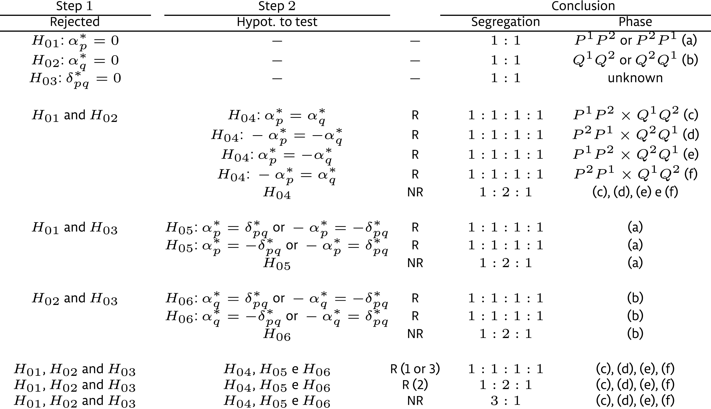

```{r setup, include=FALSE}
knitr::opts_chunk$set(echo = TRUE, cache = TRUE, tidy = TRUE, fig.width = 7, dpi = 400, warning = FALSE)
```

# Full-sib populations

For species that tolerate inbreeding, inbred lines can be used as parents of mapping populations such as backcrosses, $F_2$ and recombinant inbred lines. For such populations, the $F_1$ progeny does not segregate, e.g. $AA \times aa \rightarrow 100\% Aa$. For species that do not tolerate inbreeding (that is, outcrossing species), outbred parents are crossed and the $F_1$ progeny segregates, e.g. $ab \times cd \rightarrow 25\% ac : 25\% ad : 25\% bc : 25\% bc$. 

Four alleles $a$, $b$, $c$ and $d$ are codominant among them, but dominant over $o$. The table below lists all possible crosses that a molecular marker can reveal in $F_1$ progenies derived from outbred parents:

| Type     |              |    | Cross            | Progeny          | Segregation |
|----------|--------------|----|------------------|------------------|-------------|
| A        |              | 1  | $ab \times cd$   | $ac,ad,bc,bd$    | 1:1:1:1     |
|          |              | 2  | $ab \times ac$   | $aa,ac,ab,bc$    | 1:1:1:1     |
|          |              | 3  | $ab \times co$   | $ac,ao,bc,bo$    | 1:1:1:1     |
|          |              | 4  | $ao \times bo$   | $ab,ao,bo,oo$    | 1:1:1:1     |
| B        |  B$_1$       | 5  | $ab \times ao$   | $ab,2a\_,bo$     | 1:2:1       |
|          |  B$_2$       | 6  | $ao \times ab$   | $ab,2a\_,bo$     | 1:2:1       |
|          |  B$_3$       | 7  | $ab \times ab$   | $aa,2ab,bb$      | 1:2:1       |
| C        |              | 8  | $ao \times ao$   | $3a\_,oo$        | 3:1         |
| D        |  D$_1$       | 9  | $ab \times cc$   | $ac,bc$          | 1:1         |
|          |              | 10 | $ab \times aa$   | $aa,ab$          | 1:1         |
|          |              | 11 | $ab \times oo$   | $ao,bo$          | 1:1         |
|          |              | 12 | $bo \times aa$   | $ab,ao$          | 1:1         |
|          |              | 13 | $ao \times oo$   | $ao,oo$          | 1:1         |
|          |  D$_2$       | 14 | $cc \times ab$   | $ac,bc$          | 1:1         |
|          |              | 15 | $aa \times ab$   | $aa,ab$          | 1:1         |
|          |              | 16 | $oo \times ab$   | $ao,bo$          | 1:1         |
|          |              | 17 | $aa \times bo$   | $ab,ao$          | 1:1         |
|          |              | 18 | $oo \times ao$   | $ao,oo$          | 1:1         |

OneMap [@Margarido2007] and fullsibQTL [@Gazaffi2020] R packages were created to deal with this complexity. [OneMap](https://github.com/augusto-garcia/onemap) is based on @Wu2002b and @Wu2002f, whereas [fullsibQTL](https://github.com/augusto-garcia/fullsibQTL) is based on @Gazaffi2014. Please find the references at the end.

# Linkage map construction

To build the linkage map, we are going to use the OneMap package, but we data that exists within the fullsibQTL package, so we need to install and load both of them.

```{r, eval=FALSE}
install.packages("onemap")
install.packages("devtools")
devtools::install_github("guilherme-pereira/fullsibQTL") # fixes small error related to %||% function; soon to be available at augusto-garcia/fullsibQTL
```

Then, we load their functions using the function `library()` and load the data from `inputfile` using the function `read_onemap()`:

```{r, message=FALSE}
library(onemap)
library(fullsibQTL)
inputfile <- system.file("extdata", "example_QTLfullsib.raw", package = "fullsibQTL")
fs_data <- read_onemap(inputfile = inputfile)
```

There are some functions associated with such data that help us to visualize and understand it better:

```{r, fig.width=7}
print(fs_data)
plot(fs_data)
plot(fs_data, all = FALSE)
plot_by_segreg_type(fs_data)
```

Our fist step of the linkage analysis starts with segregation tests. We use the function `test_segregation()` to compute the chi-square as its associated $P$ value for each marker, depending on their expected segregation:

```{r}
segreg_test <- test_segregation(fs_data)
head(print(segreg_test))
plot(segreg_test)
no_dist <- select_segreg(segreg_test, distorted = FALSE, numbers = TRUE)
length(no_dist)
```

Most markers do follow the expected segregation, but 18\% of the markers is distorted. We decide to proceed with the analyses without them.

Next, we estimate the pairwise recombination fraction (two-point estimation):

```{r}
twopts <- rf_2pts(fs_data)
twopts
print(twopts, c("M1", "M2"))
mark_no_dist <- make_seq(twopts, no_dist)
```

And use the sequence of markers created by the function `make_seq()` to group them into linkage groups by using the function `group()`:

```{r}
LOD_sug <- suggest_lod(fs_data)
LOD_sug
LGs <- group(mark_no_dist, LOD=LOD_sug)
LGs
print(LGs, detailed = FALSE)
```

We define the Kosambi map function using the `set_map_fun()`, and estimate the final multipoint genetic map (recombination fractions computed via hidden Markov models) from one of the ordering algorithms available:

```{r}
set_map_fun(type = "kosambi")
LG1 <- make_seq(LGs, 1)
LG2 <- make_seq(LGs, 2)
LG3 <- make_seq(LGs, 3)
LG4 <- make_seq(LGs, 4)
LG1 <- record(LG1)
LG1
LG2 <- order_seq(LG2)
LG2 <- make_seq(LG2, "force")
LG2
LG3 <- order_seq(LG3)
LG3 <- make_seq(LG3, "force")
LG3
LG4 <- ug(LG4)
LG4
```

Typically, we would need to go through a set of functions to order the markers within each linkage group, one by one. However, for the sake of time, we use the best order order provided by different functions as example:

```{r}
rf_graph_table(LG1)
rf_graph_table(LG2)
rf_graph_table(LG3)
rf_graph_table(LG4)
```

Finally, we can plot the map using the function `draw_map()`:

```{r}
draw_map(map.list = list(LG1, LG2, LG3, LG4), names = TRUE, cex.mrk = 0.7)
```

# QTL mapping

To perform QTL mapping, we are going to use the fullsibQTL package. 

First, we create an object that combines the raw data `fs_data` use by OneMap and the map information:

```{r, results="hide"}
fs_map <- create_fullsib(fs_data, map.list = list(LG1, LG2, LG3, LG4), step = 1, map.function = "kosambi")
fs_map
```

## Interval mapping

As always, we can initially try to find QTL using the interval mapping model below:

$$y_i = \mu + \alpha^*_px^*_{pi} + \alpha^*_qx^*_{qi} + \delta^*_{pq}x^*_{pi}x^*_{qi} + \varepsilon_i$$

This model tests if any of the possible effects of a single QTL is significant:

```{r, results="hide"}
im <- im_scan(fullsib = fs_map, pheno.col = 1)
summary(im)
```

To declare QTL, we perform the 1,000 permutation tests:

```{r, eval=FALSE}
set.seed(1234)
im_perm <- im_scan(fs_map, pheno.col = 1, n.perm = 1000)
save(im_perm, file = "im_perm.Rdata")
```

Then, use the $\alpha = 0.05$ to be our threshold:

```{r, fig.width=7}
load("im_perm.Rdata")
summary(im_perm, alpha = 0.05)
im_thr <- summary(im_perm, alpha = 0.05, verbose = FALSE)[1,1]
plot(im, col = "blue", lty = 2, main = "Interval Mapping (IM)")
abline(h = im_thr, col = "blue", lty = 2)
```

## Composite interval mapping

If we want to increase statistical power, we can use the composite interval mapping model below:

$$y_i = \boldsymbol{Z}_i\boldsymbol{\beta} + \alpha^*_px^*_{pi} + \alpha^*_qx^*_{qi} + \delta^*_{pq}x^*_{pi}x^*_{qi} + \varepsilon_i$$

The cofactors (marker covariates) - 10 in our case - are selected using the `cof_selection()` function:

```{r}
cofs_fs <- cof_selection(fs_map, pheno.col = 1, k = log(300), n.cofactor = 10)
plot(cofs_fs)
```

Then, we can proceed with the CIM scan:

```{r, results="hide"}
cim <- cim_scan(fullsib = cofs_fs, ws = 10, pheno.col = 1)
```

Again, 1,000 permutation tests is used to define a threshold: 

```{r, eval=FALSE}
cim_perm <- cim_scan(fullsib = cofs_fs, pheno.col = 1, n.perm = 1000)
save(cim_perm, file = "cim_perm.Rdata")
```

```{r, fig.width=7}
load("cim_perm.Rdata")
summary(cim_perm, alpha = 0.05)
cim_thr <- summary(cim_perm, alpha = 0.05, verbose = FALSE)[1,1]
plot(cim, col= "red", main = "Composite Interval Mapping (CIM)")
abline(h = cim_thr, col = "red")
```

Now we can compare IM and CIM results:

```{r}
plot(cim, col = "red", main = c("IM vs. CIM"))
abline(h = cim_thr, col = "red")
plot(im, col = "blue", lty=2, add=TRUE)
abline(h = im_thr, col = "blue", lty=2)
legend("topright", legend = c("IM", "CIM"), lwd = 2, lty = c(2,1), col = c("blue", "red"))
```

The function `summary()` only shows the highest peak per chromosome, so we would have to investigate manually peak by peak and annotate their positions:

```{r}
summary(cim, thr = cim_thr)
# cim[cim[,"lg"] == 1 & cim[,"LOD"] > cim_thr,]
# cim[cim[,"lg"] == 2 & cim[,"LOD"] > cim_thr,]
# cim[cim[,"lg"] == 3 & cim[,"LOD"] > cim_thr,]
# cim[cim[,"lg"] == 4 & cim[,"LOD"] > cim_thr,]
```

The function below takes the scan object and the threshold, and locates all peaks within each linkage group more easily:

```{r}
find_peaks <- function(obj, thr) {
  nlgs <- length(unique(obj[,"lg"]))
  peaks <- vector("list", nlgs)
  peaks1 <- c()
  for(c in 1:nlgs) {
    temp0 <- obj[obj[,"lg"] == c,]
    if(any(temp0[,"LOD"] > thr)) {
      temp1 <- temp0[temp0[,"LOD"] > thr,]
      ranges <- c(0, which(diff(temp1[,"pos.cM"]) > 2), nrow(temp1))
      for(pos in 1:(length(ranges)-1)) {
        peaks[[c]] <- c(peaks[[c]], names(which.max(temp1[(ranges[pos]+1):ranges[pos+1],"LOD"])))
      }
    }
    peaks0 <- temp0[which(rownames(temp0) %in% peaks[[c]]),]
    peaks1 <- rbind(peaks1, peaks0)
  }
  rownames(peaks1) <- unlist(peaks)
  return(peaks1)
}
peaks <- find_peaks(cim, cim_thr)
knitr::kable(peaks)
```

For what is worth it, here's some `ggplot2` code for the same plot plus triangles representing the QTL:

```{r}
library(ggplot2)
cim <- as.data.frame(cim)
peaks <- as.data.frame(peaks)
ggplot() +
  geom_line(data = cim, aes(x = pos.cM, y = LOD), color = "red") +
  geom_point(data = peaks, aes(x = pos.cM), y = 0, shape = 6, color = "red") +
  geom_abline(intercept = cim_thr, slope = 0, color = "red") +
  labs(title = "Composite Interval Mapping (CIM)", x = "Position (cM)") +
  facet_grid(~ lg, scales = "free_x") + 
  scale_x_continuous(breaks = seq(0, 200, 30), labels = seq(0, 200, 30)) +
  theme_minimal()
```

Given the information from the plot and function above, we end up with eight QTL: 

```{r}
QTL1 <- cim_char(fullsib = cofs_fs, pheno.col = 1, lg = 1, pos = 15)
QTL2 <- cim_char(fullsib = cofs_fs, pheno.col = 1, lg = 1, pos = 125)
QTL3 <- cim_char(fullsib = cofs_fs, pheno.col = 1, lg = 2, pos = 21)
QTL4 <- cim_char(fullsib = cofs_fs, pheno.col = 1, lg = 2, pos = 61)
QTL5 <- cim_char(fullsib = cofs_fs, pheno.col = 1, lg = 2, pos = 87)
QTL6 <- cim_char(fullsib = cofs_fs, pheno.col = 1, lg = 3, pos = 23)
QTL7 <- cim_char(fullsib = cofs_fs, pheno.col = 1, lg = 3, pos = 71)
QTL8 <- cim_char(fullsib = cofs_fs, pheno.col = 1, lg = 4, pos = 45)
```

The hypotheses tested within `cim_char()` function below are derived from the following table:



```{r}
knitr::kable(cbind(QTL1, QTL2, QTL3, QTL4, QTL5, QTL6, QTL7, QTL8))
```

Segregation and phase of each QTL can be obtained from the functions `get_segr()` and `draw_phase()`, respectively:

```{r}
get_segr(QTL1)
draw_phase(fullsib = cofs_fs, fullsib.char = QTL1)
get_segr(QTL2)
draw_phase(fullsib = cofs_fs, fullsib.char = QTL2)
get_segr(QTL3)
draw_phase(fullsib = cofs_fs, fullsib.char = QTL3)
get_segr(QTL4)
draw_phase(fullsib = cofs_fs, fullsib.char = QTL4)
get_segr(QTL5)
draw_phase(fullsib = cofs_fs, fullsib.char = QTL5)
get_segr(QTL6)
draw_phase(fullsib = cofs_fs, fullsib.char = QTL6)
get_segr(QTL7)
draw_phase(fullsib = cofs_fs, fullsib.char = QTL7)
get_segr(QTL8)
draw_phase(fullsib = cofs_fs, fullsib.char = QTL8)
```

The $R^2$ for each QTL and all of them combined is computed by the function `r2_ls()` below:

```{r}
qtls.cim <- r2_ls(fs_map, pheno.col = 1, lg = c(1, 1, 2, 2, 2, 3, 3, 4), pos = c("M3", "M14", "M21", "M25", "M27", "M33", "M38", "M53"))
knitr::kable(qtls.cim)
```

# References