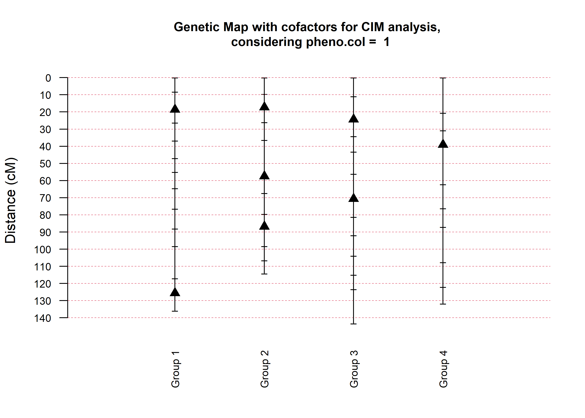

# Full-sib populations

For species that tolerate inbreeding, inbred lines can be used as parents of mapping populations such as backcrosses, $F_2$ and recombinant inbred lines. For such populations, the $F_1$ progeny does not segregate, e.g. $AA \times aa \rightarrow 100\% Aa$. For species that do not tolerate inbreeding (that is, outcrossing species), outbred parents are crossed and the $F_1$ progeny segregates, e.g. $ab \times cd \rightarrow 25\% ac : 25\% ad : 25\% bc : 25\% bc$. 

Four alleles $a$, $b$, $c$ and $d$ are codominant among them, but dominant over $o$. The table below lists all possible crosses that a molecular marker can reveal in $F_1$ progenies derived from outbred parents:

| Type     |              |    | Cross            | Progeny          | Segregation |
|----------|--------------|----|------------------|------------------|-------------|
| A        |              | 1  | $ab \times cd$   | $ac,ad,bc,bd$    | 1:1:1:1     |
|          |              | 2  | $ab \times ac$   | $aa,ac,ab,bc$    | 1:1:1:1     |
|          |              | 3  | $ab \times co$   | $ac,ao,bc,bo$    | 1:1:1:1     |
|          |              | 4  | $ao \times bo$   | $ab,ao,bo,oo$    | 1:1:1:1     |
| B        |  B$_1$       | 5  | $ab \times ao$   | $ab,2a\_,bo$     | 1:2:1       |
|          |  B$_2$       | 6  | $ao \times ab$   | $ab,2a\_,bo$     | 1:2:1       |
|          |  B$_3$       | 7  | $ab \times ab$   | $aa,2ab,bb$      | 1:2:1       |
| C        |              | 8  | $ao \times ao$   | $3a\_,oo$        | 3:1         |
| D        |  D$_1$       | 9  | $ab \times cc$   | $ac,bc$          | 1:1         |
|          |              | 10 | $ab \times aa$   | $aa,ab$          | 1:1         |
|          |              | 11 | $ab \times oo$   | $ao,bo$          | 1:1         |
|          |              | 12 | $bo \times aa$   | $ab,ao$          | 1:1         |
|          |              | 13 | $ao \times oo$   | $ao,oo$          | 1:1         |
|          |  D$_2$       | 14 | $cc \times ab$   | $ac,bc$          | 1:1         |
|          |              | 15 | $aa \times ab$   | $aa,ab$          | 1:1         |
|          |              | 16 | $oo \times ab$   | $ao,bo$          | 1:1         |
|          |              | 17 | $aa \times bo$   | $ab,ao$          | 1:1         |
|          |              | 18 | $oo \times ao$   | $ao,oo$          | 1:1         |

OneMap [@Margarido2007] and fullsibQTL [@Gazaffi2020] R packages were created to deal with this complexity. [OneMap](https://github.com/augusto-garcia/onemap) is based on @Wu2002b and @Wu2002f, whereas [fullsibQTL](https://github.com/augusto-garcia/fullsibQTL) is based on @Gazaffi2014. Please find the references at the end.

# Linkage map construction

To build the linkage map, we are going to use the OneMap package, but we data that exists within the fullsibQTL package, so we need to install and load both of them.


```r
install.packages("onemap")
install.packages("devtools")
devtools::install_github("guilherme-pereira/fullsibQTL")  # fixes small error related to %||% function; soon to be available at augusto-garcia/fullsibQTL
```

Then, we load their functions using the function `library()` and load the data from `inputfile` using the function `read_onemap()`:


```r
library(onemap)
library(fullsibQTL)
inputfile <- system.file("extdata", "example_QTLfullsib.raw", package = "fullsibQTL")
fs_data <- read_onemap(inputfile = inputfile)
```

```
##  Working...
## 
##  --Read the following data:
## 	Type of cross:           outcross 
## 	Number of individuals:   300 
## 	Number of markers:       65 
## 	Chromosome information:  no 
## 	Position information:    no 
## 	Number of traits:        2 
## 	Missing trait values:       
## 	 pheno1: 0 
## 	 pheno2: 0
```

There are some functions associated with such data that help us to visualize and understand it better:


```r
print(fs_data)
```

```
##   This is an object of class 'onemap'
##     Type of cross:      outcross 
##     No. individuals:    300 
##     No. markers:        65 
##     CHROM information:  no 
##     POS information:    no 
##     Percent genotyped:  100 
## 
##     Segregation types:
##                 A.1 -->  15
##                 A.4 -->  1
##                B1.5 -->  5
##                B2.6 -->  6
##                B3.7 -->  6
##                 C.8 -->  11
##                D1.9 -->  10
##               D2.14 -->  10
##               D2.18 -->  1
## 
##     No. traits:         2 
##     Missing trait values: 
## 	 pheno1: 0 
## 	 pheno2: 0
```

```r
plot(fs_data)
```

<!-- -->

```r
plot(fs_data, all = FALSE)
```

<!-- -->

```r
plot_by_segreg_type(fs_data)
```

<!-- -->

Our fist step of the linkage analysis starts with segregation tests. We use the function `test_segregation()` to compute the chi-square as its associated $P$ value for each marker, depending on their expected segregation:


```r
segreg_test <- test_segregation(fs_data)
head(print(segreg_test))
```

```
##   Marker      H0 Chi-square   p-value % genot.
## 1     M1     3:1 0.16000000 0.6891565      100
## 2     M2 1:1:1:1 0.93333333 0.8173772      100
## 3     M3     1:1 0.01333333 0.9080726      100
## 4     M4     3:1 0.07111111 0.7897258      100
## 5     M5   1:2:1 3.01333333 0.2216476      100
## 6     M6   1:2:1 3.04000000 0.2187119      100
```

```r
plot(segreg_test)
```

<!-- -->

```r
no_dist <- select_segreg(segreg_test, distorted = FALSE, numbers = TRUE)
length(no_dist)
```

```
## [1] 53
```

Most markers do follow the expected segregation, but 18\% of the markers is distorted. We decide to proceed with the analyses without them.

Next, we estimate the pairwise recombination fraction (two-point estimation):


```r
twopts <- rf_2pts(fs_data)
```

```
## Computing 2080 recombination fractions ...
```

```r
twopts
```

```
##   This is an object of class 'rf_2pts'
## 
##   Criteria: LOD = 3 , Maximum recombination fraction = 0.5 
## 
##   This object is too complex to print
##   Type 'print(object, c(mrk1=marker, mrk2=marker))' to see
##     the analysis for two markers
##     mrk1 and mrk2 can be the names or numbers of both markers
```

```r
print(twopts, c("M1", "M2"))
```

```
##   Results of the 2-point analysis for markers: M1 and M2 
##   Criteria: LOD =  3 , Maximum recombination fraction =  0.5 
## 
##           rf        LOD
## CC 0.0821610 39.4608413
## CR 0.4768348  0.1140935
## RC 0.5231652  0.1140935
## RR 0.9178390 39.4608413
```

```r
mark_no_dist <- make_seq(twopts, no_dist)
```

And use the sequence of markers created by the function `make_seq()` to group them into linkage groups by using the function `group()`:


```r
LOD_sug <- suggest_lod(fs_data)
LOD_sug
```

```
## [1] 3.874666
```

```r
LGs <- group(mark_no_dist, LOD = LOD_sug)
```

```
##    Selecting markers: 
## 	  group    1 
## 	   .............
## 	  group    2 
## 	   ...........
## 	  group    3 
## 	   ............
## 	  group    4 
## 	   .........
```

```r
LGs
```

```
##   This is an object of class 'group'
##   It was generated from the object "mark_no_dist"
## 
##   Criteria used to assign markers to groups:
##     LOD = 3.874666 , Maximum recombination fraction = 0.5 
## 
##   No. markers:            53 
##   No. groups:             4 
##   No. linked markers:     49 
##   No. unlinked markers:   4 
## 
##   Printing groups:
##   Group 1 : 14 markers
##     M1 M2 M3 M4 M5 M6 M7 M8 M9 M10 M11 M13 M14 M15 
## 
##   Group 2 : 12 markers
##     M18 M19 M20 M21 M22 M24 M25 M26 M27 M28 M29 M30 
## 
##   Group 3 : 13 markers
##     M31 M32 M33 M34 M35 M36 M38 M39 M40 M41 M42 M43 M45 
## 
##   Group 4 : 10 markers
##     M46 M48 M49 M50 M53 M54 M55 M57 M58 M59 
## 
##   Unlinked markers: 4  markers
##     M61 M62 M63 M64
```

```r
print(LGs, detailed = FALSE)
```

```
##   This is an object of class 'group'
##   It was generated from the object "mark_no_dist"
## 
##   Criteria used to assign markers to groups:
##     LOD = 3.874666 , Maximum recombination fraction = 0.5 
## 
##   No. markers:            53 
##   No. groups:             4 
##   No. linked markers:     49 
##   No. unlinked markers:   4
```

We define the Kosambi map function using the `set_map_fun()`, and estimate the final multipoint genetic map (recombination fractions computed via hidden Markov models) from one of the ordering algorithms available:


```r
set_map_fun(type = "kosambi")
LG1 <- make_seq(LGs, 1)
LG2 <- make_seq(LGs, 2)
LG3 <- make_seq(LGs, 3)
LG4 <- make_seq(LGs, 4)
LG1 <- record(LG1)
```

```
## 
## order obtained using RECORD algorithm:
## 
##  1 2 3 4 5 6 7 8 9 10 11 13 14 15 
## 
## calculating multipoint map using tol 1e-04 .
```

```r
LG1
```

```
## 
## Printing map:
## 
## Markers           Position           Parent 1       Parent 2
## 
##  1 M1                 0.00           a |  | o       a |  | o 
##  2 M2                 8.29           a |  | b       c |  | d 
##  3 M3                18.57           c |  | c       a |  | b 
##  4 M4                26.30           a |  | o       a |  | o 
##  5 M5                36.78           a |  | b       a |  | b 
##  6 M6                47.09           a |  | b       a |  | b 
##  7 M7                55.05           a |  | o       a |  | o 
##  8 M8                64.59           a |  | o       a |  | o 
##  9 M9                76.48           a |  | b       c |  | d 
## 10 M10               88.09           a |  | b       c |  | c 
## 11 M11               98.30           a |  | b       c |  | d 
## 13 M13              117.07           a |  | b       c |  | c 
## 14 M14              125.52           a |  | b       c |  | d 
## 15 M15              136.01           a |  | b       c |  | d 
## 
## 14 markers            log-likelihood: -3449.768
```

```r
LG2 <- order_seq(LG2)
```

```
## 
  |                                                                            
  |                                                                      |   0%
  |                                                                            
  |=                                                                     |   2%
  |                                                                            
  |==                                                                    |   3%
  |                                                                            
  |====                                                                  |   5%
  |                                                                            
  |=====                                                                 |   7%
  |                                                                            
  |======                                                                |   8%
  |                                                                            
  |=======                                                               |  10%
  |                                                                            
  |========                                                              |  12%
  |                                                                            
  |=========                                                             |  13%
  |                                                                            
  |==========                                                            |  15%
  |                                                                            
  |============                                                          |  17%
  |                                                                            
  |=============                                                         |  18%
  |                                                                            
  |==============                                                        |  20%
  |                                                                            
  |===============                                                       |  22%
  |                                                                            
  |================                                                      |  23%
  |                                                                            
  |==================                                                    |  25%
  |                                                                            
  |===================                                                   |  27%
  |                                                                            
  |====================                                                  |  28%
  |                                                                            
  |=====================                                                 |  30%
  |                                                                            
  |======================                                                |  32%
  |                                                                            
  |=======================                                               |  33%
  |                                                                            
  |========================                                              |  35%
  |                                                                            
  |==========================                                            |  37%
  |                                                                            
  |===========================                                           |  38%
  |                                                                            
  |============================                                          |  40%
  |                                                                            
  |=============================                                         |  42%
  |                                                                            
  |==============================                                        |  43%
  |                                                                            
  |================================                                      |  45%
  |                                                                            
  |=================================                                     |  47%
  |                                                                            
  |==================================                                    |  48%
  |                                                                            
  |===================================                                   |  50%
  |                                                                            
  |====================================                                  |  52%
  |                                                                            
  |=====================================                                 |  53%
  |                                                                            
  |======================================                                |  55%
  |                                                                            
  |========================================                              |  57%
  |                                                                            
  |=========================================                             |  58%
  |                                                                            
  |==========================================                            |  60%
  |                                                                            
  |===========================================                           |  62%
  |                                                                            
  |============================================                          |  63%
  |                                                                            
  |==============================================                        |  65%
  |                                                                            
  |===============================================                       |  67%
  |                                                                            
  |================================================                      |  68%
  |                                                                            
  |=================================================                     |  70%
  |                                                                            
  |==================================================                    |  72%
  |                                                                            
  |===================================================                   |  73%
  |                                                                            
  |====================================================                  |  75%
  |                                                                            
  |======================================================                |  77%
  |                                                                            
  |=======================================================               |  78%
  |                                                                            
  |========================================================              |  80%
  |                                                                            
  |=========================================================             |  82%
  |                                                                            
  |==========================================================            |  83%
  |                                                                            
  |============================================================          |  85%
  |                                                                            
  |=============================================================         |  87%
  |                                                                            
  |==============================================================        |  88%
  |                                                                            
  |===============================================================       |  90%
  |                                                                            
  |================================================================      |  92%
  |                                                                            
  |=================================================================     |  93%
  |                                                                            
  |==================================================================    |  95%
  |                                                                            
  |====================================================================  |  97%
  |                                                                            
  |===================================================================== |  98%
  |                                                                            
  |======================================================================| 100%
```

```r
LG2 <- make_seq(LG2, "force")
LG2
```

```
## 
## Printing map:
## 
## Markers           Position           Parent 1       Parent 2
## 
## 18 M18                0.00           a |  | b       c |  | d 
## 19 M19                9.67           c |  | c       a |  | b 
## 20 M20               17.30           a |  | b       c |  | c 
## 21 M21               26.09           a |  | b       a |  | b 
## 22 M22               36.47           a |  | b       c |  | c 
## 24 M24               57.51           a |  | o       a |  | o 
## 25 M25               67.41           c |  | c       a |  | b 
## 26 M26               79.55           a |  | b       c |  | d 
## 27 M27               86.77           c |  | c       a |  | b 
## 28 M28               98.36           c |  | c       a |  | b 
## 29 M29              106.58           a |  | b       c |  | d 
## 30 M30              114.31           c |  | c       a |  | b 
## 
## 12 markers            log-likelihood: -2254.32
```

```r
LG3 <- order_seq(LG3)
```

```
## 
  |                                                                            
  |                                                                      |   0%
  |                                                                            
  |=                                                                     |   2%
  |                                                                            
  |==                                                                    |   3%
  |                                                                            
  |====                                                                  |   5%
  |                                                                            
  |=====                                                                 |   7%
  |                                                                            
  |======                                                                |   8%
  |                                                                            
  |=======                                                               |  10%
  |                                                                            
  |========                                                              |  12%
  |                                                                            
  |=========                                                             |  13%
  |                                                                            
  |==========                                                            |  15%
  |                                                                            
  |============                                                          |  17%
  |                                                                            
  |=============                                                         |  18%
  |                                                                            
  |==============                                                        |  20%
  |                                                                            
  |===============                                                       |  22%
  |                                                                            
  |================                                                      |  23%
  |                                                                            
  |==================                                                    |  25%
  |                                                                            
  |===================                                                   |  27%
  |                                                                            
  |====================                                                  |  28%
  |                                                                            
  |=====================                                                 |  30%
  |                                                                            
  |======================                                                |  32%
  |                                                                            
  |=======================                                               |  33%
  |                                                                            
  |========================                                              |  35%
  |                                                                            
  |==========================                                            |  37%
  |                                                                            
  |===========================                                           |  38%
  |                                                                            
  |============================                                          |  40%
  |                                                                            
  |=============================                                         |  42%
  |                                                                            
  |==============================                                        |  43%
  |                                                                            
  |================================                                      |  45%
  |                                                                            
  |=================================                                     |  47%
  |                                                                            
  |==================================                                    |  48%
  |                                                                            
  |===================================                                   |  50%
  |                                                                            
  |====================================                                  |  52%
  |                                                                            
  |=====================================                                 |  53%
  |                                                                            
  |======================================                                |  55%
  |                                                                            
  |========================================                              |  57%
  |                                                                            
  |=========================================                             |  58%
  |                                                                            
  |==========================================                            |  60%
  |                                                                            
  |===========================================                           |  62%
  |                                                                            
  |============================================                          |  63%
  |                                                                            
  |==============================================                        |  65%
  |                                                                            
  |===============================================                       |  67%
  |                                                                            
  |================================================                      |  68%
  |                                                                            
  |=================================================                     |  70%
  |                                                                            
  |==================================================                    |  72%
  |                                                                            
  |===================================================                   |  73%
  |                                                                            
  |====================================================                  |  75%
  |                                                                            
  |======================================================                |  77%
  |                                                                            
  |=======================================================               |  78%
  |                                                                            
  |========================================================              |  80%
  |                                                                            
  |=========================================================             |  82%
  |                                                                            
  |==========================================================            |  83%
  |                                                                            
  |============================================================          |  85%
  |                                                                            
  |=============================================================         |  87%
  |                                                                            
  |==============================================================        |  88%
  |                                                                            
  |===============================================================       |  90%
  |                                                                            
  |================================================================      |  92%
  |                                                                            
  |=================================================================     |  93%
  |                                                                            
  |==================================================================    |  95%
  |                                                                            
  |====================================================================  |  97%
  |                                                                            
  |===================================================================== |  98%
  |                                                                            
  |======================================================================| 100%
```

```r
LG3 <- make_seq(LG3, "force")
LG3
```

```
## 
## Printing map:
## 
## Markers           Position           Parent 1       Parent 2
## 
## 31 M31                0.00           a |  | b       c |  | d 
## 32 M32               11.02           c |  | c       a |  | b 
## 33 M33               24.34           a |  | b       a |  | b 
## 34 M34               34.31           a |  | o       a |  | o 
## 35 M35               43.31           a |  | b       c |  | c 
## 36 M36               56.19           c |  | c       a |  | b 
## 38 M38               70.63           a |  | b       c |  | c 
## 39 M39               81.28           a |  | b       c |  | d 
## 40 M40               92.06           a |  | o       a |  | o 
## 41 M41              103.90           a |  | b       a |  | b 
## 42 M42              115.00           a |  | b       c |  | d 
## 43 M43              123.41           a |  | b       c |  | c 
## 45 M45              143.42           a |  | b       c |  | c 
## 
## 13 markers            log-likelihood: -2829.672
```

```r
LG4 <- ug(LG4)
```

```
## 
## order obtained using UG algorithm:
## 
##  46 48 49 50 53 54 55 57 58 59 
## 
## calculating multipoint map using tol  1e-04 .
```

```r
LG4
```

```
## 
## Printing map:
## 
## Markers           Position           Parent 1       Parent 2
## 
## 46 M46                0.00           a |  | b       c |  | d 
## 48 M48               20.58           a |  | o       a |  | o 
## 49 M49               30.87           a |  | b       c |  | d 
## 50 M50               39.03           a |  | o       a |  | o 
## 53 M53               62.23           a |  | b       c |  | c 
## 54 M54               76.32           a |  | o       a |  | o 
## 55 M55               87.17           c |  | c       a |  | b 
## 57 M57              107.73           c |  | c       a |  | b 
## 58 M58              122.09           a |  | b       c |  | d 
## 59 M59              131.88           a |  | b       c |  | c 
## 
## 10 markers            log-likelihood: -2677.736
```

Typically, we would need to go through a set of functions to order the markers within each linkage group, one by one. However, for the sake of time, we use the best order order provided by different functions as example:


```r
rf_graph_table(LG1)
```

<!-- -->

```r
rf_graph_table(LG2)
```

<!-- -->

```r
rf_graph_table(LG3)
```

<!-- -->

```r
rf_graph_table(LG4)
```

<!-- -->

Finally, we can plot the map using the function `draw_map()`:


```r
draw_map(map.list = list(LG1, LG2, LG3, LG4), names = TRUE, cex.mrk = 0.7)
```

<!-- -->

# QTL mapping

To perform QTL mapping, we are going to use the fullsibQTL package. 

First, we create an object that combines the raw data `fs_data` use by OneMap and the map information:


```r
fs_map <- create_fullsib(fs_data, map.list = list(LG1, LG2, LG3, LG4), step = 1,
    map.function = "kosambi")
fs_map
```

## Interval mapping

As always, we can initially try to find QTL using the interval mapping model below:

$$y_i = \mu + \alpha^*_px^*_{pi} + \alpha^*_qx^*_{qi} + \delta^*_{pq}x^*_{pi}x^*_{qi} + \varepsilon_i$$

This model tests if any of the possible effects of a single QTL is significant:


```r
im <- im_scan(fullsib = fs_map, pheno.col = 1)
summary(im)
```

To declare QTL, we perform the 1,000 permutation tests:


```r
set.seed(1234)
im_perm <- im_scan(fs_map, pheno.col = 1, n.perm = 1000)
save(im_perm, file = "im_perm.Rdata")
```

Then, use the $\alpha = 0.05$ to be our threshold:


```r
load("im_perm.Rdata")
summary(im_perm, alpha = 0.05)
```

```
##  Threshold considering 1000 permutations
##  First column indicates 'classical' threshold showed by Churchill and Doerge, 1994
##  Second column means threshold values suggested by Chen and Storey, 2006
```

```
##        peak.1   peak.2
## 0.05 3.511084 2.432988
```

```r
im_thr <- summary(im_perm, alpha = 0.05, verbose = FALSE)[1, 1]
plot(im, col = "blue", lty = 2, main = "Interval Mapping (IM)")
abline(h = im_thr, col = "blue", lty = 2)
```

<!-- -->

## Composite interval mapping

If we want to increase statistical power, we can use the composite interval mapping model below:

$$y_i = \boldsymbol{Z}_i\boldsymbol{\beta} + \alpha^*_px^*_{pi} + \alpha^*_qx^*_{qi} + \delta^*_{pq}x^*_{pi}x^*_{qi} + \varepsilon_i$$

The cofactors (marker covariates) - 10 in our case - are selected using the `cof_selection()` function:


```r
cofs_fs <- cof_selection(fs_map, pheno.col = 1, k = log(300), n.cofactor = 10)
```

```
## Number of Cofactors selected: 1 ... 2 ... 3 ... 4 ... 5 ... 6 ... 7 ... 8 ... done
```

```r
plot(cofs_fs)
```

<!-- -->

Then, we can proceed with the CIM scan:


```r
cim <- cim_scan(fullsib = cofs_fs, ws = 10, pheno.col = 1)
```

Again, 1,000 permutation tests is used to define a threshold: 


```r
cim_perm <- cim_scan(fullsib = cofs_fs, pheno.col = 1, n.perm = 1000)
save(cim_perm, file = "cim_perm.Rdata")
```


```r
load("cim_perm.Rdata")
summary(cim_perm, alpha = 0.05)
```

```
##  Threshold considering 1000 permutations
```

```
##        peak.1   peak.2   peak.3   peak.4
## 0.05 4.013218 2.847424 2.280803 1.756119
```

```r
cim_thr <- summary(cim_perm, alpha = 0.05, verbose = FALSE)[1, 1]
plot(cim, col = "red", main = "Composite Interval Mapping (CIM)")
abline(h = cim_thr, col = "red")
```

<!-- -->

Now we can compare IM and CIM results:


```r
plot(cim, col = "red", main = c("IM vs. CIM"))
abline(h = cim_thr, col = "red")
plot(im, col = "blue", lty = 2, add = TRUE)
abline(h = im_thr, col = "blue", lty = 2)
legend("topright", legend = c("IM", "CIM"), lwd = 2, lty = c(2, 1), col = c("blue",
    "red"))
```

<!-- -->

The function `summary()` only shows the highest peak per chromosome, so we would have to investigate manually peak by peak and annotate their positions:


```r
summary(cim, thr = cim_thr)
```

```
##       lg pos.cM       LOD model
## loc15  1     15  5.494113     0
## loc21  2     21 12.174380     0
## loc71  3     71  7.905967     0
## loc45  4     45  8.091756     0
```

```r
# cim[cim[,'lg'] == 1 & cim[,'LOD'] > cim_thr,] cim[cim[,'lg'] == 2 &
# cim[,'LOD'] > cim_thr,] cim[cim[,'lg'] == 3 & cim[,'LOD'] > cim_thr,]
# cim[cim[,'lg'] == 4 & cim[,'LOD'] > cim_thr,]
```

The function below takes the scan object and the threshold, and locates all peaks within each linkage group more easily:


```r
find_peaks <- function(obj, thr) {
    nlgs <- length(unique(obj[, "lg"]))
    peaks <- vector("list", nlgs)
    peaks1 <- c()
    for (c in 1:nlgs) {
        temp0 <- obj[obj[, "lg"] == c, ]
        if (any(temp0[, "LOD"] > thr)) {
            temp1 <- temp0[temp0[, "LOD"] > thr, ]
            ranges <- c(0, which(diff(temp1[, "pos.cM"]) > 2), nrow(temp1))
            for (pos in 1:(length(ranges) - 1)) {
                peaks[[c]] <- c(peaks[[c]], names(which.max(temp1[(ranges[pos] +
                  1):ranges[pos + 1], "LOD"])))
            }
        }
        peaks0 <- temp0[which(rownames(temp0) %in% peaks[[c]]), ]
        peaks1 <- rbind(peaks1, peaks0)
    }
    rownames(peaks1) <- unlist(peaks)
    return(peaks1)
}
peaks <- find_peaks(cim, cim_thr)
knitr::kable(peaks)
```


|      | lg|   pos.cM|       LOD| model|
|:-----|--:|--------:|---------:|-----:|
|loc15 |  1|  15.0000|  5.494113|     0|
|M14   |  1| 125.5217|  4.826832|     0|
|loc21 |  2|  21.0000| 12.174380|     0|
|loc61 |  2|  61.0000|  7.649761|     0|
|loc87 |  2|  87.0000|  8.645440|     0|
|loc23 |  3|  23.0000|  6.487702|     0|
|loc71 |  3|  71.0000|  7.905967|     0|
|loc45 |  4|  45.0000|  8.091756|     0|

For what is worth it, here's some `ggplot2` code for the same plot plus triangles representing the QTL:


```r
library(ggplot2)
cim <- as.data.frame(cim)
peaks <- as.data.frame(peaks)
ggplot() + geom_line(data = cim, aes(x = pos.cM, y = LOD), color = "red") + geom_point(data = peaks,
    aes(x = pos.cM), y = 0, shape = 6, color = "red") + geom_abline(intercept = cim_thr,
    slope = 0, color = "red") + labs(title = "Composite Interval Mapping (CIM)",
    x = "Position (cM)") + facet_grid(~lg, scales = "free_x") + scale_x_continuous(breaks = seq(0,
    200, 30), labels = seq(0, 200, 30)) + theme_minimal()
```

<!-- -->

Given the information from the plot and function above, we end up with eight QTL: 


```r
QTL1 <- cim_char(fullsib = cofs_fs, pheno.col = 1, lg = 1, pos = 15)
QTL2 <- cim_char(fullsib = cofs_fs, pheno.col = 1, lg = 1, pos = 125)
QTL3 <- cim_char(fullsib = cofs_fs, pheno.col = 1, lg = 2, pos = 21)
QTL4 <- cim_char(fullsib = cofs_fs, pheno.col = 1, lg = 2, pos = 61)
QTL5 <- cim_char(fullsib = cofs_fs, pheno.col = 1, lg = 2, pos = 87)
QTL6 <- cim_char(fullsib = cofs_fs, pheno.col = 1, lg = 3, pos = 23)
QTL7 <- cim_char(fullsib = cofs_fs, pheno.col = 1, lg = 3, pos = 71)
QTL8 <- cim_char(fullsib = cofs_fs, pheno.col = 1, lg = 4, pos = 45)
```

The hypotheses tested within `cim_char()` function below are derived from the following table:


```r
knitr::kable(cbind(QTL1, QTL2, QTL3, QTL4, QTL5, QTL6, QTL7, QTL8))
```


|             |      M2-M3|     M13-M14|    M20-M21|    M24-M25|        M27|    M32-M33|        M38|    M50-M53|
|:------------|----------:|-----------:|----------:|----------:|----------:|----------:|----------:|----------:|
|LG           |  1.0000000|   1.0000000|  2.0000000|  2.0000000|  2.0000000|  3.0000000|  3.0000000|  4.0000000|
|pos          | 14.0000000| 124.0000000| 20.0000000| 60.0000000| 86.7676104| 22.0000000| 70.6301048| 44.0000000|
|-log10(pval) |  4.8701572|   4.2283553| 11.3200322|  6.9355684|  7.9552787|  5.8014811|  7.2228836|  7.3907618|
|LOD_Ha       |  5.4840039|   4.8168567| 12.0899477|  7.6140644|  8.6592243|  6.4471306|  7.9088934|  8.0810315|
|mu           | -0.1827467|  -0.2728064| -0.1953875| -0.0800127| -0.1177260| -0.0162989|  0.0030825|  0.0411382|
|alpha_p      |  1.5627064|  -0.2771685|  1.6404805| -0.7521899|  2.0082574|  1.4629215|  1.6371741|  1.7861678|
|LOD_H1       |  5.2143169|   0.1979365|  4.2768827|  0.4708942|  4.4349704|  4.2466223|  6.4180358|  5.8274013|
|alpha_q      | -0.2423797|  -1.3193820|  0.6538712| -1.2702779|  0.0082992| -1.0663265| -0.2046311|  1.1332518|
|LOD_H2       |  0.1433153|   4.3271240|  0.7324168|  2.0248274|  0.0001210|  1.9847061|  0.0712420|  2.5794944|
|delta_pq     | -0.2334113|   0.5106579| -1.8641405|  1.6601113| -1.3942585| -0.7584228|  0.8555226| -0.0081756|
|LOD_H3       |  0.1105743|   0.6322249|  6.3892582|  3.2307121|  3.9145687|  1.2706572|  1.5529075|  0.0001131|
|H4_pvalue    |  0.0026443|   0.0089484|  0.0582544|  0.4436995|  0.0003438|  0.3670598|  0.0017614|  0.1562159|
|H5_pvalue    |  0.0036544|   0.5567491|  0.6585139|  0.2407929|  0.2903649|  0.1087086|  0.0708428|  0.0007012|
|H6_pvalue    |  0.9831229|   0.0455018|  0.0173148|  0.5432953|  0.0069860|  0.5102534|  0.1399503|  0.0205353|
|model        |  0.0000000|   0.0000000|  0.0000000|  0.0000000|  0.0000000|  0.0000000|  0.0000000|  0.0000000|

Segregation and phase of each QTL can be obtained from the functions `get_segr()` and `draw_phase()`, respectively:


```r
get_segr(QTL1)
```

```
## QTL segregation is 1:1
```

```
## [1] "1:1"
```

```r
draw_phase(fullsib = cofs_fs, fullsib.char = QTL1)
```

```
## 
## Printing QTL and its linkage phase between markers across the LG:
## 
## Markers          Position           Parent 1       Parent 2
## 
## M1                   0.00           a  |  | o        a  |  | o  
## M2                   8.29           a  |  | b        c  |  | d  
## QTL                 14.00           P1 |  | P2       Q0 |  | Q0 
## M3                  18.57           c  |  | c        a  |  | b  
## M4                  26.30           a  |  | o        a  |  | o  
## M5                  36.78           a  |  | b        a  |  | b  
## M6                  47.09           a  |  | b        a  |  | b  
## M7                  55.05           a  |  | o        a  |  | o  
## M8                  64.59           a  |  | o        a  |  | o  
## M9                  76.48           a  |  | b        c  |  | d  
## M10                 88.09           a  |  | b        c  |  | c  
## M11                 98.30           a  |  | b        c  |  | d  
## M13                117.07           a  |  | b        c  |  | c  
## M14                125.52           a  |  | b        c  |  | d  
## M15                136.01           a  |  | b        c  |  | d  
## 
## P1 and Q1 have positive effect (increase phenotypic value)
## P2 and Q2 have negative effect (reduce phenotypic value) 
## P0 and Q0 have neutral effect (non signif.)
```

```r
get_segr(QTL2)
```

```
## QTL segregation is 1:1
```

```
## [1] "1:1"
```

```r
draw_phase(fullsib = cofs_fs, fullsib.char = QTL2)
```

```
## 
## Printing QTL and its linkage phase between markers across the LG:
## 
## Markers          Position           Parent 1       Parent 2
## 
## M1                   0.00           a  |  | o        a  |  | o  
## M2                   8.29           a  |  | b        c  |  | d  
## M3                  18.57           c  |  | c        a  |  | b  
## M4                  26.30           a  |  | o        a  |  | o  
## M5                  36.78           a  |  | b        a  |  | b  
## M6                  47.09           a  |  | b        a  |  | b  
## M7                  55.05           a  |  | o        a  |  | o  
## M8                  64.59           a  |  | o        a  |  | o  
## M9                  76.48           a  |  | b        c  |  | d  
## M10                 88.09           a  |  | b        c  |  | c  
## M11                 98.30           a  |  | b        c  |  | d  
## M13                117.07           a  |  | b        c  |  | c  
## QTL                124.00           P0 |  | P0       Q2 |  | Q1 
## M14                125.52           a  |  | b        c  |  | d  
## M15                136.01           a  |  | b        c  |  | d  
## 
## P1 and Q1 have positive effect (increase phenotypic value)
## P2 and Q2 have negative effect (reduce phenotypic value) 
## P0 and Q0 have neutral effect (non signif.)
```

```r
get_segr(QTL3)
```

```
## QTL segregation is 1:2:1
```

```r
draw_phase(fullsib = cofs_fs, fullsib.char = QTL3)
```

```
## 
## Printing QTL and its linkage phase between markers across the LG:
## 
## Markers          Position           Parent 1       Parent 2
## 
## M18                  0.00           a  |  | b        c  |  | d  
## M19                  9.67           c  |  | c        a  |  | b  
## M20                 17.30           a  |  | b        c  |  | c  
## QTL                 20.00           P1 |  | P2       Q0 |  | Q0 
## M21                 26.09           a  |  | b        a  |  | b  
## M22                 36.47           a  |  | b        c  |  | c  
## M24                 57.51           a  |  | o        a  |  | o  
## M25                 67.41           c  |  | c        a  |  | b  
## M26                 79.55           a  |  | b        c  |  | d  
## M27                 86.77           c  |  | c        a  |  | b  
## M28                 98.36           c  |  | c        a  |  | b  
## M29                106.58           a  |  | b        c  |  | d  
## M30                114.31           c  |  | c        a  |  | b  
## 
## P1 and Q1 have positive effect (increase phenotypic value)
## P2 and Q2 have negative effect (reduce phenotypic value) 
## P0 and Q0 have neutral effect (non signif.)
```

```r
get_segr(QTL4)
```

```
## QTL segregation is 1:2:1
```

```r
draw_phase(fullsib = cofs_fs, fullsib.char = QTL4)
```

```
## 
## Printing QTL and its linkage phase between markers across the LG:
## 
## Markers          Position           Parent 1       Parent 2
## 
## M18                  0.00           a  |  | b        c  |  | d  
## M19                  9.67           c  |  | c        a  |  | b  
## M20                 17.30           a  |  | b        c  |  | c  
## M21                 26.09           a  |  | b        a  |  | b  
## M22                 36.47           a  |  | b        c  |  | c  
## M24                 57.51           a  |  | o        a  |  | o  
## QTL                 60.00           P0 |  | P0       Q2 |  | Q1 
## M25                 67.41           c  |  | c        a  |  | b  
## M26                 79.55           a  |  | b        c  |  | d  
## M27                 86.77           c  |  | c        a  |  | b  
## M28                 98.36           c  |  | c        a  |  | b  
## M29                106.58           a  |  | b        c  |  | d  
## M30                114.31           c  |  | c        a  |  | b  
## 
## P1 and Q1 have positive effect (increase phenotypic value)
## P2 and Q2 have negative effect (reduce phenotypic value) 
## P0 and Q0 have neutral effect (non signif.)
```

```r
get_segr(QTL5)
```

```
## QTL segregation is 1:2:1
```

```r
draw_phase(fullsib = cofs_fs, fullsib.char = QTL5)
```

```
## 
## Printing QTL and its linkage phase between markers across the LG:
## 
## Markers          Position           Parent 1       Parent 2
## 
## M18                  0.00           a  |  | b        c  |  | d  
## M19                  9.67           c  |  | c        a  |  | b  
## M20                 17.30           a  |  | b        c  |  | c  
## M21                 26.09           a  |  | b        a  |  | b  
## M22                 36.47           a  |  | b        c  |  | c  
## M24                 57.51           a  |  | o        a  |  | o  
## M25                 67.41           c  |  | c        a  |  | b  
## M26                 79.55           a  |  | b        c  |  | d  
## QTL                 86.77           P1 |  | P2       Q0 |  | Q0 
## M28                 98.36           c  |  | c        a  |  | b  
## M29                106.58           a  |  | b        c  |  | d  
## M30                114.31           c  |  | c        a  |  | b  
## 
## P1 and Q1 have positive effect (increase phenotypic value)
## P2 and Q2 have negative effect (reduce phenotypic value) 
## P0 and Q0 have neutral effect (non signif.)
```

```r
get_segr(QTL6)
```

```
## QTL segregation is 3:1
```

```r
draw_phase(fullsib = cofs_fs, fullsib.char = QTL6)
```

```
## 
## Printing QTL and its linkage phase between markers across the LG:
## 
## Markers          Position           Parent 1       Parent 2
## 
## M31                  0.00           a  |  | b        c  |  | d  
## M32                 11.02           c  |  | c        a  |  | b  
## QTL                 22.00           P1 |  | P2       Q2 |  | Q1 
## M33                 24.34           a  |  | b        a  |  | b  
## M34                 34.31           a  |  | o        a  |  | o  
## M35                 43.31           a  |  | b        c  |  | c  
## M36                 56.19           c  |  | c        a  |  | b  
## M38                 70.63           a  |  | b        c  |  | c  
## M39                 81.28           a  |  | b        c  |  | d  
## M40                 92.06           a  |  | o        a  |  | o  
## M41                103.90           a  |  | b        a  |  | b  
## M42                115.00           a  |  | b        c  |  | d  
## M43                123.41           a  |  | b        c  |  | c  
## M45                143.42           a  |  | b        c  |  | c  
## 
## P1 and Q1 have positive effect (increase phenotypic value)
## P2 and Q2 have negative effect (reduce phenotypic value) 
## P0 and Q0 have neutral effect (non signif.)
```

```r
get_segr(QTL7)
```

```
## QTL segregation is 1:2:1
```

```r
draw_phase(fullsib = cofs_fs, fullsib.char = QTL7)
```

```
## 
## Printing QTL and its linkage phase between markers across the LG:
## 
## Markers          Position           Parent 1       Parent 2
## 
## M31                  0.00           a  |  | b        c  |  | d  
## M32                 11.02           c  |  | c        a  |  | b  
## M33                 24.34           a  |  | b        a  |  | b  
## M34                 34.31           a  |  | o        a  |  | o  
## M35                 43.31           a  |  | b        c  |  | c  
## M36                 56.19           c  |  | c        a  |  | b  
## QTL                 70.63           P1 |  | P2       Q0 |  | Q0 
## M39                 81.28           a  |  | b        c  |  | d  
## M40                 92.06           a  |  | o        a  |  | o  
## M41                103.90           a  |  | b        a  |  | b  
## M42                115.00           a  |  | b        c  |  | d  
## M43                123.41           a  |  | b        c  |  | c  
## M45                143.42           a  |  | b        c  |  | c  
## 
## P1 and Q1 have positive effect (increase phenotypic value)
## P2 and Q2 have negative effect (reduce phenotypic value) 
## P0 and Q0 have neutral effect (non signif.)
```

```r
get_segr(QTL8)
```

```
## QTL segregation is 1:2:1
```

```r
draw_phase(fullsib = cofs_fs, fullsib.char = QTL8)
```

```
## 
## Printing QTL and its linkage phase between markers across the LG:
## 
## Markers          Position           Parent 1       Parent 2
## 
## M46                  0.00           a  |  | b        c  |  | d  
## M48                 20.58           a  |  | o        a  |  | o  
## M49                 30.87           a  |  | b        c  |  | d  
## M50                 39.03           a  |  | o        a  |  | o  
## QTL                 44.00           P1 |  | P2       Q1 |  | Q2 
## M53                 62.23           a  |  | b        c  |  | c  
## M54                 76.32           a  |  | o        a  |  | o  
## M55                 87.17           c  |  | c        a  |  | b  
## M57                107.73           c  |  | c        a  |  | b  
## M58                122.09           a  |  | b        c  |  | d  
## M59                131.88           a  |  | b        c  |  | c  
## 
## P1 and Q1 have positive effect (increase phenotypic value)
## P2 and Q2 have negative effect (reduce phenotypic value) 
## P0 and Q0 have neutral effect (non signif.)
```

The $R^2$ for each QTL and all of them combined is computed by the function `r2_ls()` below:


```r
qtls.cim <- r2_ls(fs_map, pheno.col = 1, lg = c(1, 1, 2, 2, 2, 3, 3, 4), pos = c("M3",
    "M14", "M21", "M25", "M27", "M33", "M38", "M53"))
knitr::kable(qtls.cim)
```


|           | lg|loc |      r2|
|:----------|--:|:---|-------:|
|R2.trait   | NA|All | 48.6812|
|R2.lg1.M3  |  1|M3  |  4.1687|
|R2.lg1.M14 |  1|M14 |  3.1083|
|R2.lg2.M21 |  2|M21 |  6.6329|
|R2.lg2.M25 |  2|M25 |  5.4782|
|R2.lg2.M27 |  2|M27 |  8.4979|
|R2.lg3.M33 |  3|M33 |  4.0442|
|R2.lg3.M38 |  3|M38 |  6.0821|
|R2.lg4.M53 |  4|M53 |  4.0848|

# References
