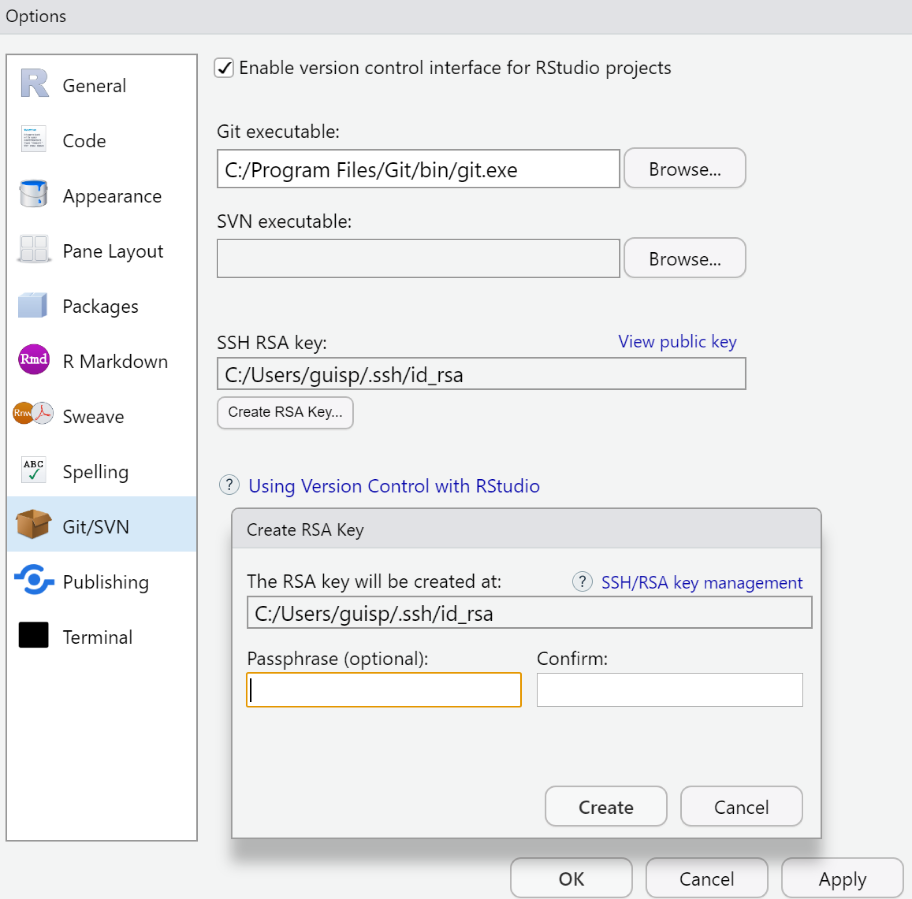
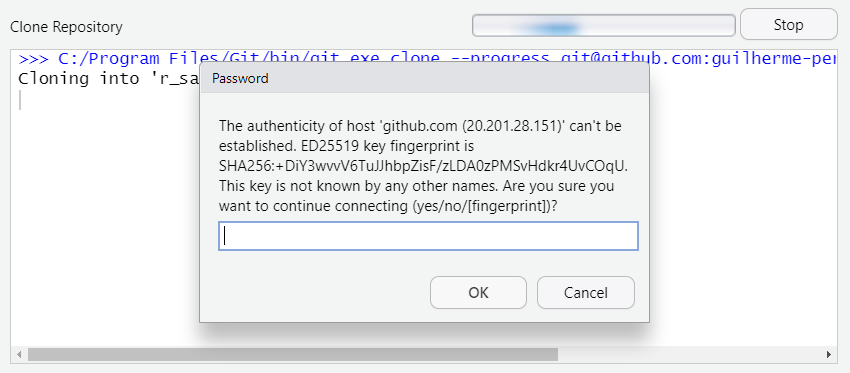

```{r setup, include=FALSE}
knitr::opts_chunk$set(echo = TRUE)
```

# Installation

All installation tips below are fragments of [this blog post](https://www.r-bloggers.com/2021/03/get-a-treat-a-template-for-reproducible-research-with-r/). Please visit it for more detailed information.

## 1. R

R is a statistical programming language and a software itself. We will use it as the base software for our analyses.

To install R go to <https://cloud.r-project.org>, follow the links for your platform, download and install the current R binaries for base distribution. Do not create any menu items or task bar entries. You will not need them as you will be using R via RStudio.

### Rtools

While not strictly required, Rtools help to make projects reproducible cross-platform -- we might skip it for now. 

Again, installing Rtools essentially means going to <https://cran.r-project.org/bin/windows/Rtools/> and downloading the according file. 

After installation, make sure that you add it to your PATH environment variable. In RStudio, copy-and-paste the command below in the R console (the thing on the left side of RStudio), and press `Enter`:

```{r, eval=FALSE}
writeLines('PATH="${RTOOLS40_HOME}\\usr\\bin;${PATH}"', con = "~/.Renviron")
```

## 2. RStudio

RStudio is an Integrated Development Environment (IDE) centered on R, which offers everything you need to bridge to other programming languages and tools. We will rely on RStudio to run R, write reports using R Markdown and collaborate using its integration to Git.

To install RStudio go to <https://rstudio.com/products/rstudio/download/>, download and install the free Desktop version. You can add a task bar entry, as you will need it.

## 3. Git

Git will help us to keep track of versions of our work and to collaborate with others on a project and you work on it concurrently. 

First, we will create your GitHub account at <https://github.com/join>. You will need to give an username, email and confirm it. GitHub will send a first email to confirm that it is you.

Prior to using Git with RStudio, you should install it using the appropriate method for your platform:

- Windows & OS X: <http://git-scm.com/downloads>
- Debian/Ubuntu: `sudo apt-get install git-core`
- Fedora/RedHat: `sudo yum install git-core`

Click on `Next` buttons until the `Install` button appears and click on it.

After installing Git you need to configure it. To set your user name and password using RStudio, go to `Terminal` tab (Fig. 1):

{#id .class width=50% height=50%}

In the `Terminal` tab, run the following code (change to _your_ name and email):

```{r, eval=FALSE, engine='bash'}
git config --global user.name "Your Name"
git config --global user.email "your_email@example.com"
```

# RStudio and GitHub Integration

## RStudio

In RStudio, go to `Tools` > `Global Options...` > `Git/SVN`

The window below will prompt (Fig. 2).

{#id .class width=50% height=50%}

Then:

1. Select `Enable version control for RStudio projects`
2. Make sure to point to the right path for Git executable (and don't worry about SVN)
3. Click on `Create SSH Key...` and click on `Create`
4. Click on `View public key`, and press `Crtl` + `C` to copy the key to the clipboard

## GitHub

You will need to add a key to link your GitHub to RStudio.

Go to <https://github.com/settings/keys>:

1. Click on `New SHH key`
2. Give a title to your key (identifying the computer your at), e.g. "My laptop"
3. Paste (`Crtl` + `V`) the key from your clipboard
4. Click on `Add SSH key`

# Getting Started

We are going to create a repository, link it to an RStudio project, update the project with an R Markdown file, and upload this file to the repository.

## Create a GitHub repository

Now, go to <http://github.com/new>:

1. Choose a repository name, e.g. `r_sandbox`
2. Click on `Private`
3. Select `Add a README file` 
4. Select `Add .gitignore` (and pick `R` as your `.gitignore template`)
5. Click `Create Repository`
6. Click on `Code` > `SSH` and copy (`Crtl` + `C`) the repository URL to your clipboard

## Create an RStudio project

In RStudio, go to `File` > `New Project...` > `Version Control` > `Git`

1. Paste (`Crtl` + `V`) the URL for `r_sandbox` repository from your clipboard
2. Choose the folder where your project will be saved (e.g. create a folder named `git` to save all your repositories in one single place)
3. Click on `Create Project`
4. If RStudio prompts the window below (Fig. 3), just type `yes` and click on `OK`

{#id .class width=50% height=50%}

You might need to close RStudio or even restart your computer if that does not work the first time around. Then, follow the steps above again.

## Create an R Markdown file

In RStudio, go to `File` > `New file` > `R Markdown...`

If RStudio asks to install some packages (Fig. 4), please allow it to do so by clicking on `Yes` (`Sim` in Portuguese)

{#id .class width=50% height=50%}

1. Insert a title and your name, and click on `OK` button
2. Go to `File` > `Knit Document` or simply click on `Knit` button, and you will have your first report

## Upload project changes to GitHub

In RStudio, go to `Tools` > `Version Control` > `Commit`. Alternativaly, you can go to `Git` tab > `Commit`

{#id .class width=50% height=50%}

In the pop-up window (Fig. 5):

1. Press `Crtl` + `A` to select all files and click on `Stage` (or you can also click on each file so that they are all ticked)
2. Write a (meaningful) `Commit message`, e.g. "My first commit"
3. Click on `Commit`, and click on `Close` once it's done
4. Click on `Push`, and click on `Close` once it's done

Go to your GitHub page on <https://github.com/> and see your `r_sandbox` repository updated.

# References

<https://rpubs.com/marschmi/105639>

<https://support.rstudio.com/hc/en-us/articles/200532077-Version-Control-with-Git-and-SVN>

<https://www.r-bloggers.com/2021/03/get-a-treat-a-template-for-reproducible-research-with-r/>

